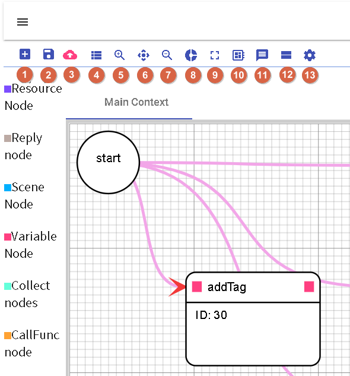
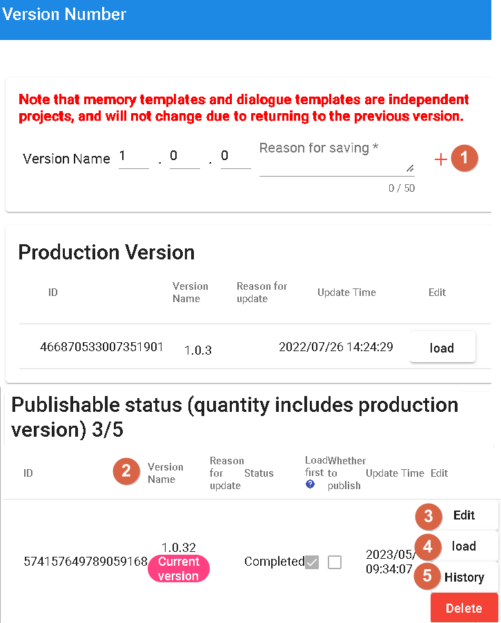
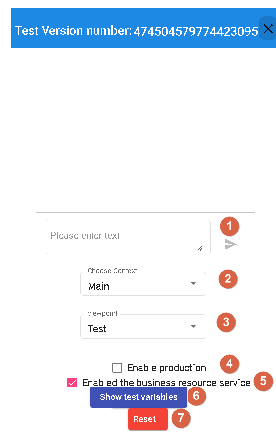
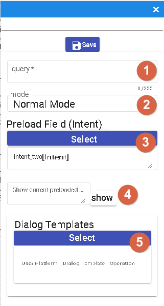
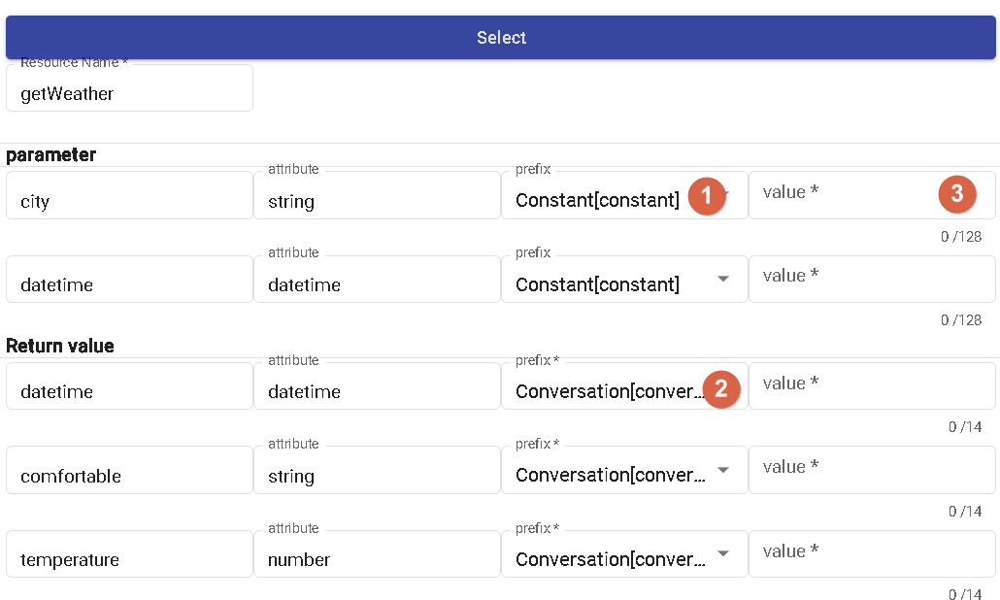
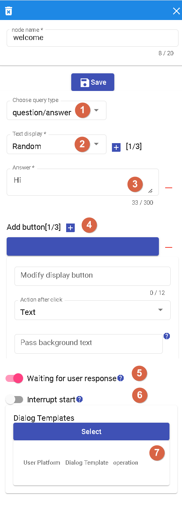
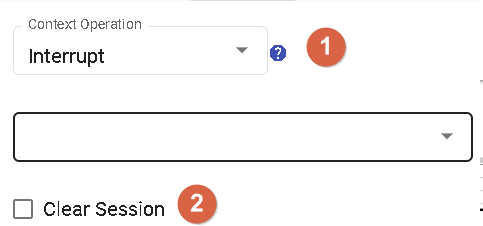
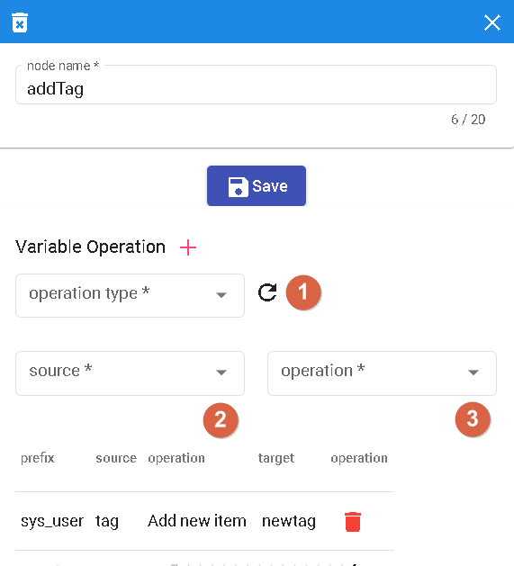
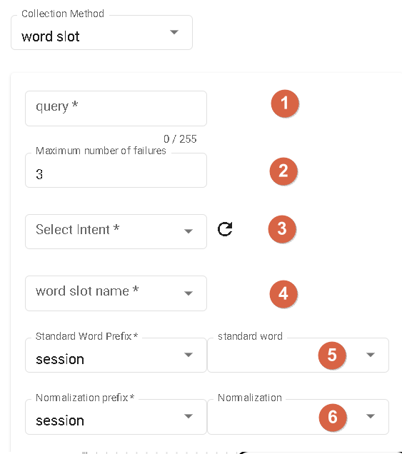

# Bot Dialogue Flow

Basic flow-based conversation is a method used to complement the limitations of domain-driven conversation flows. Domain-driven conversations are typically based on specific domains and are limited to knowledge and conversation flows within those domains. However, such limitations may not be able to handle certain edge cases or unknown user inputs.

Basic flow-based conversation provides a flexible approach to handle unknown scenarios. It doesn't rely on specific domain knowledge but instead responds based on predefined conversation flows. This approach is commonly used to handle frequently asked questions, provide answers to common queries, or offer general guidance.

Basic flow-based conversation can respond appropriately based on different user inputs and context. It can provide predefined responses, offer option choices, or guide users through specific actions. Additionally, you can incorporate conditional checks and transitions based on user responses to achieve more sophisticated conversation flows.

Using basic flow-based conversation helps overcome the limitations of domain-driven conversations and provides more flexibility and breadth in conversation handling capabilities. This ensures suitable responses for various user inputs and scenario requirements, enhancing the usability and extensibility of the conversational AI system.

## Advantages

- Visual Representation: The use of a graphical interface provides an intuitive understanding of the relationships and positions between nodes. Through visualization, users can have a clearer understanding of the structure and logic of the conversation flow.
- Drag-and-Drop Nodes: Compared to traditional command-line interface (CLI) coding for chatbots, the design of drag-and-drop nodes is more user-friendly. Users can directly drag and drop nodes and configure their properties without the need for coding, making it convenient and easy to build conversation flows.


- 1.New Process: Allows resetting the current flow, restoring all settings to their original state, including scenarios and nodes.
- 2.Save: Provides functionality to add and load versioned flows, allowing saving and managing different versions of the flow.
- 3.Update: Used to update the current version of the flow, making modifications and adjustments as needed.
- 4.Choose Context: Allows adding, updating, deleting, and selecting scenarios through a pop-up window, facilitating the management and configuration of scenarios within the conversation flow.
- 5.-7. Canvas Controls: Used to adjust the size and scale of the canvas and return it to the position of the starting node.
- 8.Global Settings: Provides global options to reload and configure settings related to the chatbot.
- 9.Full Screen: Switches to full-screen mode for better viewing and editing of the conversation flow.
- 10.Templates: Offers memory and dialogue templates for quick construction and configuration of conversation flows.
- 11.Test: Used to test the current chatbot flow, ensuring its proper functioning and meeting expectations.
- 12.Stage process: Allows temporarily storing the cache of the current flow while handling other tasks, so it can be resumed later.
- 13.Node Settings: Used to configure various properties of different nodes, such as resources, replies, scenarios, variables, and collection, to customize and configure the behavior and logic of the conversation flow.

## Save



- 1.Add New Version: This feature allows creating a new version for updating and modifying the conversation flow.
- 2.Version Properties: When creating a new version, you can fill in properties such as version name, status, update reason, preloading, and publishing settings.
    - Version Name: Assigns a unique name to the new version.
    - Status: Indicates the status of the version. "Completed" means modifications have been completed successfully.
    - Update Reason: Describes the updates or reasons for this version.
    - Preloading: Specifies whether to preload specific settings or data when creating the version.
    - Publish: Sets whether to publish the version for actual use.
- 3.Edit Version: Allows editing existing versions, including rewriting the update reason, modifying preloading settings, and changing the publishing status.
- 4.Load Selected Version Script: This feature loads the conversation flow script of the selected version for editing and modification.
- 5.Browse History: Enables viewing the historical records of past versions, allowing you to query and compare changes and modifications between different versions.

### Preloading

Preloading: When the "Preloading" option is selected in your version, the script of that version will be prioritized and loaded when entering the conversation flow canvas for the first time, instead of the script with the latest date. This can be used to specify that a specific version's script is used from the beginning to achieve more fine-grained flow control.

### Publishing

Publishing: When the "Publish" option is selected in your version, it means that the version will be published as a "development version" for testing purposes. Development versions are typically used for testing new features, bug fixes, or other development work. By marking a version as a "development version," you can differentiate between test versions and official production versions, ensuring the stability of the production version.

## Testing



- 1.Enter Query: In the testing interface, you can input the query or prompt you want to test to check the response of the conversation flow.
- 2.Test Scene Context: You can directly test the conversation flow of specific scenarios, allowing you to simulate the interaction between users and the bot in specific contexts.
- 3.Platform Response Mode: You can choose different platform response modes based on the selected perspective. This can help you simulate the conversation experience on different platforms.
- 4.Test Production Version: This feature allows you to test the published production version to ensure its proper functioning in a real environment.
- 5.Business Resource Service: You can choose whether to enable the business resource service. If enabled, the corresponding resource nodes will be invoked for business logic interaction.
- 6.Simulated Parameters: If you don't enable the business resource service, you can fill in simulated parameters here to simulate the parameters in actual resource requests.
- 7.Refresh Page: This feature allows you to reload the test page to clear previous test results and settings and start a new test.

# Node Introduction

## Start Node

As the global node for the scenario, it affects all nodes within the flow.<br>

- 1.Query Node: Used for the initial greeting or opening question. It serves as the starting point of the conversation flow, where you can set the initial prompt or question.
- 2.Mode Node: Divided into general mode and awakening mode. Awakening mode requires the user to input a specific "awakening phrase" to proceed to the subsequent flow.
- 3.Preload Domain Node: This node must be an intent node and is used for usage in subsequent collection nodes. It preloads a specific domain so that the information from that domain can be used in the subsequent flow.
- 4.Use Preloaded Domain Node: This node demonstrates how to use the preloaded domain from the "Preload Domain" node. This ensures that domain-related information can be used for operations in this node.
- 5.Dialogue Template Node: This node contains templates for different channels. It is used to provide appropriate responses based on different channels. If there are different prompts for different channels, the system will automatically select the appropriate response based on the channel to respond to the user.

## Resource Node

This node is used to call external resources and perform business logic operations. You can configure the relevant properties and parameters of the resource node for resource invocation.

- 1.Parameter Prefix: Parameters set within the node can use different prefixes, including config (bot parameters), constant (constants), conversation (single-turn conversation), session (multi-turn conversation), sys_user (system user parameters), and user (user parameters). These prefixes are used to differentiate different types of parameters for ease of use within the node.
- 2.Return Value Prefix: When the resource node completes its call and obtains a return value, the data of the return value can be stored in different prefixes, including conversation (single-turn conversation), session (multi-turn conversation), and user (user parameters). This allows the return value to be saved into the appropriate variables as needed for subsequent use.
- 3.Based on the attribute of the parameter, when selecting the constant prefix, for parameters of the datetime and number types, only numbers can be entered; for parameters of the string type, any text can be entered.

### Prefix Introduction

The prefixes are categorized as Bot Parameters, Constants, Conversation (single-turn), Conversation (multi-turn), System User Parameters, and User Parameters.
- Bot Parameters: You can find bot parameters in the template's memory template. These parameters are settings or information related to the entire bot.
- Constants: When you need to use a fixed text string as a parameter, you can choose the constant prefix.
- Conversation (single-turn): This prefix is mainly used in single-turn conversations.
- Conversation (multi-turn): In multi-turn conversations, you can use the memory templates in the template to store and retrieve information related to the current conversation.
- System User Parameters: The user parameters in the template's memory template provide some system-level user-related parameters. Currently, only userId, platform, and branch are available.
- User Parameters: You can find user parameters in the template's memory template. These parameters are information related to the user.

### Non-Text Message Reception

When receiving non-text messages in Line and Messenger, there are reserved words:

- conversation._message.type: Used to determine the type of message, such as text, image, audio, video, event, or file.
- conversaion._message: Enabled when receiving non-text and non-event messages from Line and Messenger platforms.

```
{
  "_message": {
    "type": "attachment_type",
    "attachments": [
      {
        "id": "att_id",
        "url": "att_url",
        "type": "att_type"
      }
    ]
  }
}
```
If the message type is file and the platform provides the fileName and fileSize, they will be included:

```
{
  "_message": {
    "type": "attachment_type",
    "attachments": [
      {
        "id": "att_id",
        "url": "att_url",
        "type": "att_type",
        "fileName": "fileName",
        "fileSize": 10240
      }
    ]
  }
}
```

|PATH       | Description
|---------- | ---------
| id        | Indicates whether the platform provides a specific ID. For Messenger, files can be uploaded in advance.
| url       | Indicates whether the platform provides a specific URL.
| type      | text, image, audio, video, event, file
| fileName  | When the type is file and the platform provides the fileName, it will be displayed.
| fileSize  | When the type is file and the platform provides the fileSize, it will be displayed.

How to use:

- When the node is a "Condition Node," you can first check the type of conversation._message.type.
- Then, using a "Resource Node," pass the attachments to the backend for processing.


#### Return Value

The JSON response from the resource can be returned to the conversation system [currently only JSON response is supported].

If the obtained value is "test" , the injected value into conversation.test will be "test".

## Reply Node

In the reply node, you can use it to ask questions or provide answers.<br>

- 1.In this selection, you can choose the type of question. Currently, only a simple question type is supported.
- 2.This is the textual expression of the question. The supported option is "Random," which means you can set multiple different expressions for the question, and the system will randomly select one each time it is used.
- 3.Answers: You can provide multiple answer options, and each answer has an equal probability of being selected, i.e., 1/N, where N is the total number of answers.
- 4.Add Button: This button is used to add more answer options. Clicking on it allows you to enter a new answer button.
- 5.Wait for User Reply: When selected, the node will wait for the user's response. During this time, the flow will pause until a response is received from the user before proceeding with the subsequent nodes.
- 6.Interruptible: This option determines whether the node can interrupt the execution of other nodes. If this option is enabled, the node can interrupt the execution of the Start node and branch to that node.。
- 7.Conversation Template: It is used for templates in different channels, usually used for answering questions. If different channels have different answers, you can select the corresponding answer for that channel.

## Scene Node

Characteristics of the Scene node.<br>

- 1.The scene has the following options:
  - Interrupt: Selecting this action will interrupt the execution of the current Scene node and transition to another node. You can specify the target node to transition to.
  - Restart: Selecting this action will restart the execution of the current Scene node. This will restart the entire Scene from the beginning of the Scene node.
  - Return to Main Scene: Selecting this action will return the execution flow to the Main Scene node. This can be used to continue execution in the Main Scene after performing specific actions in a Scene node.
  - Complete: Selecting this action will mark the execution of the Scene node as complete. This indicates that the execution of the Scene node has finished, and the flow can proceed to the next node.
  - End Flow: Selecting this action will end the execution of the entire flow. This will stop the execution of the flow and exit.
  - Listen: Selecting this action will put the Scene node in a listening state, waiting for user input. Once a response is received from the user, the flow will continue execution.
  - Jump: Selecting this action allows the flow to jump to a specified node. You can specify the target node to jump to.

- 2.Clear All Data in "Template" -> "Memory Template" -> "Single Conversation Storage": This action clears all data in the Single Conversation Storage of the Memory Template. This may be necessary to clear specific conversation data.

## Variable Node

The Variable Node is used to assign values to variable templates and allows for parameter variation.<br>



### Operation Type

- Variable: Selecting this operation allows you to set variables for a single session or user.
- System Parameter: Currently, only "User Tags" are supported. You can select this operation and set the value for user tags.

### Operations

- List Append: When the variable source is a list, you can use this operation to add a new value to the list.

- List Remove: When the variable source is a list, you can use this operation to remove a specific value from the list.

- String Replace: When the variable source is a time or string, you can use this operation to replace a specific substring with a new value.

- Clear String: When the variable source is a string, you can use this operation to clear the value of the string.

- Reset to Zero: When the variable source is a number, you can use this operation to reset the number to zero.

- Increment by One: When the variable source is a number, you can use this operation to increment the number by one.

- Decrement by One: When the variable source is a number, you can use this operation to decrement the number by one.

## Collect Node

The Collect Node is used to simplify the collection of intent-based slots.<br>

- 1.Set the question to collect the user's answer, which is used to collect specific intent-based slots.
- 2.Specify the maximum number of failures allowed when the user's response does not match the specified intent-based slot. Exceeding this number will trigger a fallback.
- 3.You can choose to start the node and specify the intent-based slots in a specific domain to collect the corresponding slots.
- 4.You can choose to start the node and specify all the slots in a domain to collect the values of all the slots at once.
- 5.Inject standard words directly into the field.
- 6.Inject normalized words directly into the field.

## Call Function Node
Invoke different domains.

## Conditional Node

- 1.Conditional Type:
    - Conditional: Route based on different conditions, which can be intent, variable, or query.
    - Unconditional: Connect directly to other nodes without any conditional restrictions.
    - Percentage: Distribute randomly to different nodes based on specified probabilities.
- 2.Priority: You can set the priority for conditional branches to determine the execution order. If multiple branches have the same priority, they will be sorted based on their position in the node.
- 3.Trigger Condition: Used to define the condition part of the conditional branch. It can be an intent, variable, or query.
- 4.Grouping: Conditional branches can be grouped, where branches within the same group have an AND relationship, and branches in different groups have an OR relationship. The conditions are checked based on the grouping order, and if any condition in a group is TRUE, the next node will be executed.


# Continue Reading

- [Bot Example](../../tutorials/docs/bot-example.html)