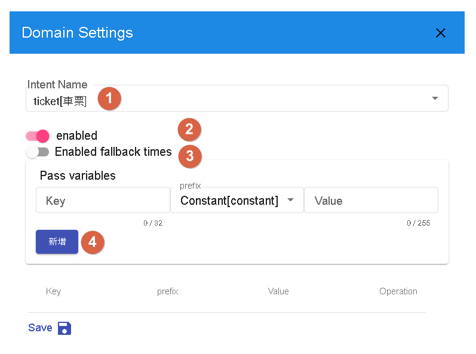
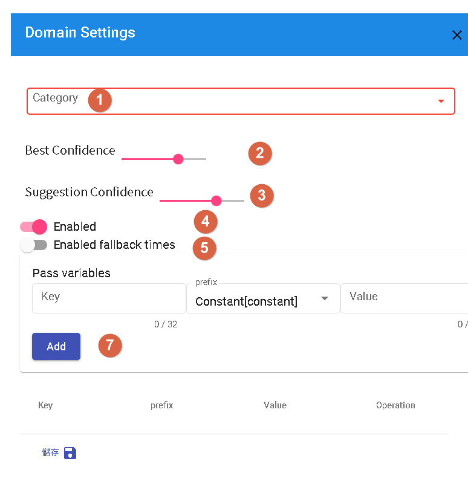

# Bot Global Settings

The configuration of a conversation flow refers to setting up enabled domains, scenes, and generic responses in a conversational bot to ensure that the bot can understand and answer questions correctly in interactions with users.

- Enabled Domains: Ensuring that only relevant domains related to the bot's functionality are enabled, avoiding an excessive number of unnecessary domains that can lead to confusion or incorrect answers. Select suitable domains based on the purpose and goals of the bot.
- Scene Configuration: Dividing the conversation into different scenes to respond based on user needs and contexts. Each scene can focus on a specific topic or task, enabling the bot to provide more specialized and accurate answers.
- Generic Responses: Setting up generic responses for common questions or situations to provide immediate responses to users. Generic responses are pre-configured fixed answers.

## Domains

### Different Domain Categories
Intent-based, Knowledge base, and Question-Answering are three different types of conversation flow categories, each requiring different configurations to optimize the conversational experience.

### Intent-based

In an intent-based conversation flow, the focus is on identifying user intents and providing corresponding responses. Here are some recommendations to optimize intent-based conversations:

- Define Clear Intents: Identify possible intents that users may have and create corresponding responses for each intent.
- Use Entities: Utilize entities within intents to identify key information such as dates, times, locations, etc. This helps in providing more accurate answers to user queries.

- 1.For specific intents, you can choose to fill entities to capture key information from the user, or leave them empty and identify their intent during the conversation. This depends on the requirements and design of your conversation flow.
- 2.In the configuration, you can choose whether to enable specific domains. Enable or disable relevant domains based on your conversation flow requirements.
- 3.Enabling the count of missed hits depends on whether you want to track and record the number of missed hits in the conversation.
- 4.If you want to pass variables to specific domains and forcefully inject the context of that domain, you can make the necessary settings in the configuration. This will help in sharing information and achieving more precise answers in specific conversation flows.

### Question-Answering

In a question-answering conversation flow, answers are provided based on pre-defined question-answer pairs.

- Cover Common Questions: Collect and organize common questions and provide corresponding answers.
- Consider Multiple Expressions: Provide multiple expressions for each question-answer pair to handle different user query variations.

- 1.You can select specific categories for designated question-answer pairs in the configuration to classify them into specific categories. This option can be overridden to specify the category of question-answer pairs as needed.
- 2.Based on the value in the configuration, when the similarity of an answer exceeds this value, the question is considered a user question. You can override this value in the configuration for more flexible control.
- 3.If the similarity of an answer exceeds the configured value, the system displays other suggested questions. You can adjust this value in the configuration to meet your needs.
- 4.Whether to enable specific domains can be configured as needed to control the enablement or disablement of domains.
- 5.Enabling the count of missed hits depends on whether you want to track and record the number of missed hits in the conversation.
- 7.You can pass variables to domains and forcefully inject the context of the domain to provide more specific conversation content. This can be overridden as needed to pass specific variables to domains.

## Scenes

In a conversation flow, different response flows can be set up based on different scenes. Each scene can have its own independent conversation flow to meet the specific requirements of that scene. When configuring scenes, please make sure that the scene names consist only of lowercase letters (a-z) and underscores (_), in accordance with the system's naming conventions. 

By dividing the conversation into scenes, you can provide specific response flows and conversation experiences based on different usage scenarios.

## General Responses

Responses inherited by every scene.

- 1.This message is usually not shown to users unless there is an abnormality in the conversation system. If you see this message, please contact the administrator for assistance.
- 2.When the event is "start," the bot will respond with the following message.
- 3.Whenever the flow is updated, we will display the following text and restart the current conversation.
- 4.This message is typically not shown and is used to indicate that the bot is busy processing a large number of requests from the same user.
- 5.This message is displayed when there is no match, unless the branch condition is set to "empty," in which case the default response will be used.

# Continue Reading
- [Bot Resource Management](../../tutorials/docs/bot-resource.html)
