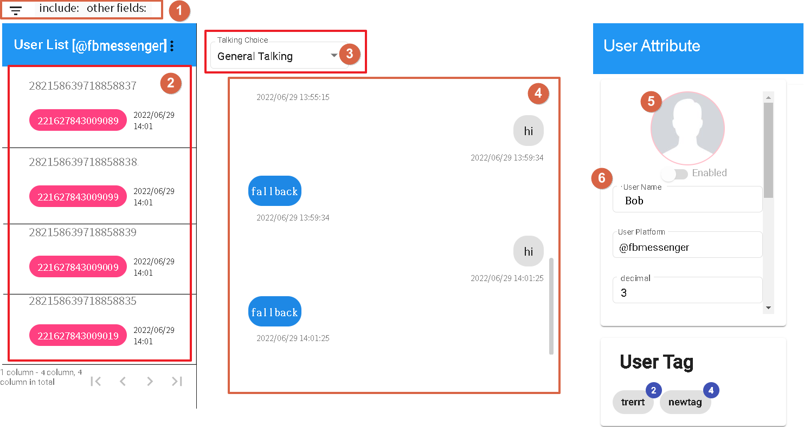
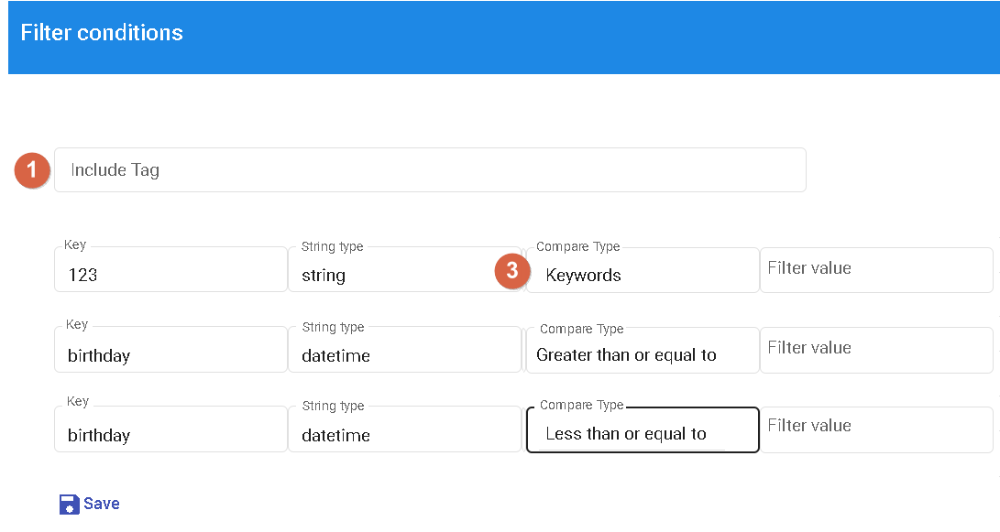
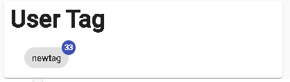
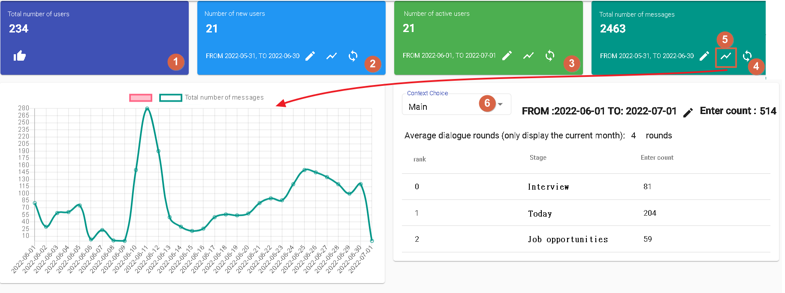

# Log
The log section consists of two main components: History and Statistics. Its purpose is to understand user information and identify areas where the bot may need improvement.

## History

- [1] to filter users based on specific fields. See Figure 2.
- [2] to display the user list.
- [3] to select the conversation type (currently only supports general conversations).
- [4] to display the historical conversation content of the selected user.
- [5] to display the user's profile picture (currently only supported by the platform).
- [6] to display the user's field values and label counts. See Figure 3.

Figure 2

- 1.Include Tags: Users must have all these tags to be displayed.
- 3.Field Query: Search by keyword for string fields. For numeric and date/time fields, search using numeric values.

Figure 3

Displays the tag code and the count of each tag.

## Statistics

- 1.Displays the total number of users.
- 2.Displays the number of new users during the selected period.
- 3.Displays the number of active users during the selected period.
- 4.Displays the total number of received messages during the selected period.
- 5.Calculates the daily increment for each metric (new users, active users, and message count) based on the selected period.
- 6.Selecting a scenario name allows you to view the number of user entries, including users who haven't responded, and the number of times each stage was triggered in the response node.

# Continue Reading
- [Broadcasting](../../tutorials/docs/bot-broadcast.html)
