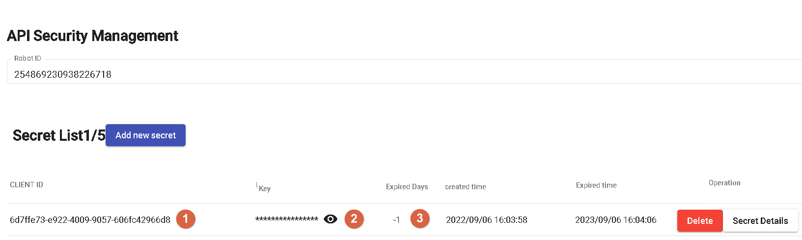
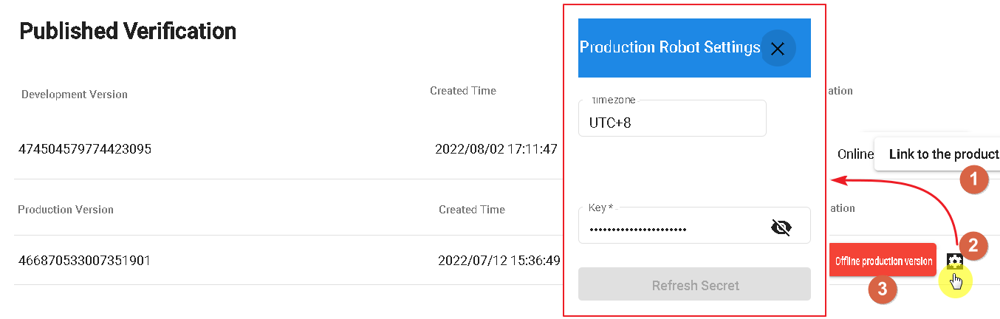

# Publishing
Publishing is used to release the production version of the bot, making it available for different channels.

## API Security Management

When using DmFlow's built-in API, you need to apply for a CLIENT ID to authorize access.

- 1.CLIENT ID: Generated by DmFlow.
- 2.Secret Key: Enter your own secret key or choose the secret key generated by DmFlow.
- 3.Expiration Days: When selecting -1, it defaults to one year expiration, with a maximum of 30 days.
- 4.Whitelist: Domains that are allowed access to DmFlow are filtered.

## Publishing

- 1.Connect to Production Version: When the development version is ready, it can be linked to the production version for deployment.
- 2.View Current Production Version: Check the current fixed settings of the production version. Currently, only the secret key can be modified (external resource key, not the API key; for details, refer to "Settings").
- 3.Close Production Version: Click this button to close the production version.

# Continue Reading
- [Settings](../../tutorials/docs/bot-setting.html)