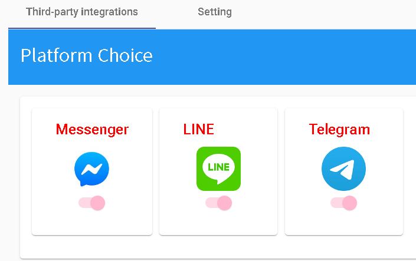
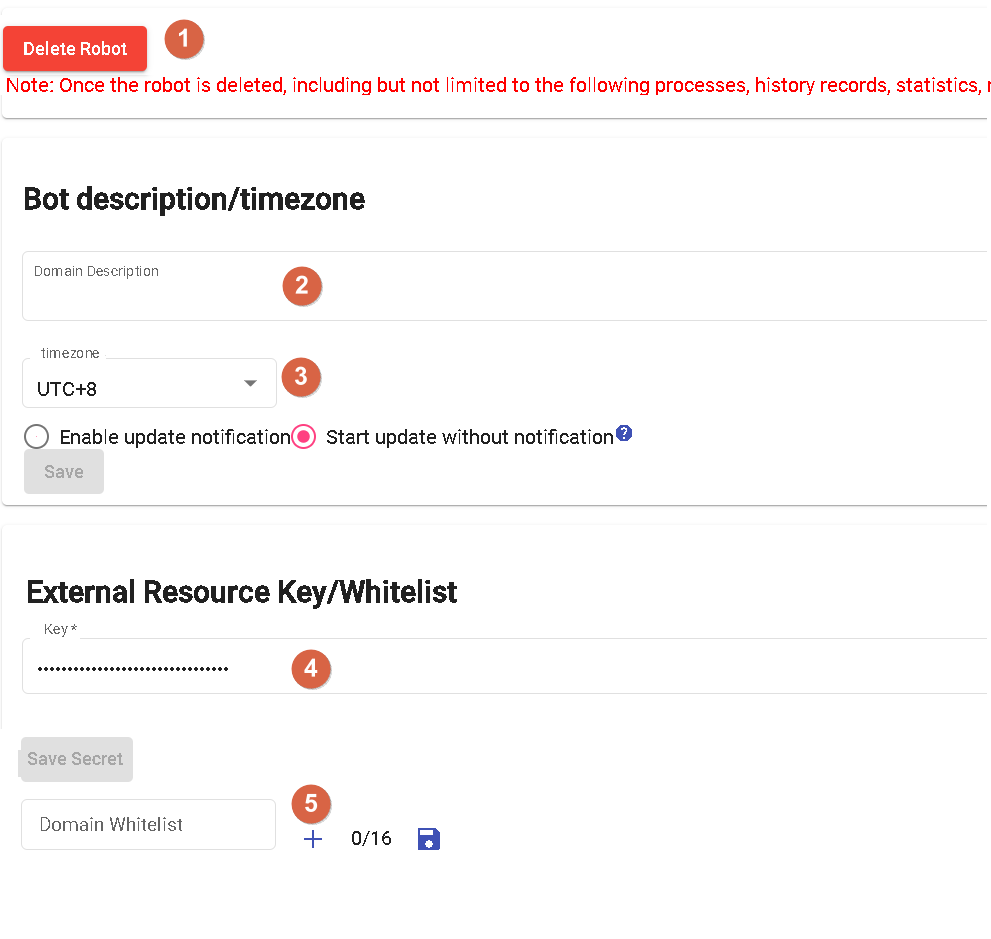

# Settings
Settings allow for integrating third-party platforms and configuring basic bot settings.

## Third-Party Integration

Currently supports LINE, Facebook Messenger, and Telegram.

## Configuration

- 1.Delete Bot: Once deleted, the bot cannot be recovered.
- 2.Description: A brief introduction to the bot.
- 3.Time Zone
- 4.Secret Key: This key is provided when external resource nodes in the bot flow make outbound calls.
- 5.Whitelist: When external resource nodes in the bot flow make outbound calls, the domain whitelist for URLs is restricted.

## Contact Information

Email: <service@dmflow.chat>

DMflow.chat Official website: [DMflow.chat](https://www.dmflow.chat/en/)
(We changed our domain to www.dmflow.chat on 2024-05-18)