# Templates

Templates are divided into Dialog Templates and Memory Templates.

## Dialog Templates

- Connect Dialog Replies: Dialog templates are used to connect dialog replies from other platforms, enabling the chatbot to respond to user questions or commands in a natural way.

- Simplify Development Process: By predefining and designing dialog templates, developers can quickly create and configure dialog flows, saving development time and costs.

- Easy Maintenance and Modification: Dialog templates make it easier to maintain and modify dialog flows. Modifications or additions can be made to the templates without the need for extensive modifications to the entire dialog flow.

### Supported Platforms
Currently, only LINE, Facebook Messenger, and Telegram are supported.

### LINE

#### Text Messages

The chatbot can send text messages containing plain text content to users. This is the most common and basic type of message used to convey textual information.

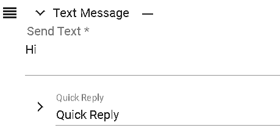

#### Preview - Text Message Preview [For Reference Only]
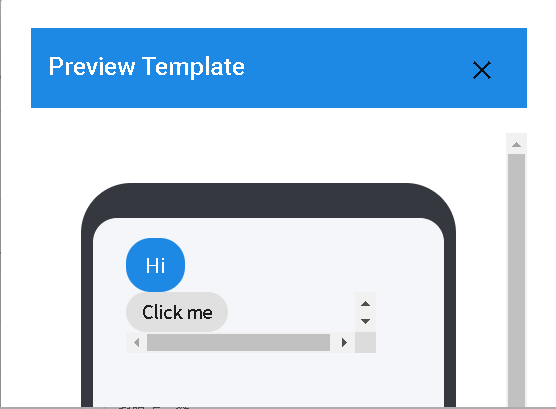

#### Quick Replies

- Instant Replies: Quick replies can be used to quickly respond to users without waiting for the chatbot to perform other processes or operations.
- Automated Replies: The chatbot can pre-configure common reply contents and quickly select the appropriate response based on the user's message content, providing immediate and personalized responses.
- Suggested Options: Quick replies can provide users with a set of option buttons that they can directly click to answer or perform corresponding operations, offering a more convenient way of interaction.
- Quick Actions: Quick replies can also be used to trigger specific actions or commands, such as subscription, search, reservation, etc. Users can directly click the buttons to perform the corresponding actions, saving input steps and time.

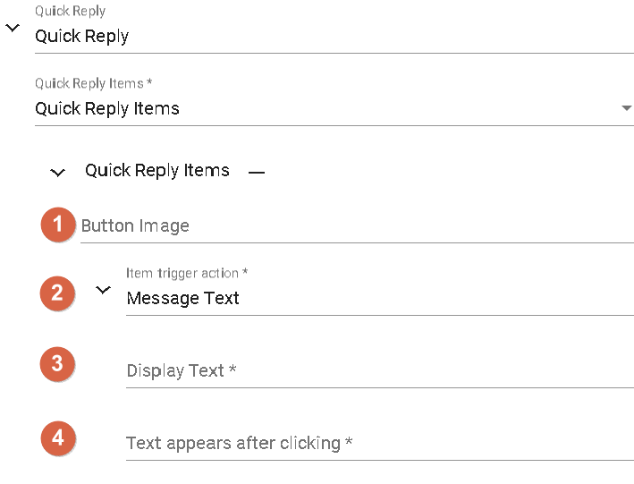

- 1.Icon Beside Text: This refers to the small icon displayed beside the text or button, providing additional visual cues or identification. These icons can be used to differentiate different button options, enhancing user understanding and interaction experience.
- 2.Object Trigger Actions: Location, Photo Carousel (scrolling through stored images on mobile), Open Window, Return Value, Camera, Time Picker, Message Text.
- 3.Display Text: The text displayed beside the icon.
- 4.Others: Additional information to be filled in after clicking the trigger action.
  - This includes two types: Action - Message Text and Action - Return Value. This refers to the two types of action in a message. One is message text, which directly displays text messages in the dialog box. The other is return value, which returns a value to the backend for further processing or analysis.

#### Image Messages

The chatbot can send images to users, allowing you to send image files for users to view the content.

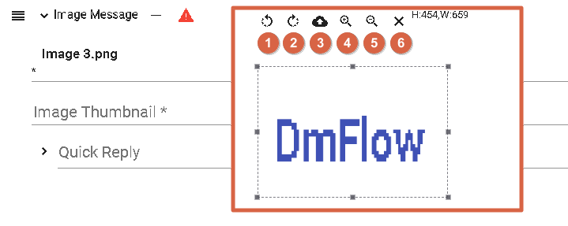

- Image Format: DmFlow supports JPEG and PNG formats for images.
- Image Size: The uploaded image size is limited to 1MB [according to DmFlow system display-based].
- Thumbnail Size: When displaying thumbnails, the image size is limited to 1MB [according to DmFlow system display-based]. This is to ensure that thumbnails can be loaded and displayed quickly.

Image URL: The URL of the image must use the HTTPS protocol to ensure security. The URL supports up to 10MB.

Upload Image: Users can provide the URL of the image for upload. As long as there is a valid image URL, DmFlow can upload and use the image.

- 1.Rotate Left: Rotate the image vertically to the left.
- 2.Rotate Right: Rotate the image vertically to the right.
- 3.Upload: Upload a new image.
- 4.Zoom In: Zoom in on the image.
- 5.Zoom Out: Zoom out the image.
- 6.Cancel Image: Cancel the display or operation of the current image.

#### Preview - Image Message Preview [For Reference Only]
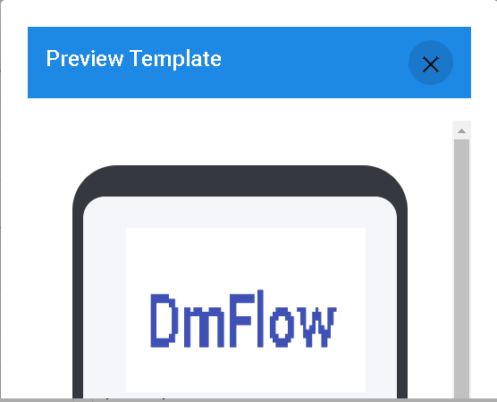

#### Actual-Image Message Preview

#### Video Message

The bot can send video messages to users, allowing you to send video files for users to watch the content.

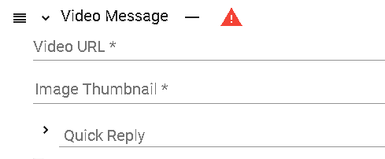

- URL Usage: In a reply message, only URLs can be used to reference images or videos. This means you can provide URLs for images or videos for the bot to display them in the conversation.
- Video Support: When referencing videos, only MP4 format videos are supported. This means you need to provide the URL of an MP4 format video file.
- Video Size Limit: The video file size is limited to 200MB. Make sure the video file you provide does not exceed this limit.
- HTTPS Protocol: For security and user privacy protection, the provided image and video URLs must use the HTTPS protocol. Ensure that the URLs you provide start with HTTPS.

Please adhere to these restrictions and requirements to ensure that images and videos are displayed correctly and comply with relevant security standards.

#### Audio Message

The bot can send audio messages to users, allowing users to listen to the audio content you send.

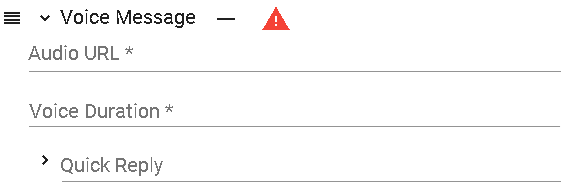

- URL Usage: In a reply message, only URLs can be used to reference audio files. This means you can provide the URL of an audio file for the bot to play the audio in the conversation.
- Audio Support: When referencing audio, only M4A format audio files are supported. This means you need to provide the URL of an M4A format audio file.
- Audio Size Limit: The audio file size is limited to 200MB. Make sure the audio file you provide does not exceed this limit.
- HTTPS Protocol: For security and user privacy protection, the provided audio file URL must use the HTTPS protocol. Ensure that the URL you provide starts with HTTPS.

Please adhere to these restrictions and requirements to ensure that the audio plays correctly and complies with relevant security standards.

#### Imagemap Message
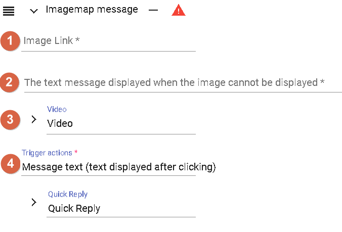

[Official Documentation for LINE Imagemap Message](https://tw.linebiz.com/manual/line-official-account/oa-manager-richmessage/)

- 1.URL Limitation: In a reply message, the URL size is limited to below 10MB. This means that the URL you provide must point to a resource with a file size below 10MB. Additionally, for security and user privacy protection, the provided URL must use the HTTPS protocol.
  - DmFlow Image Upload Limitation: On the DmFlow platform, the uploaded image size is limited to within 1MB (with DmFlow system display being the primary). This means that the images you upload on the DmFlow platform will be limited to a size below 1MB. Please ensure that the images you upload comply with this limitation.
- 2.Alternative Text: When a user receives an image carousel message, the alternative text is displayed when the image fails to load. This can be a text describing the image content or providing relevant information. The purpose of alternative text is to provide an alternative content to users when the image cannot be displayed.
- 3.[Imagemap Message Video](#imagemap-message-video)
- 4.[Imagemap Message Action](#imagemap-message-action)

#### Imagemap Message Video

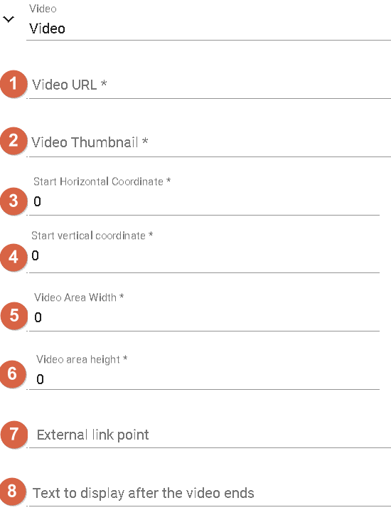

- 1.Video Limitation: Currently, the DmFlow platform does not support directly uploading videos. Therefore, videos can only be provided using URLs. When providing videos through URLs, the supported video format is MP4, and the size limit is within 200MB. Additionally, the provided video URL must use the HTTPS protocol.
- 2.Image Preview: In terms of image preview, DmFlow supports image sizes up to 1MB. Please ensure that the provided image complies with this limitation.
- 3.Horizontal Position: The horizontal position refers to the left-right position of the image or video within the message. The value of this position must be greater than 0, indicating the position counted from the left.
- 4.Vertical Position: The vertical position refers to the top-bottom position of the image or video within the message. The value of this position must be greater than 0, indicating the position counted from the top.
- 5.Video Width: Video width refers to the width dimension of the video displayed in the message.
- 6.Video Height: Video height refers to the height dimension of the video displayed in the message.
- 7.Provide External Link After Video Ends: After the video ends, you can provide an external link to the user. This can be a link pointing to another webpage or resource.
- 8.External Link Name: The external link name refers to the displayed link text after the video ends, used to describe the content or purpose of the link.

#### Imagemap Message Action
Include [Imagemap Message Text](#imagemap-message-text) and [Imagemap Message Link](#imagemap-message-link)

#### Imagemap Message Text

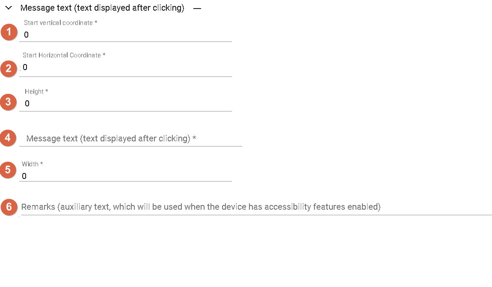

- 1.Calculated from the Top: It means that the vertical position of the element within the message is calculated from the top. Smaller values indicate that the element is closer to the top of the message.
- 2.Calculated from the Left: It means that the horizontal position of the element within the message is calculated from the left. Smaller values indicate that the element is closer to the left side of the message.
- 3.Text Display Height: It refers to the vertical height of the text within the message, i.e., the number of lines or vertical space occupied by the text.
- 4.Display Text: It means displaying the text content within the message for the user to read.
- 5.Text Display Width: It refers to the horizontal width of the text within the message, i.e., the number of characters or horizontal space occupied by the text.
- 6.Note: In specific cases, when the client has accessibility features, a note function can be provided. This may include voice reminders for the text content to assist users with special needs such as visual impairments.

#### Imagemap Message Link

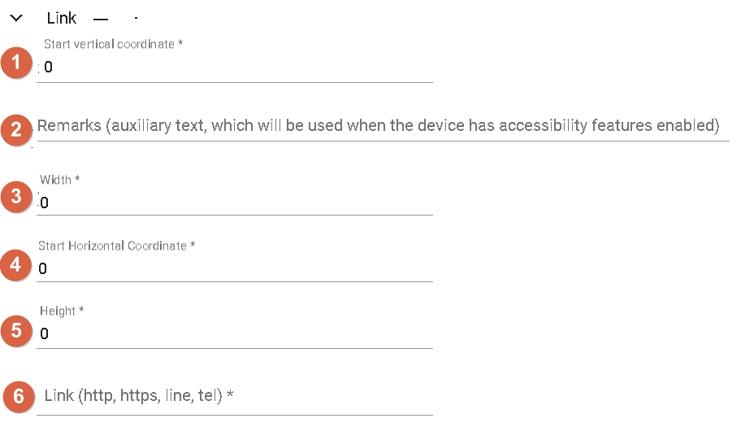

- 1.Calculated from the Top: It means that the vertical position of the element within the message is calculated from the top. Smaller values indicate that the element is closer to the top of the message.
- 2.Note: When the client has accessibility features, a note function can be provided, such as voice reminders to assist users with special needs.
- 3.ext Display Width: It refers to the horizontal width of the text within the message, i.e., the number of characters or horizontal space occupied by the text.
- 4.Calculated from the Left: It means that the horizontal position of the element within the message is calculated from the left. Smaller values indicate that the element is closer to the left side of the message.
- 5.Text Display Height: It refers to the vertical height of the text within the message, i.e., the number of lines or vertical space occupied by the text.
- 6.Link URL: It refers to the link URL that can be provided for users to click on, allowing them to access more related information or perform specific actions.

#### Preview - Imagemap Message Preview [For reference only]

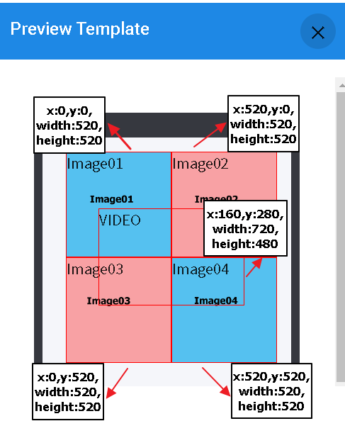

The red arrows and pointing box are alignment aids. The video is represented by the "VIDEO" label to indicate its position and dimensions. The text section will display the text label upon clicking (the actual text will not appear), and the hyperlink will display the link content upon clicking (the actual hyperlink text will not appear). The actual display may vary.

#### Actual - Imagemap Message Preview

#### Image Carousel

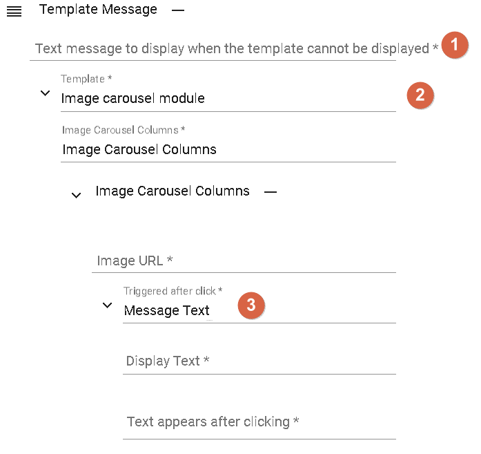

- Text displayed when the image carousel cannot be displayed on the desktop version.
- Template selection: "Image Carousel Module"
- Clicking triggers actions such as displaying text, postback, or link.

#### Trigger Actions
Include [Trigger Action Text](#trigger-action-text), [Trigger Action Postback](#trigger-action-postback), [Trigger Action Link](#trigger-action-link)

#### Trigger Action Text

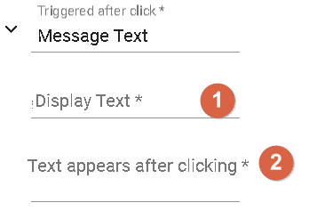
- 1.Text displayed on the text button in the image.
- 2.Text returned when the button is clicked.

#### Trigger Action Postback
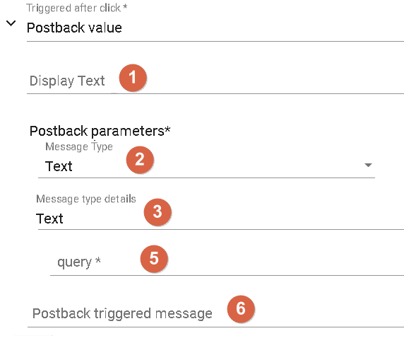

- 1.Text displayed on the text button in the image: When setting a text button on the image, you can specify the text to be displayed for each button. This text will appear on the image to guide users to take corresponding actions or obtain more information.
- 2.Message type: Text or Event. In the conversation, you can use text or events as the message type. Text messages are used to directly show text content to users, while events trigger corresponding actions or processes.
- 3.Details of text: It only contains the text for text details. For event details, they depend on the type of event set, such as interrupt events, ignore events, start events, end events, or wake-up events. To learn more about using return values, please refer to the [usage of postback values.](../../tutorials/docs/bot-template.html#Postback%20Value)。
- 5.Text inquiry: Through the conversation, you can ask users for text content and pass it to DmFlow for further processing. This allows you to interact with users in a conversational manner and perform subsequent operations based on their answers.
- 6.When the user clicks this text button, the displayed text on their LINE client: When the user clicks the text button, the corresponding text content will be displayed on the user's LINE client. This allows you to provide relevant information or instructions to the user.

#### Postback Value
Represents the data passed to DmFlow when the button is clicked. The key thing to understand is the event details:
- 1.Interrupt event: When the user clicks the interrupt event, the conversation will directly jump to the specified scene. This can be used to interrupt the current conversation flow and guide the user to a specific scene or sub-flow.
- 2.Ignore event: When the user clicks the ignore event, no response will be sent in the conversation. This is usually used to display specific data or information without triggering a backend response or other actions. It is useful for providing static content or displaying informational prompts.
- 3.Start event: When the user clicks the start event, the current conversation can be restarted. This will reset the conversation state, allowing the user to restart the conversation flow and interact from the beginning.
- 4.End event: When the user clicks the end event, the entire conversation flow will end. This means the conversation will not continue, and there will be no further interaction or response.
- 5.Wake-up event: When a node enters a sleep mode, if the user clicks the wake-up event, the execution of that node will be reactivated. This is useful for nodes that have a sleep mode, and users can restart the conversation flow associated with that node by clicking the wake-up event.

#### Trigger Action Link

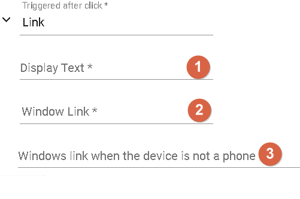
- 1.Text displayed on the text button in the image: When you add text buttons on the image, these buttons will display the specified text. The text displayed when users click these buttons will be passed to the corresponding part of the conversation flow to trigger the corresponding actions or responses.
- 2.Webview popped up on mobile devices: When users click a button in an image message, and the trigger action for that button is to open a window, if users click the button on a mobile device, a webview will pop up displaying the specified web page content. This webview can be displayed within the LINE client on the mobile device, allowing users to browse the web without leaving LINE.
- 3.Web page opened in a new browser window on non-mobile devices: When users click a button in an image message, and the trigger action for that button is to open a window, if users click the button on a non-mobile device (such as a computer or tablet), the specified web page will be opened in a new browser window. This allows users to view and interact with the specified web page content in a separate browser window.

#### Preview - Image Carousel Preview [for reference only]

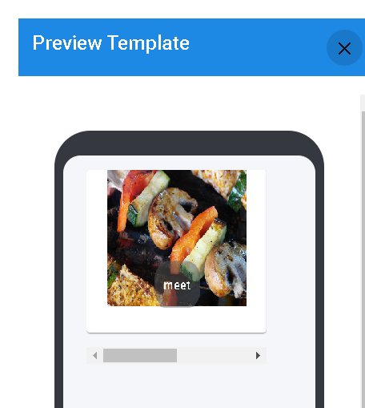

#### Actual - Image Carousel Preview

#### Confirm Template

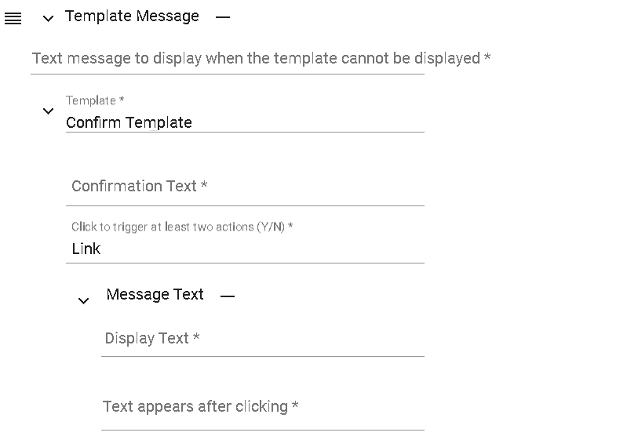
- 1.Template selection: "Confirm Template": This is a predefined template used in conversations to display interactive confirmation questions and options. You can choose this template to create a message that includes a yes-or-no question and related options to guide users in making a choice.
- 2.Confirmation question with two options: In the "Confirm Template," you can set a binary question, offering two options for users to choose from. Users can select one of the options as their answer. The purpose of this question is to gather user preferences or choices between the two options.
- 3.Trigger actions for each option: In the "Confirm Template," each option can be configured with a trigger action. The trigger action defines the action to be taken when the user selects a particular option. You can configure trigger actions based on your business requirements, such as sending a specific reply message, jumping to another scene, or invoking an API. For more information on trigger actions, you can refer to the [Trigger Actions](#trigger-actions) section.

#### Preview - Confirm Template Preview [for reference only]

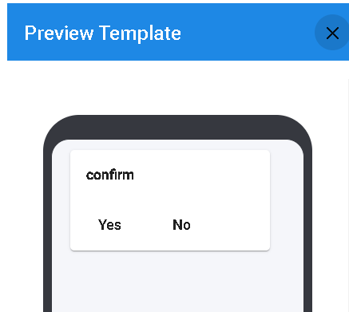

#### Actual - Confirm Template Preview

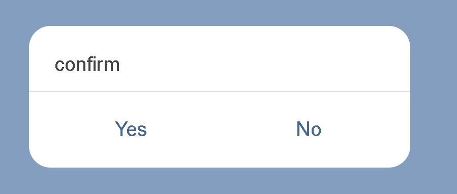

#### Button Template

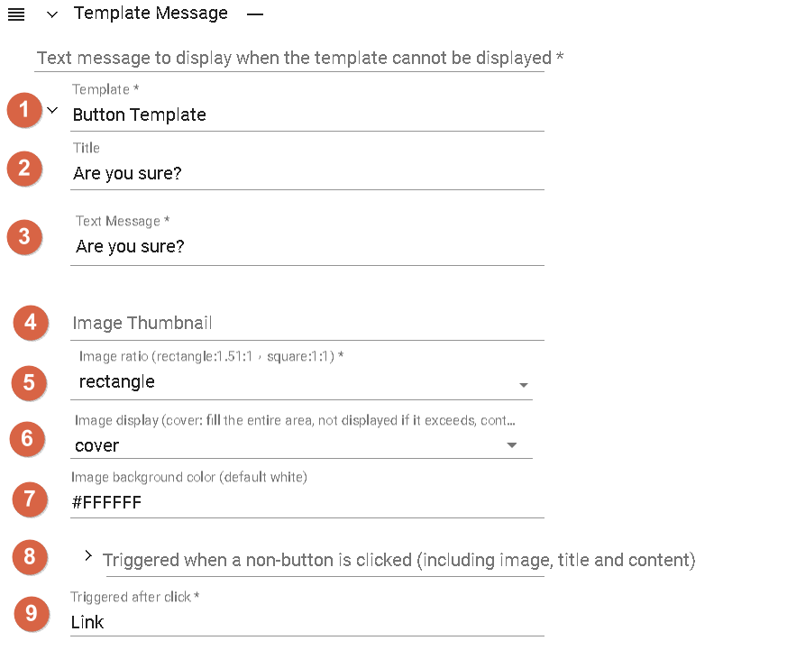

- 1.Template selection: "Button Template": This is a default template used to display messages with button options. You can choose this template to create a message that includes buttons for users to click and perform corresponding actions.
- 2.Title: The title can be placed based on the preview.
- 3.Text message: The text message can be placed based on the preview.
- 4.Thumbnail image: The thumbnail image can be placed based on the preview.
- 5.[Image aspect ratio](#image-aspect-ratio)
- 6.[Image presentation](#image-presentation)
- 7.Background color: When "Image presentation"
- 8.When clicked outside the button (including image, title, and content),[Trigger Action](#trigger-actions)
- 9.[Trigger Action](#trigger-actions)

#### Image aspect ratio

- rectangle=1.51:1
- quare=1:1

#### Image presentation

- cover:Fill the entire block, excess image is not displayed
- contain:Display the entire image, fill with background color if not fully filled

#### Preview - Button Template [for reference only]
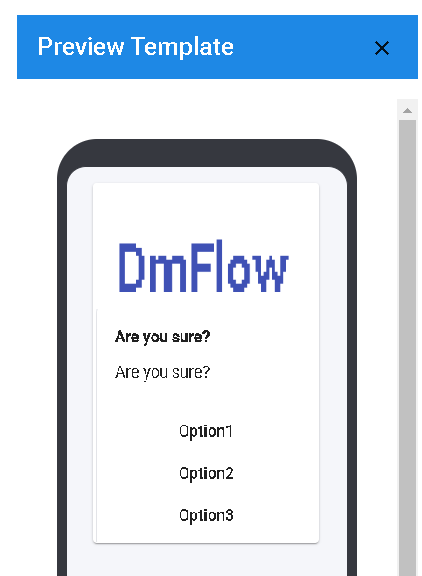

#### Actual Preview - Button Template
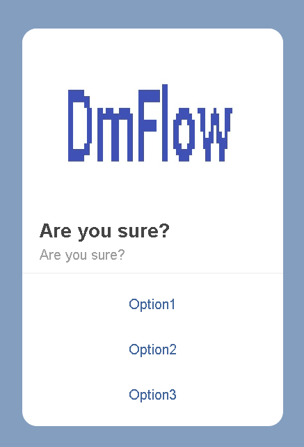

#### Carousel Template

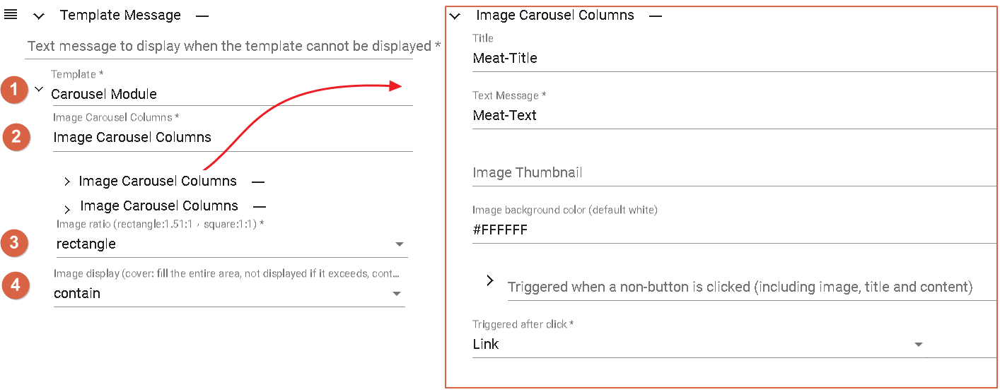
- 1.Choose the "Carousel Template" module.
- 2.Image carousel field, same as [Button Template](#button-template), but can support multiple items.
- 3.[Image aspect ratio](#image-aspect-ratio)
- 4.[Image presentation](#image-presentation)

#### Preview - Carousel Template [for reference only]
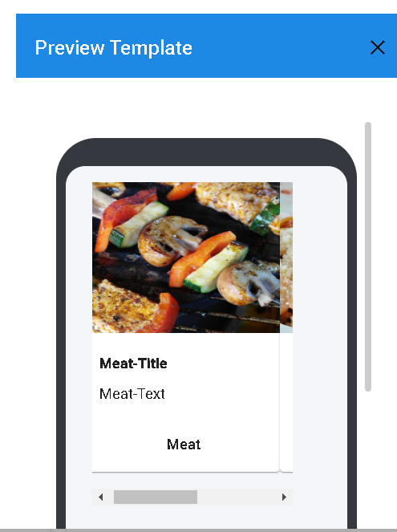

#### Actual Preview - Carousel Template
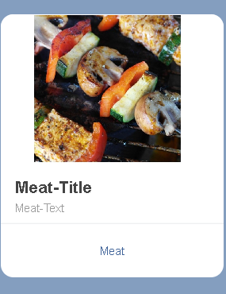

### Facebook Messenger

#### Text and Other Messages

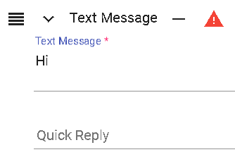

Text and images (uploadable, within 1MB), while others such as videos, audios, and files only support URL links.

#### Actual Preview - Text Message

#### Generic Template

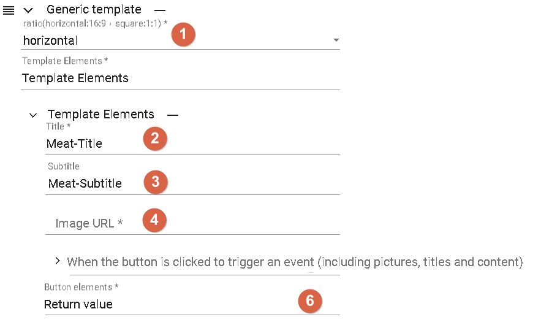

- 1.Horizontal: 16:9, Square: 1:1
- 2.Title, placement can be understood based on the preview.
- 3.Subtitle, placement can be understood based on the preview.
- 4.Image, placement can be understood based on the preview.
- 5.[Link Elements extension](#link-elements-extension)
- 6.Trigger conditions include [Link Elements extension](#link-elements-extension) and [Action - Return Value](#trigger-action-postback).

#### Preview - Generic Template [for reference only]
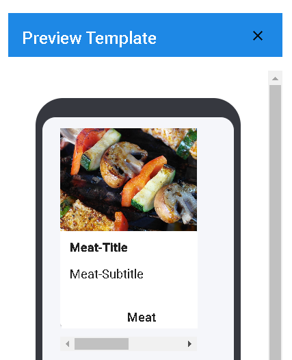

#### Actual Preview - Generic Template

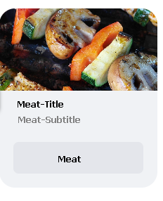

#### Link Elements extension

Link Elements

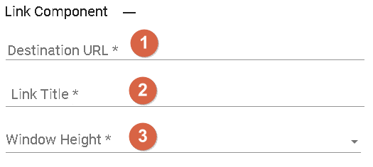

- 1.URL link
- 2.URL name
- 3.FULL(100%)、COMPACT(50%)、TAIL(75%)

Link Elements (extension)

[Add Messenger Extension SDK](https://developers.facebook.com/docs/messenger-platform/webview/extensions/)

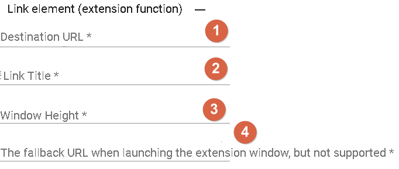

- 1.URL link
- 2.URL name
- 3.FULL(100%)、COMPACT(50%)、TAIL(75%)
- 4.URL for unsupported cases

#### Button Template

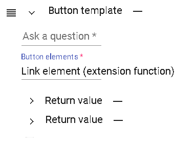

- 1.Ask a question.
- 2.Button elements include [Link Elements extension](#link-elements-extension) and [Action - Return Value](#trigger-action-postback).

#### Preview - Button Template [for reference only]
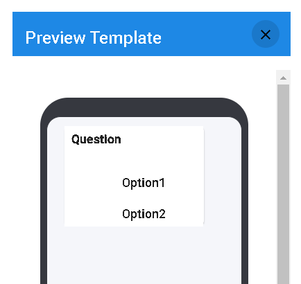

#### Actual Preview - Button Template
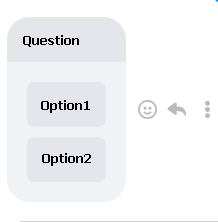

### Telegram

#### Text Message

The bot can send messages containing plain text content to the user. This is the most common and basic type of message used to convey textual information.

#### File Message

The bot can send files to the user. This includes various types of files such as documents, images, audio, etc. Users can click on the file message to download or view the corresponding file.

#### Image Message

The bot can send images to the user. This allows you to send image files for users to view the contents of the image.

#### Voice Message

The bot can send voice messages to the user. Users can listen to the voice content you send.

#### Video Message

The bot can send videos to the user. This allows you to send video files for users to watch the video content.

#### Location Message

The bot can send location messages to the user. This allows you to share geographic coordinates of a specific location for users to view on a map.

#### Multimedia Message

A multimedia message refers to a message that includes multiple media elements such as images, audio, video, etc. It can combine different media elements to provide richer and more diverse message content.

#### Additional Features

Telegram provides the following basic features typically offered in messaging functionalities:

- Reply Keyboard Template: This is a menu or button template for quick replies, allowing users to easily choose predefined reply content or perform specific actions. You can build your own reply keyboard template, including selecting button styles, text content, and corresponding actions.

- Message Formatting: You can adjust the format of messages as needed, such as using Markdown, MarkdownV2, or HTML markup languages to set text styles, bold, italic, links, etc. These markup languages allow you to better present text content, making it more readable and visually appealing.

- Disabled Notifications: In some chat applications or platforms, you can set whether to disable or enable notification functionality. This means that when you send a message, whether the user will receive a notification or prompt. You can control whether to notify the user of new incoming messages based on your needs.

## Memory Template
The memory template is divided into User Parameters, User Tags, Bot Config, and Single Session Storage.
- 1.User Parameters: These are fields used to store user data. They can include various attributes such as text, numbers, time, etc. These parameters can be used in different stages of the conversation to record and retrieve relevant information about the user.
- 2.User Tags: User tags are labels or markers used to tag and identify specific attributes or characteristics of the user. These tags are often associated with the user's behavior, preferences, or specific features. The bot can respond or perform specific actions based on user tags. User tags typically keep track of the number of times a tag has been applied and the last time it was applied.
- 3.Bot Config: These are permanent parameters of the bot used to store global settings or configuration values. These parameters are typically identified with specific prefixes (e.g., "config") to distinguish them from other types of parameters. Bot parameters can be used to configure the bot's behavior, adjust settings, or store global variables.
- 4.Single Session Storage: These are fields used to temporarily store data during a single conversation. These fields can include various attributes such as text, numbers, time, lists, etc. During a specific conversation, the bot can use these fields to record, process, and retrieve information related to that conversation. Once the conversation ends, these temporary data are typically cleared or discarded.

### Attributes
- 1.Text: Text parameters are used to store general text data. This can be text input by the user, responses generated by the bot, or other text messages that need to be stored. Text parameters can contain any string value, such as user names, addresses, problem descriptions, etc.
- 2.Number: Number parameters are used to store numeric text data. This can be numbers input by the user, results calculated by the bot, or other numeric messages that need to be stored. Number parameters can be used for numeric operations, comparisons, and other number-related operations.
- 3.Time: Time parameters are used to store date or time text data. This can be the date and time of specific events, scheduled meeting times, or other situations where time information needs to be recorded. Time parameters can be used for time comparisons, displaying date and time formats, and other time-related operations.
- 4.List: List parameters allow storing multiple field values, with one field acting as a primary key to identify the items in the list. Lists can be used to store multiple related data, such as a user's order list, a list of items in a shopping cart, or other situations that require organizing and accessing multiple related values. List parameters facilitate easy retrieval, updating, and manipulation of specific items in the list.

# Continue Reading
- [Bot Global Settings](../../tutorials/docs/bot-global.html)