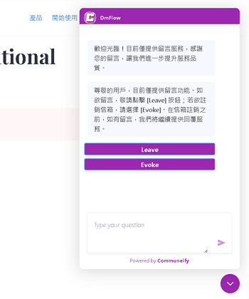

## Embedded Web Page Usage Guide

The use of embedded web pages can be categorized as plugin-style and full-screen, with the main difference being that the former requires activation through a button, while the latter is directly presented via an iframe in a full-screen window.



**Plugin Style**


**Full Screen**

Various customization options are currently supported, including frame color, header, and link settings.


You can limit the number of messages received per hour, allowing the system to pause messages after reaching a certain quantity. Please note that your website must be provided, and only HTTPS is supported. If using HTTP for local development, you can test with HTTPS using ngrok.


After saving the settings, copy and paste the generated script into your webpage to make it effective.


## Additional Code Settings

The code supports further customization of button color, language, and scene. If the scene is not filled in, it defaults to Main, and if the language is not specified, the original language is used.

```json
{
	"lang": "<lang>",
	"scene": "<scene>",
	"theme": {
		"button": {
			"backgroundColor": "#9c27b0"
		}
	}
}
```
Language code examples:
```
zh_TW, zh_CN, en_US, ...
```

With this guide, you can professionally leverage the embedded web page feature on your website.

## Contact Information

Email: <service@dmflow.chat>

DMflow.chat Official website: [DMflow.chat](https://www.dmflow.chat/en/)
(We changed our domain to www.dmflow.chat on 2024-05-18)