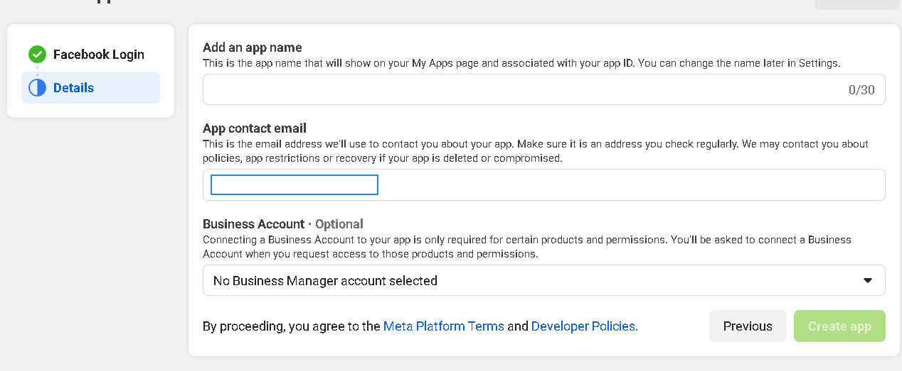
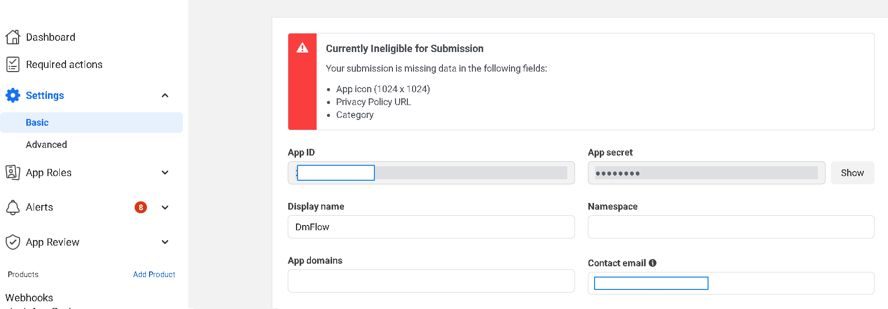
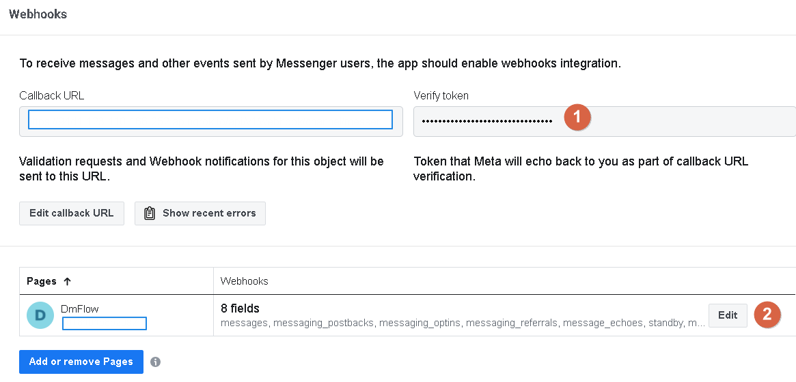
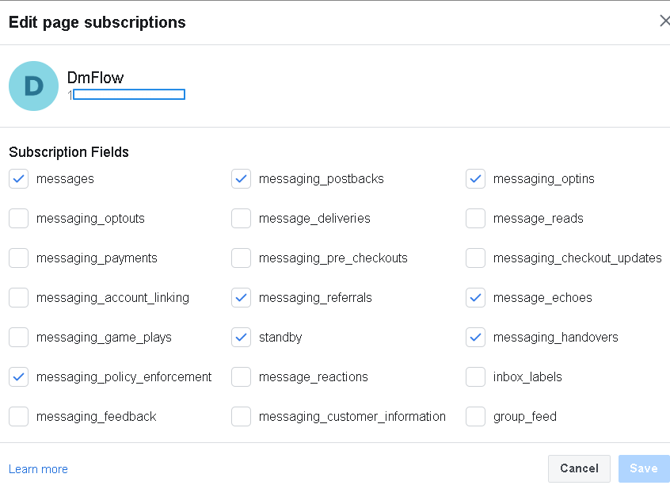
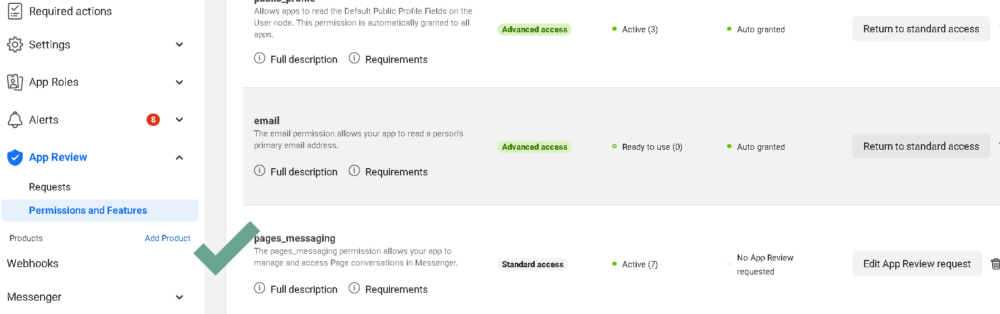

# Applying for Facebook API

# Architecture
DmFlow integrates with the Facebook server via API to publish the chatbot to Messenger and provide it to users for interaction.

## Facebook Server

Facebook provides various services that allow data exchange with DmFlow through API to communicate with Facebook's platform.

## API

API stands for Application Programming Interface, which specifies the rules for communication between software applications.

## Getting Started
To begin, you need a Facebook account. The following steps focus on application creation, configuration, and review.

## Application Creation
First, go to the Facebook Developers website and access "Apps"

[Apps](https://developers.facebook.com/apps/)is shown in the image below. Click on "Create App" to proceed.

Choose the purpose of the application (usually for commercial use) and provide basic information, such as APP Name and App Contact Email. Both can be saved and modified later.

Once created, as shown in Image 1, click on the newly created application to enter the Dashboard. Go to "Settings" -> "Basic."

The Application ID is referred to as "APP ID," and the Application Secret is the "APP SECRET."

## Configuration

Navigate to Products -> Messenger -> Settings to find the "Access Tokens" [PAGE ACCESS TOKEN]. Click on [3]. If you haven't created a Facebook Page, click on [2] to create one.

Click on [1] to edit "Callback URL" and provide the "Callback URL" and "Verify Token" [you can generate it automatically in DmFlow -> Bot -> Publish -> Keys]. Then, click [3] as shown in the image below to enable the required permissions.

## Review

To allow other users to access the chatbot, you need to publish and review the "pages_messaging" permission under Advanced Access for the Facebook Page.

