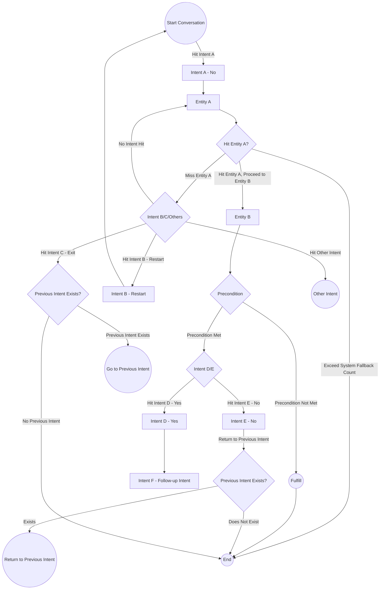

# Intents
Intents are divided into six main sections: Trigger Condition, Slots, Utterances, Interrupt Intent, Precondition, and Completion.

## Intent Types

### None

- General intent used for finding intents or populating entities.

### Restart

- When triggered, restarts the execution of the current intent.

### Exit

- When triggered, closes the execution of the entire intent.

### Yes

- In the precondition node, when the action is set to "Confirmation," affirming the intent is required to proceed to the next stage.

### No

- In the precondition node, when the action is set to "Confirmation," denying the intent will cancel the execution of the current state.

With these intent types, you can design different scenarios in your conversation flow, such as finding intents, restarting, exiting, yes, and no.

## Trigger Condition
The trigger condition requires filling in the following fields: Trigger Type, Starting Point, Operation, and Object.

- Trigger Type: Currently only supports "Slots" and "contexts".
  - contexts represents the result of a resource variable.
- Start: Choose between Slots or Normalization.
- Operation:Varies depending on the slot, including Filled, Not Filled, Equal To, Not Equal To, Greater Than, Less Than, and other operations.
- Object:Constant value.
- Or: Within the same group is AND, while different groups are OR.

By filling in these trigger conditions, you can define the conditions for triggering dialogue flow based on specific slot fillings or other conditions to trigger corresponding responses or actions.

### Prefix
- constant:Fill in a string, time (in seconds), or number. Numbers will be treated as numerical values.
- context:Assign values based on context parameters, such as resource return values or injected non-business resource parameters.
- entities:Entities.
- rangeTime: Date range, can be compared using weekdays or specific dates.
- config:Global parameters located in the domain management, serving as fixed variables

By filling in these fields, you can trigger specific dialogue flows based on conditions such as constants, context parameters, entities, date ranges, and more.

## Slots

Slots consist of Slot Name, Required, Inherited Slot,  and Inquiry.
- Slot Name: Add slot names from the "Display all slots in the domain" button.
- Referenced Dictionary: Set based on the standards of referenced dictionaries.
- Numeric Quantifier: When the slot question does not match the current slot, it needs to match the definition of the numeric quantifier to extract the slot.
- Required: Indicates whether the slot is required. If it is required, the slot will always be prompted. If not required, the slot will only be filled when there is corresponding information during questioning.
- Inherited Slot: When switching between different intents, if different intents have the same slot name, it will be overwritten.
- Inquiry: When a user asks a question and not all slots are filled, relevant slots will be queried. If the slot is not required, it will only be filled if there is corresponding information during questioning.
- Alias: If multiple slots reference the same entity, such as "departure time" and "arrival time" both referencing "location," aliases need to be used to differentiate them.

By filling in these slot-related items, you can create slots with characteristics such as slot name, referenced dictionary, numeric quantifier, requiredness, inherited slots, inquiry, and aliases.

## Utterances
Used for training the bot by simulating questions asked by users.

## Interrupt Intent
When the topic does not match the slot hit, it checks if there is an interrupt intent triggered. If so, it jumps to another intent.

## Precondition

Precondition includes the following elements: Trigger Type, Starting Point, Operation, Condition Group, and Object, which are similar to trigger conditions.

Each condition group has node actions.

Node actions include Confirmation and Jump. Confirmation actions are similar to interrupt intents but require including affirmations and denials. Jump actions directly jump to the specified intent.

## Completion
Completion includes the following elements: Trigger Type, Starting Point, Operation, and Object, similar to trigger conditions. 
Invoke Resource: 

- Parameters: Fill in according to the prompts.
- Return Values: Used for "Answer After Condition Is Met."

Others:

- Failure Response Block: Provides a response when the HTTP status is not 200 or when an error occurs.
- Reply Activation: Enables the "Answer After Condition Is Met" block.
- Answer After Condition Is Met: The dialogue to be answered when all "Trigger Conditions" are met and there are no errors.

### Answer After Condition Is Fulfilled

Entering "$" will provide a prompt. The syntax is the same as the previous template output.

# Continue Reading
- [Bot Introduction](../../tutorials/docs/bot-intro.html)

## Contact Information

Email: <service@dmflow.chat>

DMflow.chat Official website: [DMflow.chat](https://www.dmflow.chat/en/)
(We changed our domain to www.dmflow.chat on 2024-05-18)
