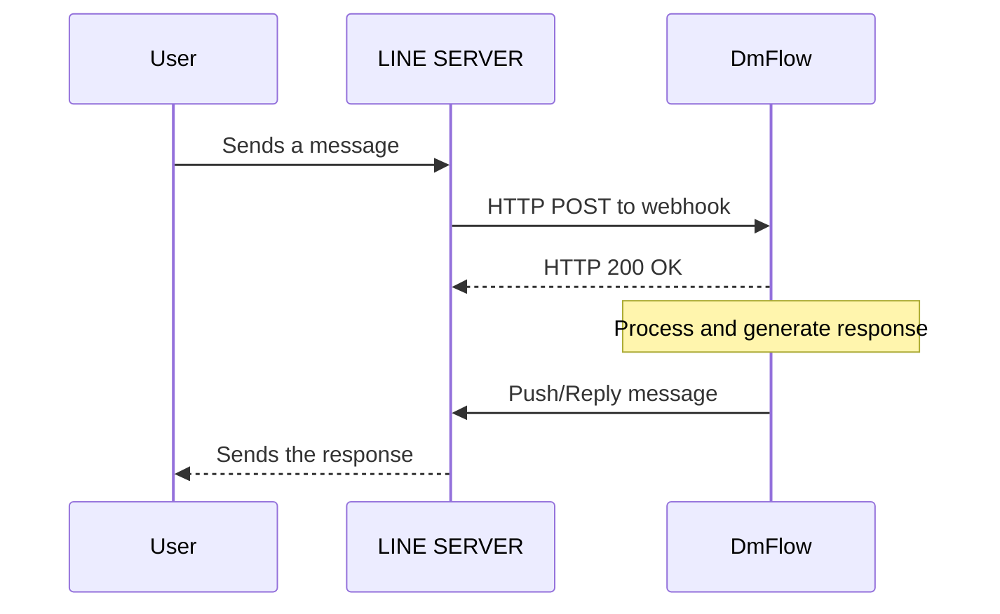
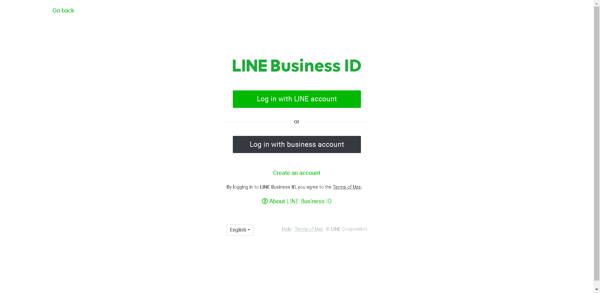
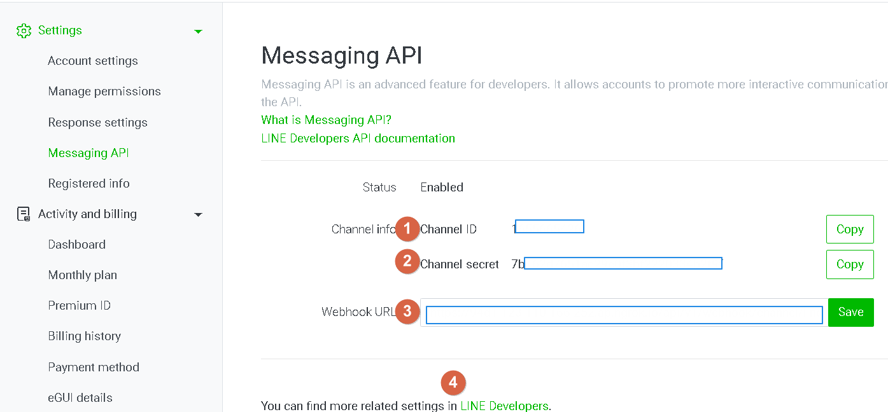
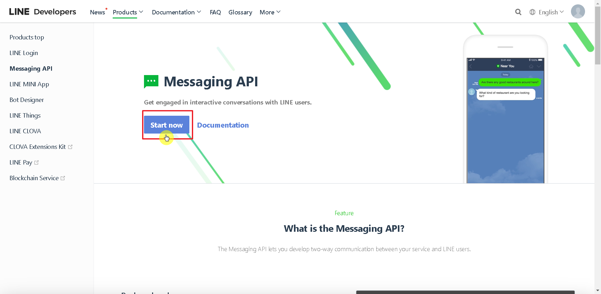
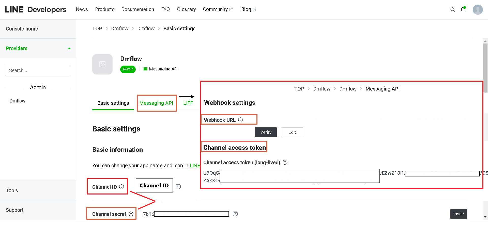

# Applying for LINE API

# Architecture
DmFlow integrates with the LINE Server via API to provide a chatbot for users.

## LINE Server

LINE provides various services that can be accessed through DmFlow for data exchange.

## API

API stands for Application Programming Interface, which allows communication between different software applications.

## Getting Started
First, you need to have a LINE account. Visit [LINE Business ID](https://account.line.biz/login)

### Login with LINE Account
You can use your regular LINE user account to log in.

### Login with Business Account
If you have a business email account, you can apply using that. Provide the account name, email address, company name, and business category (description of your business). After filling in the details, the application will be completed.

## Configuration

If the Messaging API is not enabled, go to Settings -> Messaging API and click on "Enable Messaging API". Enter the service provider name (you can name it as per your business; it can be changed later), and fill in the Privacy Policy URL and Terms of Use URL (optional). Confirm the details and click "OK".

- 1.Channel ID
- 2.Channel Secret
- 3.Fill in the Webhook URL.
- 4.Proceed to LINE Developers for the next steps.

### LINE Developers

Clicking on the LINE Developers link will take you to [LINE Developers](https://developers.line.biz/en/). Follow the steps shown in the screenshots below.

You will obtain the Channel ID, Channel Secret, and Channel Access Token. Fill in the Webhook URL, and you are done.
