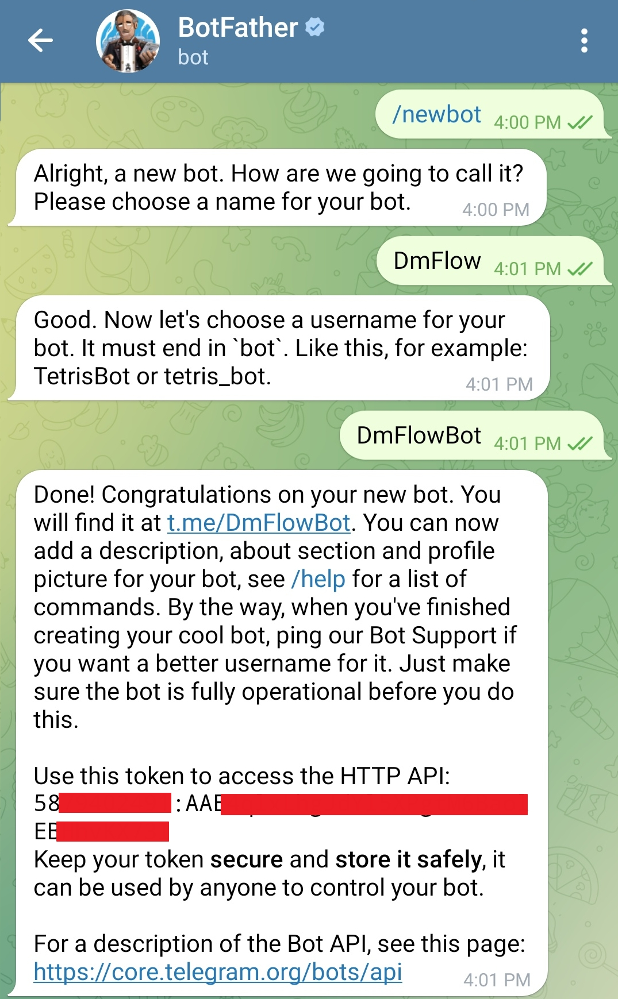

# Apply for a Telegram bot

To create a new bot on Telegram, follow these steps:

- Open the Telegram app on your device.
- Search for the "BotFather" bot in the search bar.
- Start a chat with BotFather by clicking on it and then clicking the "Start" button.
- Type "/newbot" in the chat with BotFather to create a new bot.
- Follow the instructions provided by BotFather. It will ask you to provide a name for your bot (e.g., "MyNewBot") and a unique username for your bot (e.g., "@MyNewBot").
- Once you have provided the required information, BotFather will generate an API token for your bot. Make sure to keep this token secure as it is used to access the Telegram Bot API.
- Your new bot is now created. You can access and manage its settings through BotFather's chat or by using the generated API key to interact with the Telegram Bot API.

The token is covered by a red box in the image below. Please copy the token.

If you want to receive all messages in a group, you can follow these steps. By default, only messages starting with the command "/" are received.

To configure your Telegram integration in the DmFlow system, select your bot, go to Settings -> Third-Party Integrations -> Telegram. Enter the numeric portion of the token before the colon (:) in the APP_ID field, and enter the complete token "58XXXXXXXX:AAEXXXXXXXXXXEBXXXXXXX" in the token field. Select "Enable" and save. The system will verify if the provided information is correct.

