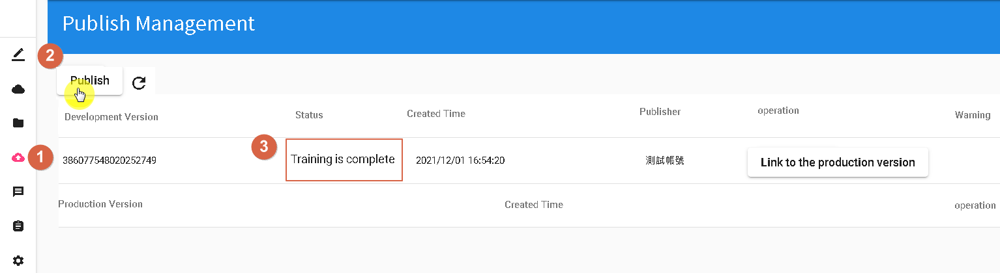
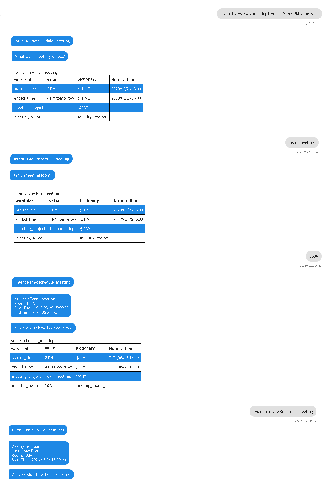

# Publish and Test
- 1.Click on the "Publish Management" tab in the left sidebar.
- 2.Click on the "Publish" button until the status shows "Training Completed" (step 3 in the image below).

- 3.Once the training is completed, click on the "Test" tab in the left sidebar.

- 4.You can now engage in a conversation and test your bot's responses.

By following these steps, you can publish your bot and perform simple conversation testing.

## Contact Information

Email: <service@dmflow.chat>

DMflow.chat Official website: [DMflow.chat](https://www.dmflow.chat/en/)
(We changed our domain to www.dmflow.chat on 2024-05-18)