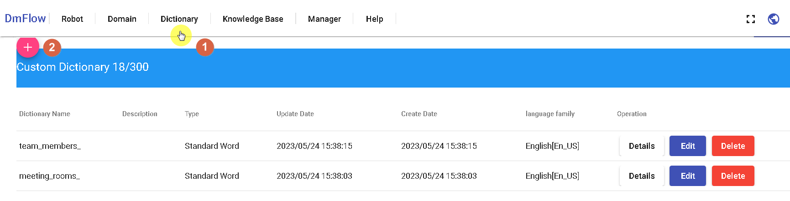
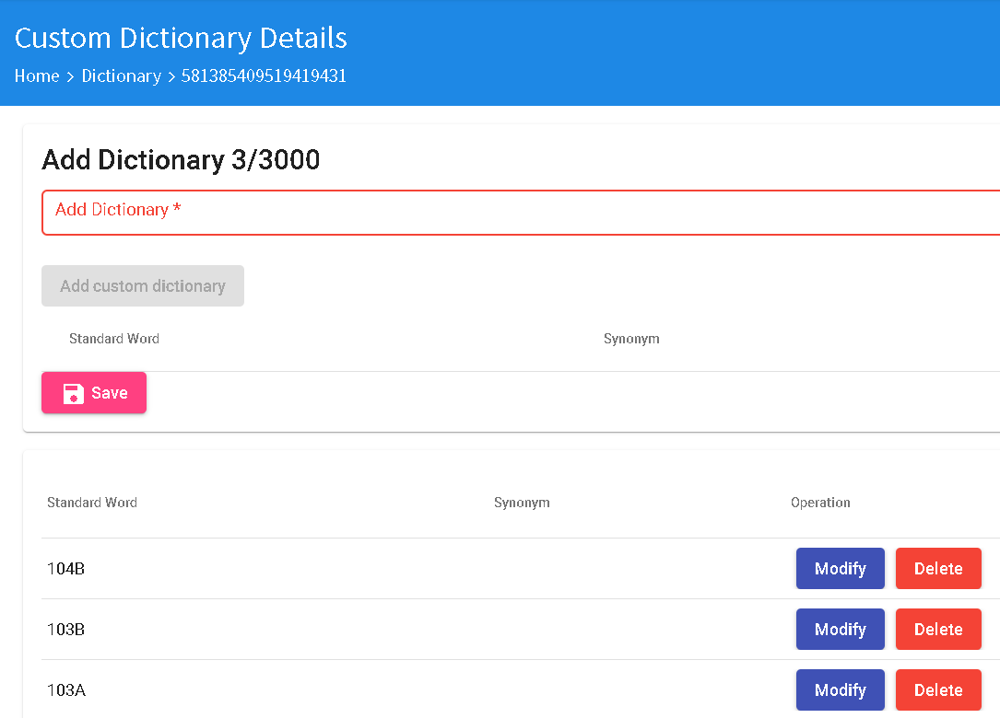
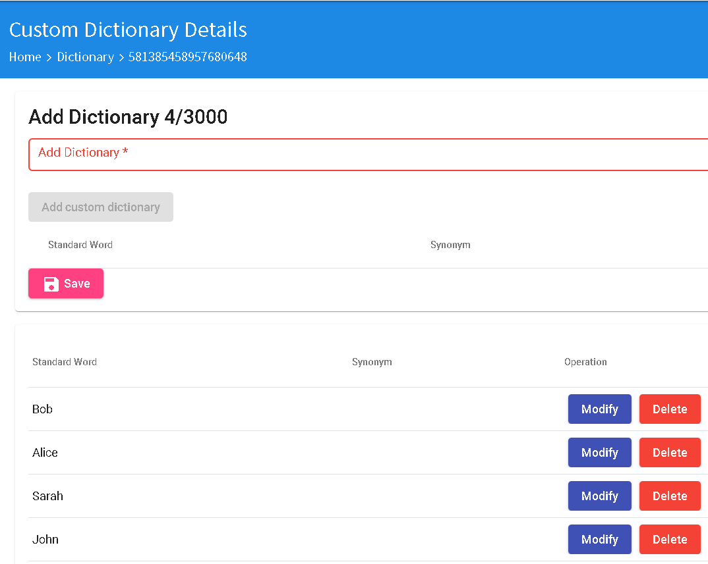

# Building Requirement Dictionaries

Click on "Dictionary" at [1], then click on the button [2] to create a new custom dictionary. Create two dictionaries: "meeting_rooms_" and "team_members_".

For the "meeting_rooms_" dictionary, click on the "Details" button. Add entries such as "103A", "103B", "104B", or any other room names as needed. See the image below.

For the "team_members_" dictionary, click on the "Details" button. Add names such as "John", "Sarah", "Alice", "Bob", or any other names as needed. See the image below.

# NEXT
- [Individual Intent Content](../../tutorials/intro/distinct-content.html)
