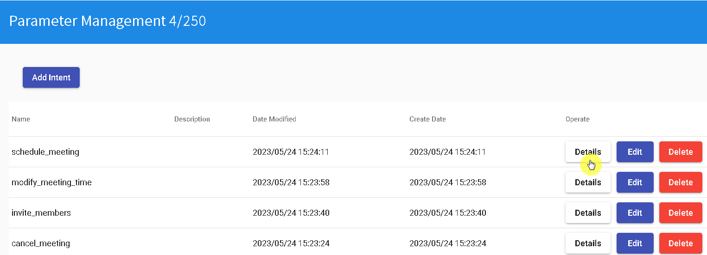
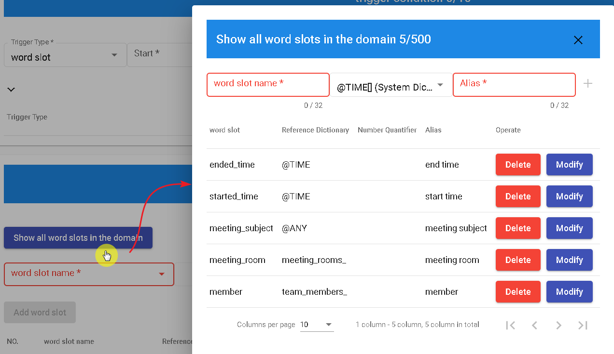
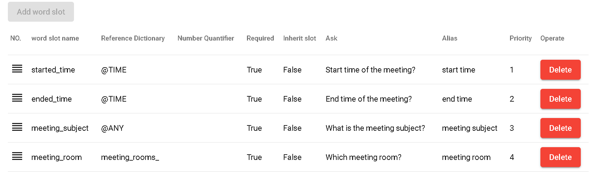
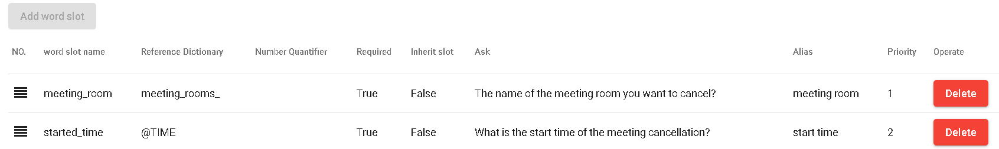
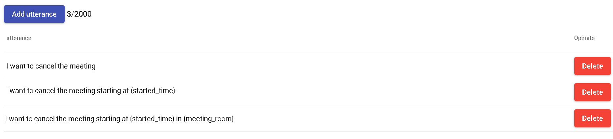
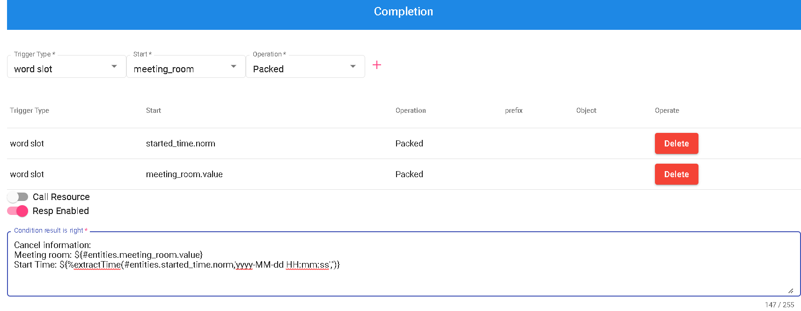
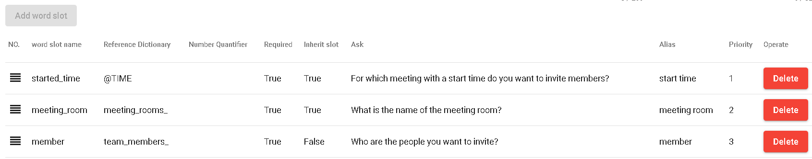
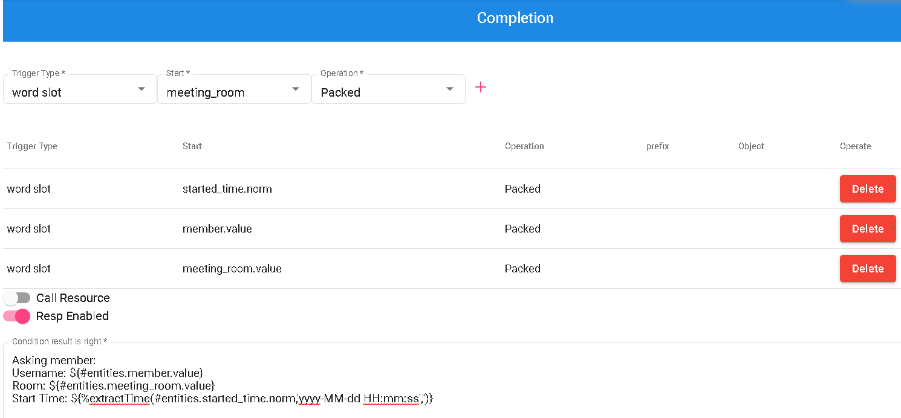
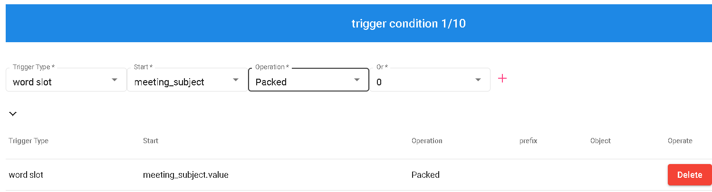

# Individual Intent Content
## Schedule Meeting
First, let's go to the "schedule_meeting" section and click on "Details".

Next, create five domain slots as shown in the image below: "member", "meeting_room", "meeting_subject", "ended_time", and "started_time".

Create four slot groups for the slots: started_time, ended_time, meeting_subject, and meeting_room.

Add the following sample dialogues: "Reserve a meeting room {meeting_room}", "I want to reserve a meeting", "I want to reserve a meeting from {started_time} to {ended_time}".

Fill in the "Completion" field as shown below to complete the "Schedule Meeting" intent.

## Cancel Meeting

Go to the "Cancel Meeting" section and click on "Details".

Create two slot groups for the slots: started_time and meeting_room.

Add the following sample dialogues: "I want to cancel the meeting starting at {started_time} in {meeting_room}", "I want to cancel the meeting starting at {started_time}", "I want to cancel the meeting".

Fill in the "Completion" field as shown below to complete the "Cancel Meeting" intent.

## Invite Members

Go to the "Invite Members" section and click on "Details".

Create three slot groups for the slots: started_time, meeting_room, and member.

Add the following sample dialogues: "Invite {member} to the meeting at {started_time}", "I want to invite {member} to the meeting".

Fill in the "Completion" field as shown below to complete the "Invite Members" intent.

## Modify Meeting Time

Go to the "Modify Meeting Time" section and click on "Details".

he trigger condition should meet the requirement of "Meeting subject is packed", as shown below.

Create two slot groups for the slots: start_time and end_time.

Fill in the "Completion" field as shown below to complete the "Modify Meeting Time" intent.

# NEXT
- [Publishing and Testing](../../tutorials/intro/deploy-test.html)
