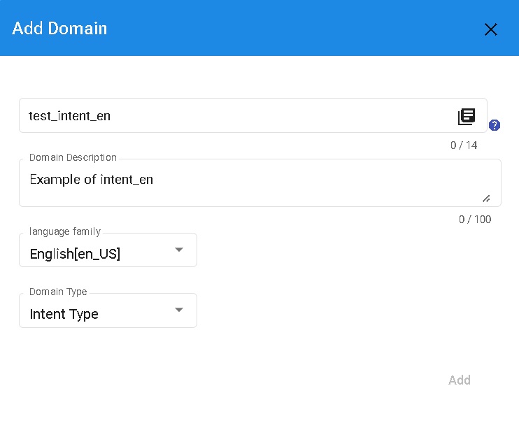
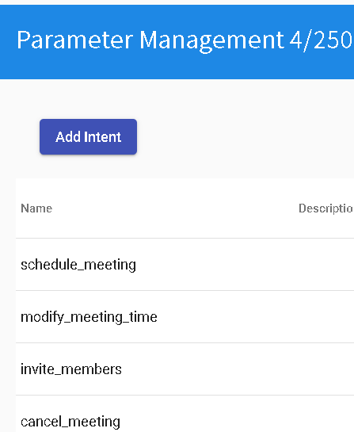

# Creating Intent Domains

First, create a domain and set the domain type to "Intent-based", as shown in the following image.

Create intents for "cancel_meeting", "invite_members", "modify_meeting_time", and "schedule_meeting". Set the intent type to "None". See the image below:

# NEXT
- [Entity Logical Thinking](../../tutorials/intro/entity-logical.html)

## Contact Information

Email: <service@dmflow.chat>

DMflow.chat Official website: [DMflow.chat](https://www.dmflow.chat/en/)
(We changed our domain to www.dmflow.chat on 2024-05-18)