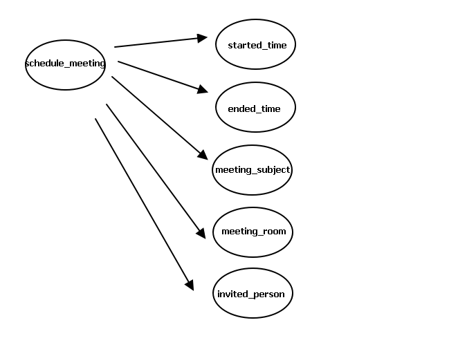

# Entity Logical Thinking

When creating the following intents, it is helpful to consider the entities required for these intents. Entities will be the data we collect. See the image below:

We can divide them into the following entities:

- schedule_meeting -> started_time, ended_time, meeting_subject, meeting_room
- cancel_meeting -> started_time, meeting_room
- invite_members -> started_time, meeting_room, invited_person

# NEXT
- [Building Requirement Dictionaries](../../tutorials/intro/dict-create.html)