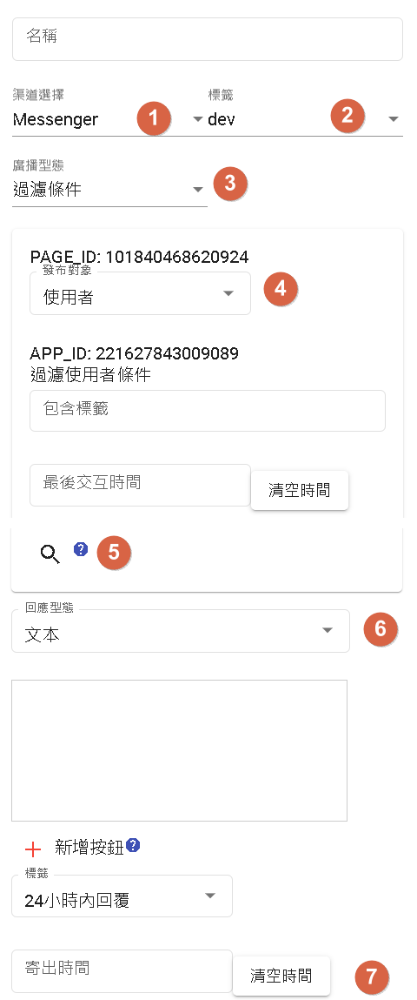

# 廣播

廣播用於向使用者群體發送批量訊息。它可以被廣泛應用於再行銷、推廣活動、通知更新等方面。以下是廣播功能的一些特點和用途：

- 批量發送訊息：廣播功能允許您一次性向多個使用者發送訊息，節省時間和工作量。您可以選擇特定的使用者群體或整個使用者基礎進行廣播。

- 提高覆蓋範圍：通過廣播功能，您可以將訊息傳達給廣大使用者，提高訊息的覆蓋範圍和可見性。這有助於推廣活動、新產品發布或重要公告的傳達。

- 再行銷和推廣：廣播功能是再行銷的有力工具，您可以向之前表現興趣的使用者發送相關的優惠、促銷或重要訊息，以提高使用者轉化率和參與度。

- 重要通知和更新：廣播功能還可用於發送重要通知和更新，如系統變更、服務中斷通知或政策變更等。這確保使用者及時了解最新訊息，並提供必要的指導。

- 個性化廣播：一些機器人平台提供個性化廣播功能，根據使用者的標籤，將定制化的訊息發送給不同的使用者群體，提供更個性化的體驗。

## 介紹

1. 渠道目前支援LINE、Messenger、Telegram
2. 標籤為dev(開發版)以及prod(生產版)
  - 開發版為測試版。
3. 過濾型態：
  - 過濾條件：可根據標籤以及最後交互時間去過濾要傳送的使用者。
  - 自行註冊：運用資源節點去跟DmFlow的API做交互，可以讓使用者自行註冊事件。
4. 發布對象：使用者以及群組
　- 群組：僅能使用LINE、Telegram，會發佈到所選擇的群組。
5. 查詢該過濾或註冊的使用者人數。
6. 回應型態，可以支援文本以及圖片，新增按鈕可以提供選項做選擇按鈕。
7. 寄出時間：可根據指定時間寄送。
　　　

# 接著讀
- [發布](../../tutorials/docs/bot-published.html)