# 機器人範例

簡單設計招募機器人步驟。

## 規劃

首先先規畫要做什麼、怎麼做。

- 確定面試過程需要收集的資訊：
  - 考慮面試過程中需要收集的各種資訊，例如個人資料（姓名、聯絡方式）、求職問題、心理測驗或簡單測驗等。
- 決定資訊的分類方式：
  - 根據資訊的性質和用途，將其分類到適當的節點類型中。例如，個人資料可以放在意圖型中，求職問題可以放在問答對或知識庫中，而心理測驗則可以使用機器人流程設計或意圖型。
- 考慮意圖型和實體：
  - 如果您決定將某些資訊放在意圖型中，則需考慮是否需要建立相應的意圖和實體。例如，如果您希望收集求職者的教育背景，可以建立一個「教育背景」意圖，並為該意圖創建相關的實體（例如學校名稱、學位等）。
- 設計機器人流程：
  - 對於特定的流程或問題集，您可以使用機器人流程設計來指導面試過程。這可能涉及對問題的提問和收集回答、根據回答進行相應的路由、給予回饋或指示等。確保您設計的流程能夠順利引導面試過程並收集所需的資訊。

### 步驟一 建立問答對

在問答對節點中，點擊「新增問答對」，建立問答對庫。
- 1.在「問題」欄位中輸入問題，例如job_openning「工作機會」。
- 2.在「回答」欄位中輸入相應的回答或指示，例如「轉向 job_openning」。
- 3.繼續新增其他問答對，例如「福利待遇」、「公司文化」、「介紹JAVA工程師」和「面試JAVA工程師」，並填入相應的回答或指示。
  - 福利待遇[文本 準時付薪水]
  - 公司文化[文本 做客戶喜愛且有用的產品]
  - 介紹JAVA工程師[轉向 describe_java]
  - 面試JAVA工程師[轉向 java_test]
- 4.在右上角的「問答對領域」選單中，點擊「新增領域」。
- 5.給這個問答對領域取名為「hire_faq」（或任意您喜歡的名稱）。
- 6.在「問答對節點」中，選擇剛剛建立的問答對領域「hire_faq」。

這樣就建立了一個問答對庫並連結到問答對領域「hire_faq」。您可以根據需求繼續新增其他的問答對和領域。

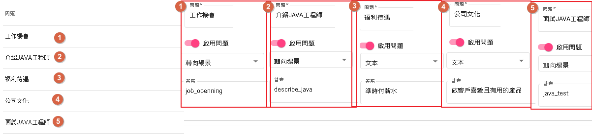

### 步驟二 建立意圖

我們將新增一個名為 "hire_int" 的意圖類，並在其中添加以下意圖：

- 1.意圖："greeting"，表示招呼意圖。可以包含一些招呼的說法，例如 "hi"、"你好"、"嗨"、"開始" 等。
- 2.意圖："basic_info"，表示取得測試者的基本資料。您可以設定需要的實體，以下是一些常見的基本資料實體：
  - 測驗者姓名
  - 測驗者來自
  - 工作年資
  - 教育程度
  - 系所
- 3.意圖："interview"，問一些面試有關的問題，例如：
  - 優勢
  - 劣勢
  - 工作/就業有遇到什麼困難地方
  - 應徵原因
  - 是否有離職
- 4."resign_bool"，表示離職意圖。您可以問測試者是否有離職的意願，例如問題可以是 "你是否考慮離職？"，測試者可以回答 "是" 或 "否"。

| 詞槽名     | 辭典名稱      | 說明
|-------     | ---------     |------
| name       | @ANY          | 測驗者姓名
| location   | @ANY          | 測驗者來自
| work_years | @NUM(量詞:年) | 工作年資
| education  | @ANY          | 教育程度
| college    | @ANY          | 就讀大學
| department | @ANY          | 系所

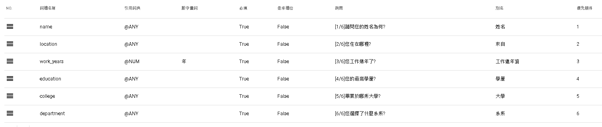

interview為一些基本問題，需要的實體為

| 詞槽名       | 辭典名稱      | 說明
|-------       | ---------     |------
| advantage    | @ANY          | 優勢
| disadvantage | @ANY          | 劣勢
| difficult    | @ANY          | 工作/就業有遇到什麼困難地方
| apply        | @ANY          | 應徵原因
| hire_reason  | @ANY          | 聘用原因
| resign_bool  | @ANY          | 是否有離職

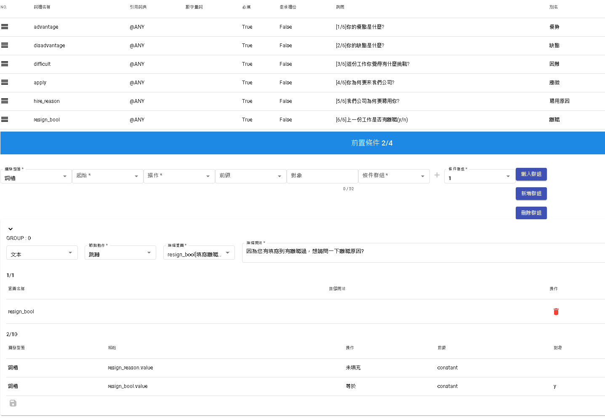

resign_bool為可選意圖，目的只是為了假設應聘者選取了有離職過，會加以詢問離職原因。

| 詞槽名          | 辭典名稱      | 說明
|-------          | ---------     |------
| resign_reason   | @ANY          | 離職原因

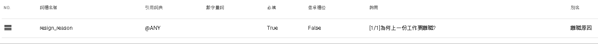

當完成意圖們後，記得進入發布做生產發布，才能供給機器人流程使用。

假設需要測試，可在basic_info中的說法填寫「基本資料」，interview中的說法填寫「自我介紹」。

測試頁面輸入「基本資料」或是「自我介紹」即可測試。

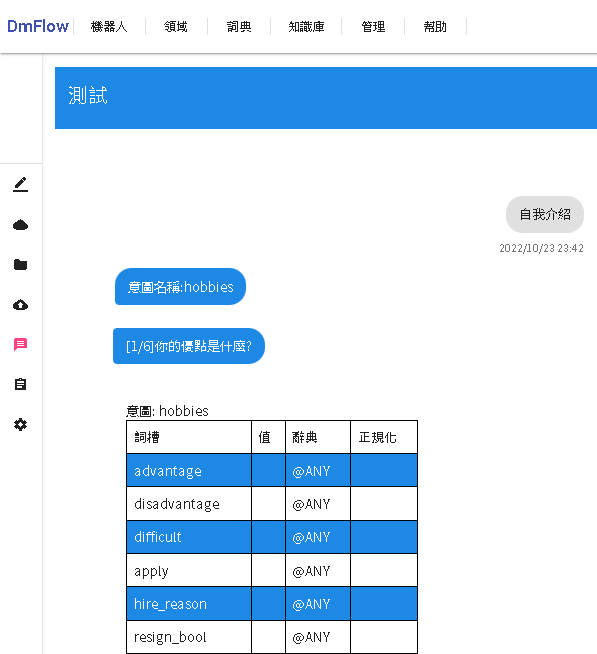

### 步驟三 機器人流程建置

1.建立名為 "hire_bot" 的機器人。

2.在記憶模板中，新增使用者參數 "email" 和單一會話儲存 "score"。

- email 當完成基本資料以及測試後，會需要對方提供email。
- score 則為JAVA試驗成績。

3.進入全局設定 -> 領域，將 "hire_int" 和 "hire_faq" 加入並啟用。

4.進入全局設定 -> 場景，新建 "job_openning"、"java_test" 和 "describe_java" 三個場景。

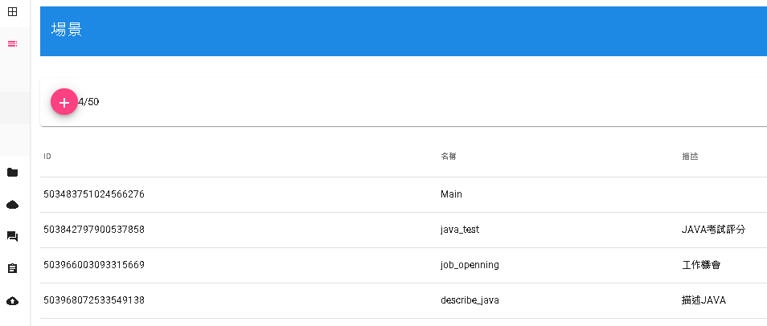

5.開始設計對話流程，根據以下步驟進行：

  - 1.選擇場景 "Main"，點擊 "start" 節點，並設定預載領域 (意圖) 為 "hire_int"。
  - 2.新增一個回覆節點，輸入以下文字並勾選 "等待用戶回覆"：

> 請問您需要什麼幫忙?
>
> 工作機會
>
> 公司文化
>
> 福利待遇

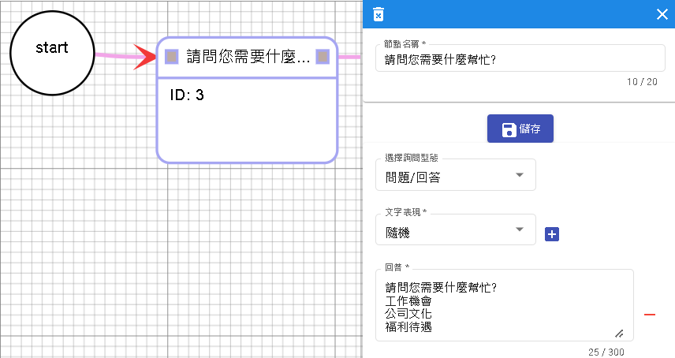

  - 3.將開始節點與回覆節點連接起來，並設定分支條件為 "intent 等於 greeting"。

  - 4.新增一個調用節點，選擇 "hire_faq"。將上一個回覆節點 (請問您需要什麼幫忙...) 節點連接到此節點，並選擇 "無條件" 分支條件。

  - 5.新增一個情境節點，選擇跳轉至回覆節點 [請問您需要什麼幫忙...]，並與調用節點 "hire_faq" 連接，選擇 "無條件" 分支條件。

6.根據上述步驟，我們已經完成了 "Main" 情境的設置。

說明

- 開始節點的設定使用了 "intent=greeting"，這樣可以將對方詢問 "你好、hi" 等類似的問候語納入對話流程中。而如果沒有命中任何意圖，系統將跳出 "未命中的回答"，您可以在後續的節點中添加其他回應，以使對話更加完善。
- 使用 "call hire_faq" 節點可以節省許多 if-else 的判斷流程。當命中 "工作機會" 意圖時，系統會跳轉到 "job_openning" 情境，而對於 "公司文化" 和 "福利待遇"，則直接顯示相應的文本回應，而無需進行額外的處理。
- 最後的跳轉節點的設置非常重要。無論是文本回應還是打斷跳轉，最終都需要回到詢問句的節點，這樣才能繼續進行後續的對話。請確保在設計流程時，考慮到這一點，以確保流程的連貫性和順暢性。

7.進入job_openning的情境，在開始節點的詢問填寫以下。

>  目前有開放職位包含以下
>
>  介紹JAVA工程師

8.新增節點"調用節點"，選擇hire_faq。並將上一個start節點跟此節點連線選擇"無條件"。

說明

- 開始節點說明"介紹JAVA工程師"會透過hire_faq讓節點前往情境describe_java。而使用者詢問公司文化等問題也會一併回答，如果想只專注於"介紹JAVA工程師"可將無條件改為有條件去限制詢問。

9.進入describe_java的情境，在開始節點的詢問填寫以下。

> JAVA工程師目的在於維護與開發DmFlow相關產品。
>
> 面試JAVA工程師

10.新增節點"調用節點"，選擇hire_faq。並將上一個start節點跟此節點連線選擇"無條件"。

11.進入java_test的情境，在開始節點的詢問填寫以下。從java_test情境我們可以介紹流程如何取代意圖或是知識庫。

> 我們將會根據[1]填寫個人資料[2]工作偏好[3]JAVA基本問題 依序填寫。
>
> 請輸入"準備好了"開始。

12.將流程分為三大區塊分為個人資料、面試基本問答，以及測驗。

下圖紅框是個人資料，藍框是基本問答。

下圖是測驗的全流程圖。

13.先新增回覆節點，輸入以下文字。，並連結start節點，條件可以選擇無條件或是有條件query=準備好了。

> 面試開始前我們先了解您的個人資料
>
> 輸入"準備好了"開始

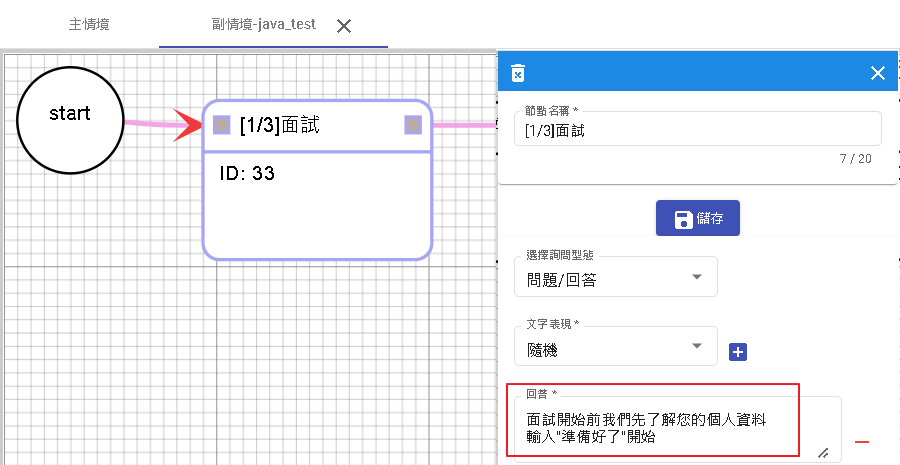

14.建立"調用節點"，領域選擇hire_int，意圖選擇basic_info。與先前的"[1/3]面試"連線條件可以選擇無條件或是有條件query=準備好了。

15.建立"回覆節點"，輸入以下文字。與調用節點[收集個人資料]做無條件連線。

> 為了瞭解您的工作偏好，請回答以下問題?
>
> 輸入"準備好了"開始問答

16.建立"調用節點"，領域選擇hire_int，意圖選擇interview。與先前的"[2/3]面試"連線條件可以選擇無條件或是有條件query=準備好了。

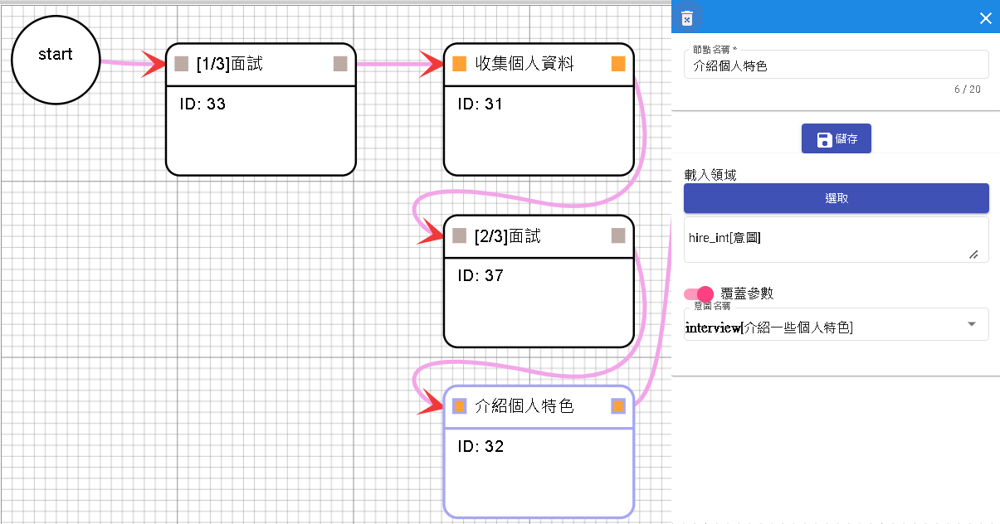

17.建立"回覆節點"，輸入以下文字。與調用節點[介紹個人特色]做無條件連線。

> 我們將考你一些關於JAVA的問題，請輸入"準備好了"開始作答。

18.新增"變數節點"，並將score歸零，並與先前節點連線，條件為無條件。

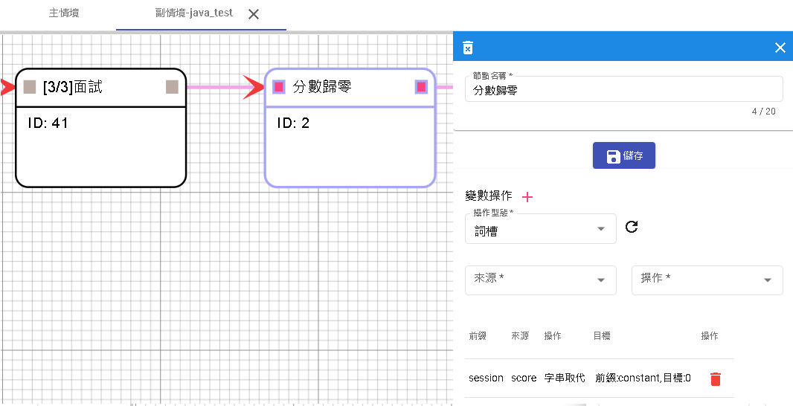

19.分別創建題目，題目為選選擇題，答對了加分，答錯繼續下一題。先建立"回覆節點"並跟先前"變數節點"連線，條件為無條件，回覆節點可採取選擇按鈕方式則不用用戶輸入訊息。

> 以下哪一個不是設計模式?
>
> 享元模式(Flyweight Pattern)
>
> 單例模式(Singleton Pattern)
>
> 策略模式(Strategy Pattern)
>
> 生產鏈模式(Factory Method Pattern)
>
> 我不知道

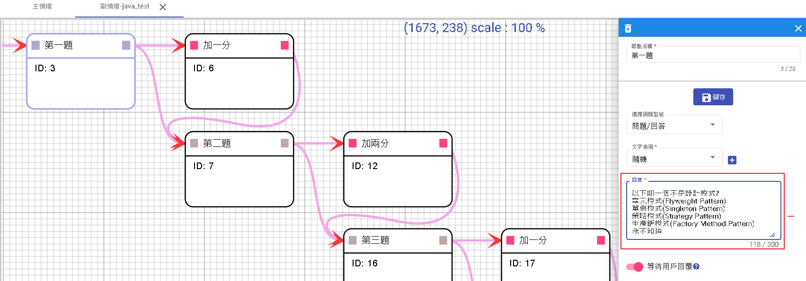

20.當正確答案等於[query|等於|constant|生產鏈模式]時，進入加分"變數節點"，並與前面"回覆節點"一起無條件連接到下一題。

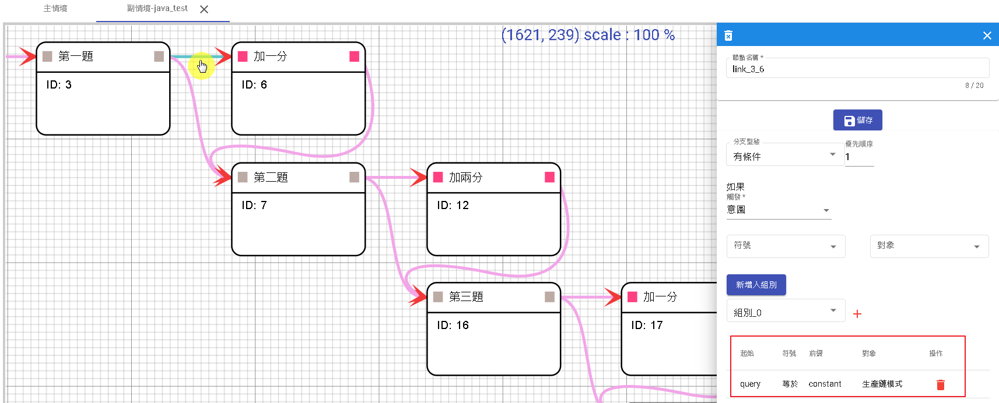
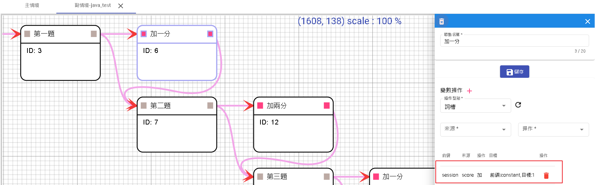

21.第二題到第四題重複步驟19-20分別是

第二題

> 下面哪個流類屬於字符的輸入流?
>
> BufferedWriter
>
> FileInputStream
>
> ObjectInputStream
>
> InputStreamReader

有條件[query|等於|constant|InputStreamReader]

第三題

> 下面關於數組聲明和初始化語法哪句有錯誤?
>
> A. int a1[]={3, 4, 5};
>
> B. String a2[] = {"string1", "string1"};
>
> C. String a3[]=new String(3);
>
> D. int[][] a4 = new int[3][3];

有條件[query|等於|constant|C]

第四題

> Java的集合接口有java.util.Collection定義了很多方法。選項中哪個不是其定義?
>
> A. int size()
>
> B. boolean containsAll(Collection c)
>
> C. compareTo(Object obj)
>
> D. boolean remove(Object obj)

有條件[query|等於|constant|C]

22.新增一個回覆節點"總得分"並新增以下文字。

> 你總共得到了 分數為: ${#session.score} / 6分，測驗已結束，我們會再通知您，可否填寫您的email

23.新增變數節點儲存email

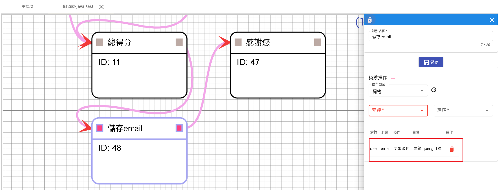

24.並在最後新增回覆節點，文字如下，且必須關閉"等待用戶回覆"。關閉等待用戶回覆目的是這句話算是結束，如果開啟則會等待用戶問話。

> 感謝您的填寫，我們會盡快給你答覆。

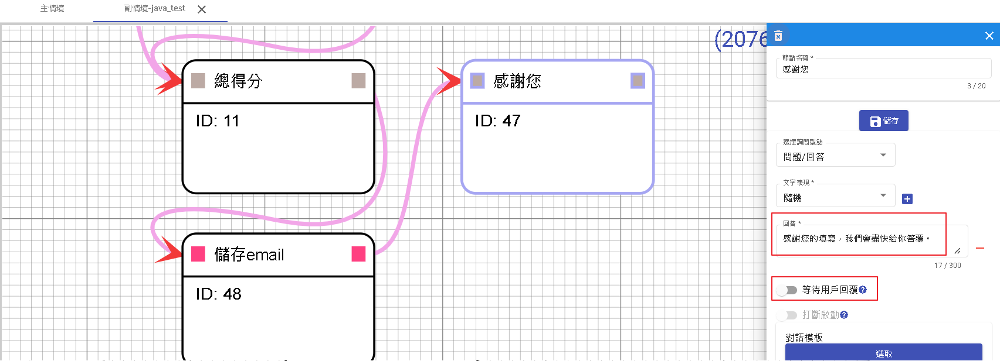

### 完成

做完以上流程，就大概完成招募機器人的基本設置。

當完成設置後，別忘了點選[1]儲存或[2]更新。

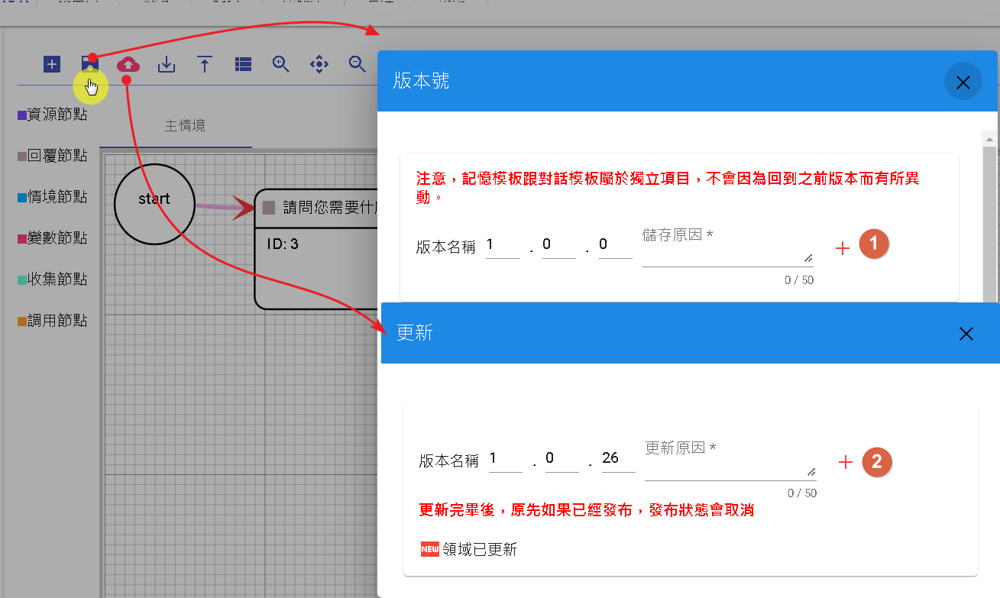

並打開保存->編輯->勾選是否發布->更新，完成後就可以進行對話測試了。

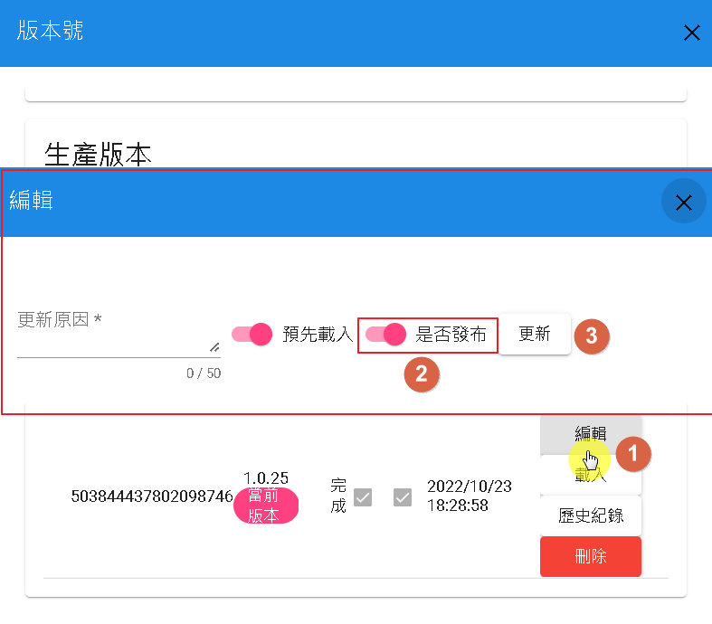

開始測試。

# 接著讀
- [日誌](../../tutorials/docs/bot-log.html)