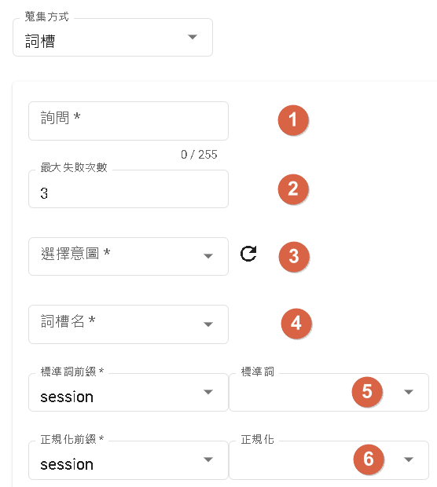
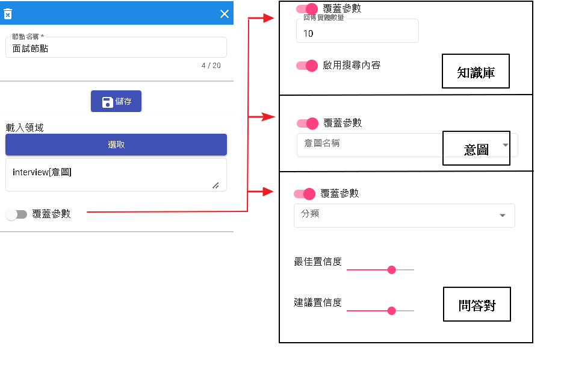

# 對話流程

基於流程式的基本對話是一種用來補足領域式對話限制流程缺點的方法。領域式對話通常以領域為基礎，限制在特定領域內的知識和對話流程。然而，這種限制可能無法處理某些特殊情況或未知的用戶輸入。

基於流程式的基本對話則提供了一種靈活的方法來處理未知情況。它不依賴於特定的領域知識，而是根據預定義的對話流程進行回應。這種方法通常用於處理常見問題、回答常見疑問或提供通用的指導。

基於流程式的基本對話可以根據不同的用戶輸入和上下文進行相應的回應。它可以提供預先定義的回答、選項選擇或引導用戶進行特定操作。此外，您還可以根據用戶的回應進行條件判斷和跳轉，以實現更豐富的對話流程。

使用基於流程式的基本對話可以彌補領域式對話的限制，提供更靈活和廣泛的對話處理能力。這樣可以確保對於各種用戶輸入和場景需求都能有合適的回應，提升對話機器人的使用體驗和功能延展性。

## 優點

- 圖示化展示：使用圖形化界面可以更直觀地了解節點之間的關係和位置。透過視覺化的方式，使用者可以更清楚地理解對話流程的結構和邏輯。
- 拖曳式節點：相對於傳統的命令行界面（CLI）方式撰寫對話機器人的程式碼，拖曳式節點的設計更適合一般使用者。使用者可以直接拖曳節點並設定其屬性，而不需要編寫程式碼，使得構建對話流程更加方便和容易上手。


- 1.新流程:用於重置當前流程，將所有設定恢復為原始狀態，包括情境和節點。
- 2.保存:新增、載入版本流程的功能，用於保存和管理不同版本的流程。
- 3.更新:用於更新當前版本的流程，可以根據需要進行修改和調整。
- 4.挑選情境:透過彈出視窗可以新增、更新、刪除和選擇情境，方便管理和配置對話流程中的情境。
- 5.-7. 用於調整畫布的大小和顯示比例，以及將畫布歸位到起始節點的位置。
- 8.全局設定:提供了一些全局選項，可以重新載入並設定對話機器人的相關選項。
- 9.全螢幕：切換到全螢幕模式，以便更好地檢視和編輯對話流程。
- 10.模板:提供了記憶模板和對話模板，用於快速構建和設定對話流程。
- 11.測試:用於測試當前的對話機器人流程，確保其正確運作並符合預期。
- 12.暫存流程:當處理其他任務時，可以暫時存儲當前流程的快取，以便稍後繼續操作。
- 13.節點設定:用於設定不同節點的相關屬性，例如資源、回覆、情境、變數、收集等，以便定製和配置對話流程的行為和邏輯。

## 保存


- 1.新增新的版本：使用此功能可以創建一個新的版本，以便進行對話流程的更新和修改。
- 2.版本屬性：在創建新版本時，可以填寫版本名稱、狀態、更新原因、預先載入和發布設置等屬性。
    - 版本名稱：為新版本指定一個唯一的名稱。
    - 狀態：表示版本的狀態，完成代表修改已經完成並成功。
    - 更新原因：描述該版本的更新內容或原因。
    - 預先載入：指定是否在創建版本時預先載入特定的設定或資料。
    - 是否發布：設定是否將該版本發布，以便應用於實際使用中。
- 3.編輯版本：可以編輯已存在的版本，包括重新撰寫更新原因、修改預先載入設定以及更改是否發布的狀態。
- 4.載入選中版本腳本：使用此功能可以載入選中版本的對話流程腳本，以便進行編輯和修改。
- 5.瀏覽歷史紀錄：查看過去版本的歷史紀錄，可以查詢和比較不同版本之間的變更和修改。

### 預先載入

預先載入：當您的版本中勾選了「預先載入」選項，那麼在第一次進入對話流程畫布時，將優先載入該版本的腳本，而不是最新日期的腳本。這可用於指定特定版本的腳本在一開始就被使用，以達到更細緻的流程控制。

### 是否發布

是否發布：當您的版本中勾選了「是否發布」選項，表示該版本將被發布為「開發版本」，可以用於測試。開發版本通常是用於測試新的功能、修復問題或進行其他開發工作。藉由將版本標記為「開發版本」，您可以區分測試版本和正式生產版本，確保正式生產版本的穩定性。

## 測試


- 1.輸入詢問句：在測試界面中，您可以輸入要進行測試的詢問句，以檢查對話流程的回應。
- 2.測試情境流程：您可以直接測試特定情境的對話流程，這樣您可以模擬使用者在特定情境下與機器人的互動。
- 3.平台回話方式：您可以根據所選的視角選擇不同平台的回話方式，這可以幫助您模擬不同平台上的對話體驗。
- 4.測試生產版版本：使用此功能可以測試已發布的生產版本，以確保它在實際環境中的運作正常。
- 5.業務資源服務：您可以選擇是否啟用業務資源服務。如果啟用，則相應的資源節點將被調用以進行業務邏輯的交互。
- 6.模擬參數：如果您不啟用業務資源服務，您可以在這裡填寫模擬的參數，以模擬實際資源請求中的參數。
- 7.刷新頁面：使用此功能可以重新載入測試頁面，以便清除之前的測試結果和設定，並開始新的測試。

# 節點介紹

## 開始節點

作為該情境全局節點，影響所有節點。<br>

- 1.詢問節點：用於開場問話，是對話流程的起點，可以設定初始的問句或問題。
- 2.模式節點：分為一般模式和喚醒模式。喚醒模式需要用戶輸入特定的「喚醒句」才會進入後續的流程。
- 3.預載領域節點：此節點必須為意圖型節點，用於在後續的收集節點中使用。它可以預先載入一個特定的領域，以便後續的流程中能夠使用該領域的資訊。
- 4.使用預載領域節點：這個節點顯示了如何使用「預載領域」節點中預先載入的領域。這樣可以確保在該節點中可以使用領域相關的資訊進行操作。
- 5.對話模板節點：這個節點包含了不同渠道的模板。它用於根據不同的渠道提供相應的回答。如果在不同渠道下有不同的問話，系統將根據渠道自動選擇適當的回答來回應用戶。

## 資源節點

此節點用於呼叫外部資源，進行業務邏輯操作。您可以設定該資源節點的相關屬性和參數，以便進行資源的調用。<br>

- 1.參數前綴：在節點中設定的參數可以使用不同的前綴，包括config(機器人參數)、constant(常數)、conversation(單輪會話)、session(多輪會話)、sys_user(系統使用者參數)、user(使用者參數)。這些前綴用於區分不同類型的參數，以方便在節點中使用。
- 2.回傳值前綴：當資源節點完成呼叫並獲取回傳值時，可以將該回傳值的數據存儲到不同的前綴中，包括conversation(單輪會話)、session(多輪會話)和user(使用者參數)。這樣可以根據需要將回傳值保存到相應的變數中，以便後續使用。
- 3.根據參數的屬性不同，前綴選取constant時，對於datetime和number類型的參數，只能填入數字；對於string類型的參數，可以填入任何文字。

### 前綴介紹

前綴分為機器人參數、常數、單輪會話、多輪會話、系統使用者參數以及使用者參數。
- 機器人參數:您可以在模板的記憶模板中找到機器人參數。這些參數是與整個機器人相關的設定或資訊。
- 常數:當您需要使用一個固定的文字字串作為參數時，您可以選擇常數前綴。
- 單輪對話:主要以前綴為conversation為主。
- 多輪對話:在多輪對話中，您可以使用模板的記憶模板中的單一會話儲存，以獲取與當前對話相關的資訊。
- 系統使用者參數:模板的記憶模板中的使用者參數提供了一些系統級別的使用者相關參數，目前僅提供了userId、platform、branch。
- 使用者參數:您可以在模板的記憶模板中找到使用者參數，這些參數是與使用者相關的資訊。

### 消息接收非文字類

如果用於line和messenger接收非文字訊息時，有保留字

- conversation._queryType 用於判斷text, image, audio, video, event, file
- conversaion.@line 和 conversaion.@fbmessenger 接收到非text和event時啟用。

```
{
  "@line": {
    "attachments": [
      {
        "id": "att_id",
        "url": "att_url",
        "type": "att_type"
      }
    ]
  }
}
```
若為file且平台有提供fileName和fileSize時，一樣會提供

```
{
  "@line": {
    "attachments": [
      {
        "id": "att_id",
        "url": "att_url",
        "type": "att_type",
        "fileName": "fileName",
        "fileSize": 10240
      }
    ]
  }
}
```

相同於@fbmessenger

```
{
  "@fbmessenger": {
    "attachments": [
      {
        "id": "att_id",
        "url": "att_url",
        "type": "att_type"
      }
    ]
  }
}
```
|PATH       | 說明
|---------- | ---------
| id        | 對應平台是否提供特定id，messenger可以事前上傳檔案
| url       | 對應平台是否提供特定url
| type      | text, image, audio, video, event, file
| fileName  | 當type=file時，若平台有提供即會顯示
| fileSize  | 當type=file時，若平台有提供即會顯示

如何使用

- 當節點為"條件節點"時，可以先判斷conversation._queryType 型態為何。
- 再透過"資源節點"，把attachments傳出去後端做處理。


#### 回傳值

將資源回應的JSON[目前只支援JSON回傳]回傳給對話系統。

假設得到的數值是"測試"，則注入到conversation.test的數值將會是"測試"。

## 回覆節點

在回覆節點中，您可以使用它來提問問題或回答問題。<br>

- 1.在此選擇中，您可以選擇問題的類型。目前支援的類型為單純問題。
- 2.這是問題的文字表達方式。目前支援的選項是隨機，表示您可以設定多個不同的問題表達方式，系統將在每次使用時隨機選擇一個。
- 3.回答:您可以提供多個回答選項，每個回答的機率是相等的，即 1/N，其中 N 是回答的總數。
- 4.新增按鈕：這個按鈕可用於新增更多回答選項。點擊後，您可以輸入新的回答按鈕。
- 5.等待用戶回復:選中此選項後，節點將等待用戶的回答。在此期間，流程將暫停，直到收到用戶的回應後，才會繼續執行後續的節點。
- 6.打斷啟動:此選項用於決定節點是否能打斷其他節點的執行。如果此選項設置為打開，節點可以打斷開始節點的執行並分支到該節點。
- 7.對話模板，用於不同渠道的模板，通常用於回答問題。如果不同渠道有不同的回答，您可以選擇該渠道對應的回答。

## 情境節點

情境節點的特點。<br>

- 1.情境有以下選擇：
  - 打斷：選擇此操作將打斷當前情境節點的執行，並轉移到其他節點。您可以指定轉移的目標節點。
  - 重新開始：選擇此操作將重新開始當前情境節點的執行。這將從情境節點的開始處重新執行整個情境。
  - 重回主情境：選擇此操作將使執行流程返回主情境節點。這可以用於在某個情境節點中執行完特定操作後，回到主情境繼續執行。
  - 完成：選擇此操作將標記情境節點的執行為完成。這表示該情境節點的執行已經結束，並且流程可以繼續執行到下一個節點。
  - 結束流程：選擇此操作將結束整個流程的執行。這將停止流程的執行並退出。
  - 聆聽：選擇此操作將使情境節點處於聆聽狀態，等待用戶的輸入。一旦收到用戶的回應，流程將繼續執行。
  - 跳轉：選擇此操作可以將流程跳轉到指定的節點。您可以指定跳轉的目標節點。

- 2.清除"模板"->"記憶模板"->"單一會話儲存"的所有資料：這個操作將清除模板中記憶模板中的單一會話儲存的所有數據。這可能是為了清除特定會話數據的需要。

## 變數節點

變數節點作為參數變動，賦予變數模板數值的地方。<br>


### 操作型態

- 變數:選擇此操作可以設置單一會話 (session) 或使用者 (user) 的變數。
- 系統參數:目前僅支援 "使用者標籤"，您可以選擇此操作並設置使用者標籤的值。

### 操作

- 列表新增：當變數的來源是列表時，您可以使用此操作將新的值添加到列表中。

- 列表刪除：當變數的來源是列表時，您可以使用此操作從列表中刪除特定的值。

- 字串取代：當變數的來源是時間或字串時，您可以使用此操作將特定字串替換為新的值。

- 字串清空：當變數的來源是字串時，您可以使用此操作將字串的值清空。

- 歸零：當變數的來源是數字時，您可以使用此操作將數字歸零。

- 加一：當變數的來源是數字時，您可以使用此操作將數字加一。

- 減一：當變數的來源是數字時，您可以使用此操作將數字減一。

## 收集節點

收集節點為意圖型的簡單化收集詞槽。<br>

- 1.設置問題以收集用戶的回答，該問題用於收集特定的意圖型詞槽。
- 2.當用戶回答未能命中指定的意圖型詞槽時，允許的最大失敗次數。超過此次數將觸發 fallback。
- 3.您可以選擇開始節點，並指定特定領域中的意圖型，以便收集相應的詞槽。
- 4.您可以選擇開始節點，並指定領域中的所有詞槽，以一次性收集所有詞槽的值。
- 5.將標準詞直接注入該欄位。
- 6.將正規化直接注入該欄位。

## 調用節點
調用不同的領域

當"開啟"覆蓋，將會覆蓋掉本來在領域內的參數。

## 條件節點


- 1.分支條件類型：
    - 有條件：根據不同的條件進行路由，可以是意圖、變數或詢問。
    - 無條件：直接連線到其他節點，沒有條件限制。
    - 百分比：根據指定的機率分配，隨機選擇前往不同的節點。
- 2.優先順序：您可以為分支條件設置優先順序，用於排序分支條件的執行先後順序。如果多個分支條件具有相同的優先順序，則根據節點的位置進行排序。
- 3.觸發條件：用於定義分支條件的條件部分。可以是意圖、變數或詢問。
- 4.組別：分支條件可以分組，同一組的分支條件之間是 AND 關係，不同組的分支條件之間是 OR 關係。根據組別的順序檢查條件，只要有一個條件為 TRUE，就會執行下一個節點。


# 接著讀

- [機器人範例](../../tutorials/docs/bot-example.html)

# 最後更新時間
2023/05/22

- 取消前綴為slots的全部前綴
- 回覆節點新增選擇按鈕