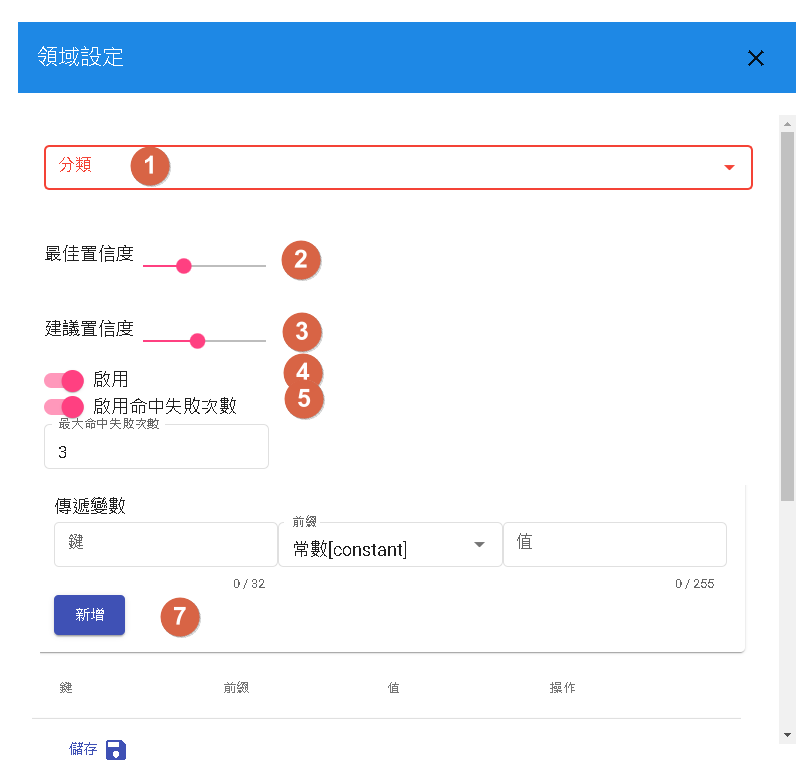

# 全局設定

對話流程的設定是指在對話機器人中設定啟用的領域、場景和通用回答，以確保機器人在與使用者的對話中能夠正確理解和回答問題。

- 啟用的領域：確保只啟用與機器人功能相關的領域，避免過多不必要的領域導致回答混亂或錯誤。根據機器人的用途和目標，選擇適合的領域進行啟用。
- 場景設定：將對話分為不同的場景，根據使用者的需求和情境進行回應。每個場景可以專注於特定的主題或任務，使機器人能夠提供更專業和準確的回答。
- 通用回答：為常見的問題或情境設定通用回答，以提供使用者即時的回應。通用回答是預先設定的固定回答。

## 領域

### 不同類別領域
意圖型、知識庫和問答對是三種不同的對話流程類型，每種類型需要進行不同的設定以優化對話體驗。

### 意圖型

在意圖型對話流程中，重點是識別使用者的意圖並針對意圖提供相應的回答。以下是優化意圖型對話的建議：

- 定義清晰的意圖：確定使用者可能有的意圖，並為每個意圖創建相對應的回答。
- 使用實體(entity)：在意圖中使用實體來識別關鍵信息，例如日期、時間、地點等。這有助於更準確地回答使用者的問題。

- 1.對於特定意圖的填實體，您可以選擇填實體以捕獲使用者的關鍵信息，或者選擇留空並在對話中辨識其意圖。這取決於您對話流程的需求和設計。
- 2.在設定中，您可以選擇是否啟用特定領域。根據您的對話流程需求，啟用或禁用相應的領域。
- 3.是否啟用命中失誤次數取決於您希望跟蹤並記錄對話中的命中失誤次數。
- 4.如果您希望將變數傳遞給特定領域，並強制注入該領域的上下文（context），您可以在設定中進行相應的設置。這將有助於在特定對話流程中共享信息並實現更精確的回答。

### 知識庫

在知識庫對話流程中，基於預先建立的知識庫內容提供回答。

- 組織知識庫：將知識庫內容分為不同的主題或類別，使查找和檢索知識更加容易。
- 使用關鍵字、數字、時間查找，以便更快地找到相關內容。

- 1.您可以在設定中覆蓋回傳答案數量的限制，根據您的需求自定義回傳的答案數量上限。最大為十。
- 2.如果您啟用搜尋內容，系統將同時搜尋實體和內容，以提供更全面的回答。這個選項可以根據需要進行覆蓋，以控制是否啟用搜尋內容的功能。
- 3.在設定中，您可以選擇是否啟用特定領域。根據您的對話流程需求，啟用或禁用相應的領域。
- 4.否啟用命中失誤次數取決於您希望跟蹤並記錄對話中的命中失誤次數。

### 問答對

在問答對對話流程中，根據預先定義的問答對提供回答。

- 涵蓋常見問題：收集和整理常見的問題並提供相應的回答。
- 考慮多種表達方式：為每個問答對提供多個表達方式，以應對使用者不同的提問方式。

- 1.您可以在設定中選擇指定問答對的分類，這樣可以將問答對歸類到特定的分類中。這個選項可以根據需要進行覆蓋，以指定問答對的分類。
- 2.根據設定中的數值，當解答的相似度高於此數值時，將該問題視為用戶問題。您可以在設定中覆蓋此數值，以擁有更靈活的控制。
- 3.如果解答的相似度高於設定的數值，系統會顯示其他建議問題。您可以在設定中調整此數值，以符合您的需求。
- 4.是否啟用特定領域的功能可以根據需要進行設定，以控制領域的啟用或禁用。
- 5.是否啟用命中失誤次數的功能取決於您希望在對話中跟蹤和記錄命中失誤的次數。
- 7.您可以在設定中傳遞變數給領域，強制注入領域的上下文，以提供更具體的對話內容。這樣可以根據需要進行覆蓋，以傳遞特定的變數給領域。

## 場景

對話流程可以根據不同的場景進行不同的回答流程。每個場景可以有自己獨立的對話流程，以滿足特定場景的需求。在設定場景時，請確保場景名稱僅使用小寫字母（a-z）和底線（_），以符合系統的命名規則。透過場景的劃分，您可以根據不同的使用情境，提供特定的回答流程和對話體驗。

## 通用回答

每個場景共通繼承的回答。

- 1.當對話系統核心發生異常時，我們將告知用戶的訊息通常不會出現，若出現此訊息，請聯絡管理員處理。
- 2.當事件為「start」時，機器人將回應以下訊息。
- 3.每當流程更新時，我們將顯示以下文字並重新開始當前對話。
- 4.忙碌中，一般情況下不會出現，除非機器人正在處理同一個使用者的大量請求。
- 5.未命中，若分支條件未設置為「空」，則將使用預設回應。

# 接著讀
- [變數以及資源管理](../../tutorials/docs/bot-resource.html)

# 最後更新時間
2023/05/22

- 移除表格問答以及問答隊的平台選擇。