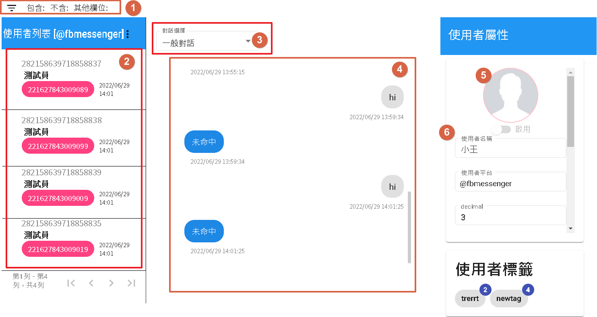

# 日誌
日誌的細項分為歷史紀錄與統計，目的是了解用戶資訊，以及補充機器人不足的地方。

## 歷史紀錄

- 點[1]可以根據欄位過濾使用者。如圖二。
- 點[2]顯示使用者列表。
- 點[3]目前僅有一般對話選擇。
- 點[4]顯示該使用者歷史對話內容。
- 點[5]顯示該使用者圖片[目前僅平台支援才有圖片]
- 點[6]顯示使用者欄位以及標籤次數[圖三]。

圖二

- 1.包含標籤，同時包含這些標籤才會顯示使用者。
- 3.欄位查詢，字串都以關鍵字查詢，數字以及時間日期都是以數字做查詢。

圖三

分別為標籤代號以及標籤次數。

## 統計

- 1.顯示總用戶人數。
- 2.顯示該時段新加入的用戶。
- 3.顯示該時段有在使用的用戶。
- 4.顯示該時段總共有多少次接收的訊息量。
- 5.將該時段每個總量用天數計算出每天新增的數量。(新加入、活躍以及訊息量)。
- 6.選擇該情境名稱，可以了解使用者進入數量且包含使用者未回話的部分，以及各階段在回覆節點觸發之數量。

# 接著讀
- [廣播](../../tutorials/docs/bot-broadcast.html)
