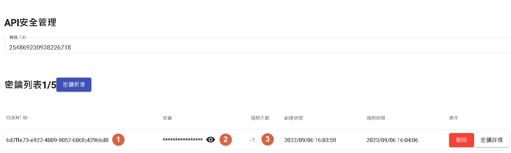
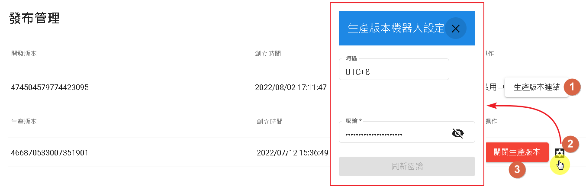

# 發布
用於發布生產版本，提供給不同渠道使用。

## API安全管理

當使用DmFlow自帶的API時，需先申請CLIENT ID才能授權進入。

- 1.CLIENT ID為DmFlow自己產生
- 2.密鑰，自己輸入密鑰或是選擇DmFlow自己產生的密鑰。
- 3.過期天數，當選擇-1時，預設都是一年後過期，最高可以30天。
- 4.白名單，進入詳請可以看到，會過濾進入DmFlow的網域。

## 發布

- 1.當開發版本可以連結至生產版本，生產版本使用。
- 2.可查看當前生產版本固定設定，目前只能修改密鑰[外部資源密鑰，非API密鑰，詳情可前往"設定"]。
- 3.當要關閉生產版本可以點選此按鈕。

# 接著讀
- [設置](../../tutorials/docs/bot-setting.html)