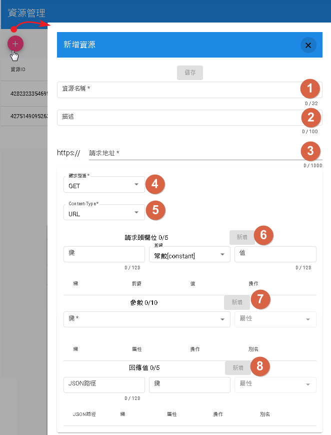

# 變數以及資源管理
- 變數管理：在對話流程中，您可以使用變數來管理和存儲資源所需的參數。變數用於傳遞資源參數，或是代表回傳參數。
- 資源管理：在對話流程中，資源節點用於管理資源的使用和連接對外的API，以實現業務邏輯的交互。資源節點可以執行特定的操作，例如調用外部API進行數據查詢、修改資源狀態、存取外部資料庫等。通過資源節點的使用，您可以在對話流程中實現與外部系統的集成，提供更豐富和個性化的服務。藉由資源管理，您可以有效利用現有的資源和外部服務來擴展對話系統的功能和能力。

## 變數管理

- 1.名稱：變數的名稱，通常使用英文來命名。名稱應具有描述性，以便在對話流程中識別和使用該變數。
- 2.指定變數的數據類型，可選的屬性有：
    - 字串（string）：用於存儲文字信息。
    - 數字（number）：用於存儲數值。
    - 日期時間（datetime）：用於存儲日期和時間。
    - 布林（bool）：用於存儲真假值。
    - 物件（object）：用於存儲複雜的結構化數據。
    - 陣列（array）：用於存儲多個值的集合。
- 3.描述：對變數的說明和解釋，可以提供更詳細的信息，以幫助開發人員理解該變數的用途和功能。
- 4.別名：這是一個可選的屬性，用於為變數指定別名，以便更容易理解和辨識該變數。例如，如果變數名稱是"price"，您可以為其指定別名"價格"或"價錢"，這樣在對話流程中使用該變數時，可以更直觀地理解其含義。

## 資源管理

- 1.資源名稱：該資源的名稱，使用英文進行命名。
- 2.描述：對該資源的說明和解釋，可以提供更詳細的信息，以幫助開發人員理解該資源的用途和功能。
- 3.請求地址：資源的業務邏輯地址，請填寫完整的URL，並確保已包含https協定。
- 4.請求型態：指定資源的請求方法，目前支援GET、POST、PATCH、PUT、DELETE請求方式。
- 5.Content-Type：指定請求的內容類型，可選擇URL編碼或JSON格式（application/json）。
- 6.請求頭欄位：填寫請求的標頭信息，根據不同的前綴指定不同的標頭類型，可選擇常數（constant）、單輪會話（conversation）、多輪對話（session）、使用者參數（user）或機器人參數（config）。
- 7.參數：根據請求的Content-Type填寫相應的參數，這些參數將被注入到請求中。[延伸2]
- 8.回傳值：指定該請求的回傳值，您可以指定要提取的JSON路徑，並將其值注入到指定的變數中。[延伸3]

### 延伸1
- constant:後面可放任何文字，不用理會前綴。
- conversation、session、user以及config等。可從[模板](../../tutorials/docs/bot-template.html#記憶模板)中的記憶模板前往觀看。
### 延伸2
假設有一參數city=>城市
- URL:直接作為參數&city=urlEncode(城市) 方式傳遞。
- JSON:則是 {"city":"城市"} 方式傳遞。

### 延伸3
假設地址回應為{"city":"城市"}，有一參數city=>城市

那JSON路徑為city，鍵選擇變數city即可。而數值將會在"對話流程"中的"資源節點"做注入。

### JSON路徑教學
JSON路徑：範例地址回應為{"city":"城市", "obj":{"apple":"蘋果"}, "order":["訂單"]}
- 假如我們要拿城市則路徑為city
- 假如我們要拿蘋果則路徑為obj['apple']
- 假如我們要拿訂單則路徑為order[0]

# 接著讀
- [對話流程](../../tutorials/docs/bot-flow.html)

# 最後更新時間
2023/05/22

- 新增PATCH、PUT、DELETE請求方式。