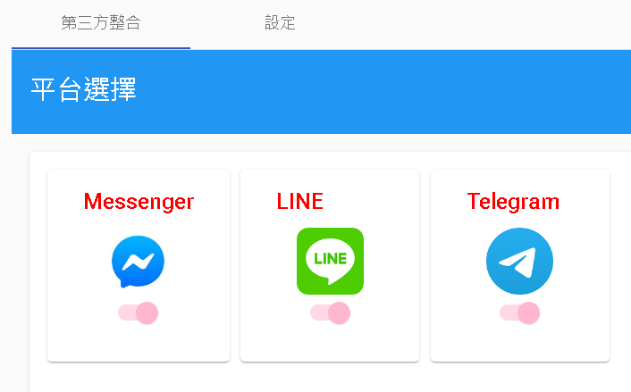
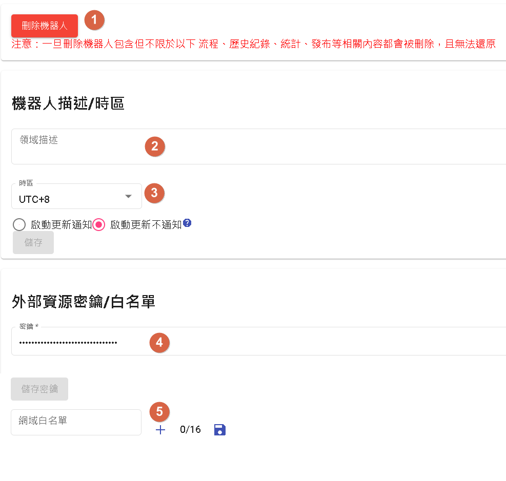

# 設置
用於整合第三方平台，以及該機器人基本設定。

## 第三方整合

目前支援LINE以及Facebook Messenger、Telegram

## 設定

- 1.刪除機器人，一旦點選刪除將無法復原。
- 2.描述:機器人簡介
- 3.時區
- 4.密鑰:機器人流程中的資源節點若對外呼叫會提供此密鑰。
- 5.白名單:機器人流程中的資源節點若對外呼叫會限制該URL的Domain白名單

# 最後更新時間
2023/05/22

- 新增Telegram

## 聯絡資訊

信箱: <service@dmflow.chat>

DMflow.chat 官網: [DMflow.chat](https://www.dmflow.chat)
(於2024-05-18更改網域至[DMflow.chat](https://www.dmflow.chat)，此文檔將不再維護請至[DMflow.chat文檔](https://docs.dmflow.chat)查看新版文檔)