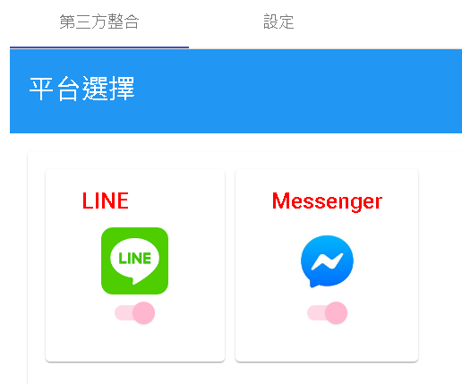

# 設置
用於整合第三方平台，以及該機器人基本設定。

## 第三方整合

目前支援LINE以及Facebook Messenger(Meta)

## 設定

- 1.刪除機器人，一旦點選刪除將無法復原。
- 2.描述:機器人簡介
- 3.時區
- 4.密鑰:機器人流程中的資源節點若對外呼叫會提供此密鑰。
- 5.白名單:機器人流程中的資源節點若對外呼叫會限制該URL的Domain白名單

