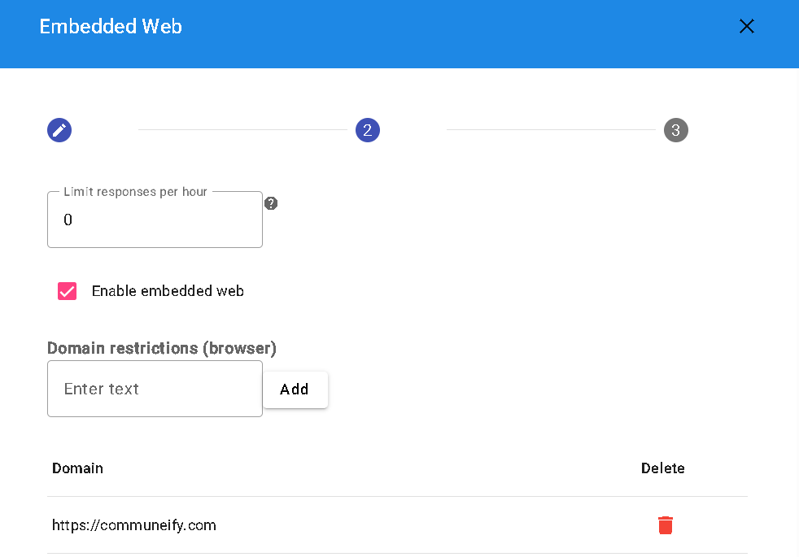
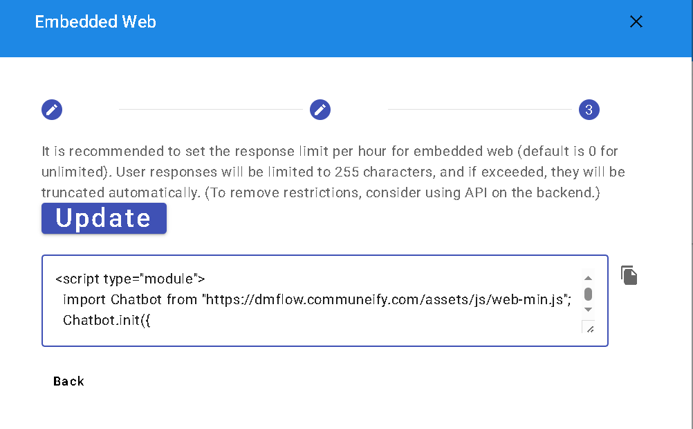

## 內嵌網頁使用指南

內嵌網頁的運用可分為外掛式與滿版，其主要區別在於前者需透過按鈕觸發，而後者則直接透過iframe呈現在全螢幕視窗中。


**外掛**


**滿版**

目前支援多種客製化選項，包括外框顏色、抬頭以及連結設定。


您可以透過限制每小時收到的訊息數量，讓系統在達到一定數量後暫停訊息進入。請注意，請提供您的網站，並僅支援使用HTTPS，若在本地開發中使用HTTP，可透過ngrok啟用HTTPS進行測試。



儲存設定後，複製並貼上生成的script至您的網頁中即可生效。



## 代碼其他設定

代碼支援按鈕顏色、語言以及場景的進一步設定。若未填寫場景，則預設為Main，而未填寫語言則使用原先文字。
```
{
	"lang": <lang>,
	"scene": "<scene>",
	"theme": {
		"button": {
			"backgroundColor": "#9c27b0"
		}
	}
}
```
語言代碼示例：
```
zh_TW、zh_CN、en_US...
```
藉由以上指南，您可以更專業地運用內嵌網頁功能於您的網站。

