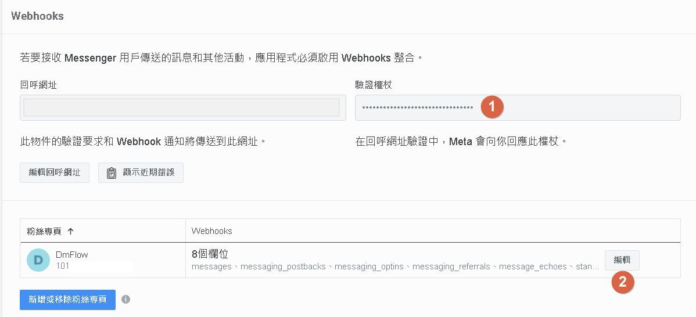

# 申請Facebook API

# 架構
DmFlow透過API與Facebook Server進行串接，並發布到messenger，提供對話機器人給用戶使用。

## Facebook Server

Facebook 透過整合有不同的服務，可以透過DmFlow溝通Facebook的終端，去做資料交換。

## API

API全名為Application Programming Interface，透過別人開出的規範，可以向其他程式做溝通。

## 開始
首先，需擁有Facebook帳號，再來以下偏重於申請應用程式、設定以及審查。

## 申請
先透過Facebook開發者網站進去"我的應用程式"。

[我的應用程式](https://developers.facebook.com/apps/)如下圖。並點選"建立應用程式"

選取應用程式目的(一般選擇商用)，並提供基本資訊，顯示名稱以及電子郵件信箱，兩者都可儲存後修改。

新增後，如圖一所示點選該應用程式，進入主控台。點選"設定"->"基本資料"

而應用程式編號，則是"APP ID"，應用程式密鑰，則是"APP SECRET"。

## 設定

可以從商品->Messenger->設定，去查詢"存取權杖"[PAGE ACCESS TOKEN]，點取[3]。若尚未有粉絲專頁可點選[2]新增。

點[1]點擊"編輯回呼網址"，填寫"回呼網址"以及"驗證權杖"[可隨便填寫或是去DmFlow->機器人->發布->密鑰->自動產生]，並點選[3]如下圖，勾起開放允許權限。

## 審查

需要將該粉絲頁發布以及審核pages_messaging到進階存取權限，才能讓其他使用者使用。

