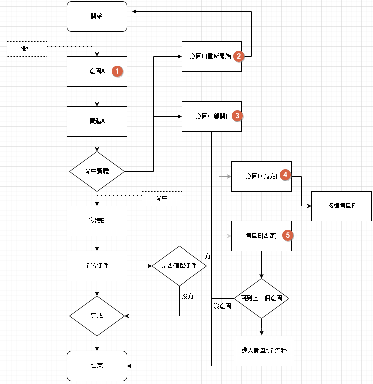

# 意圖
意圖分為六大區塊分別是觸發條件、詞槽、說法、打斷意圖、前置條件以及完成。

## 意圖型態

### 無

- 一般意圖，用於尋找意圖或填充實體的目的。

### 重新開始

- 當觸發重新開始意圖時，將重新開始當前意圖的執行。

### 離開

- 當觸發離開意圖時，將關閉整個意圖的執行。

### 肯定

- 在前置節點中，當動作設置為"確認"時，需要肯定意圖才能進入下一個階段。

### 否定

- 在前置節點中，當動作設置為"確認"時，否定意圖將取消當前狀態的執行。

透過這些意圖型，您可以設計對話流程中的不同情境，例如尋找意圖、重新開始、離開、肯定和否定等。

## 觸發條件
觸發條件，需要填寫的格子分別為觸發型態、起始、操作、或是以及對象。

- 觸發型態:目前僅支援「詞槽」以及「上下文」
  - 上下文表示資源變數的結果。
- 起始:可以選擇詞槽或正規化
- 操作:根據詞槽的不同而變化，包括已填充、未填充、等於、不等於、大於、小於等操作。
- 對象:常數值
- 或是:在同一個組別是AND，不同組之間為OR

透過填寫這些觸發條件，您可以精確地定義觸發對話流程的條件，以便根據特定詞槽的填寫情況或其他條件來觸發相應的回應或動作。

### 前綴
- constant:填入字串、時間（秒數）或數字，數字會被當作數值處理。
- context:根據上下文參數進行賦值，例如資源回傳值或非業務資源使用參數注入。
- entities:實體
- rangeTime:日期範圍，可以使用星期或指定日期進行比較。
- config:全域參數位於領域管理中，為固定變數。

透過填寫這些格子，您可以根據常數、上下文參數、實體、日期範圍等條件來觸發特定的對話流程。

## 詞槽

詞槽分為詞槽名稱、必填、繼承詞槽、詢問
- 詞槽名稱:從「顯示領域內所有詞槽」按鈕新增詞槽名稱。
- 引用辭典:根據引用辭典的標準進行設定。
- 數字量詞:詞槽問法不符合當前詞槽時，需要符合數字量詞的定義才會提取該詞槽。
- 必填:指示該詞槽是否為必填項，若為必填，將一定詢問該詞槽；若非必填，則詢問時有對應的資訊時才填寫該詞槽。
- 繼承詞槽:在不同意圖之間轉換時，若不同意圖具有相同的詞槽名稱，則會進行覆蓋。
- 詢問:當使用者提問時，若尚未完成所有詞槽填寫，將詢問相關詞槽。若詞槽為非必填，則在詢問時只有對應的資訊才會填寫。
- 別名:若多個詞槽都引用相同的實體，例如「出發時間」和「抵達時間」都引用「地點」，則需要使用別名進行區分。

藉由填寫這些詞槽相關項目，您可以建立具有詞槽名稱、引用辭典、數字量詞、必填性、繼承詞槽、詢問和別名等特性的詞槽。

## 說法
用於訓練機器人，模擬使用者詢問的問題。

## 打斷意圖
當話題不符合命中詞槽時，將檢查是否有打斷意圖被觸發，若是，則轉跳至其他意圖。

## 前置條件

前置條件包含以下要素：觸發型態、起始、操作、條件群組和對象，與觸發條件相似。

每個條件群組中都有節點動作。

節點動作分為確認和跳轉，確認動作類似於打斷意圖，但意圖必須包含肯定和否定。跳轉則是直接跳轉至指定的意圖。

## 完成
完成包含以下要素：觸發型態、起始、操作和對象，與觸發條件相似。 
呼叫資源: 
- 參數:賦值根據提示填寫。
- 回傳值:供「達成條件後回答」使用。

其他:
- 調用失敗回答區塊：當HTTP狀態不為200或出現錯誤時，提供的回答。
- 回覆啟動：是否啟用「達成條件回答區塊」
- 達成條件回答區塊：在滿足所有「觸發條件」且沒有錯誤時，所回答的對話。

### 達成條件後回答

可直接輸入"$"會進行提示。語法同先前的模板輸出一樣。

# 接著讀
- [機器人介紹](../../tutorials/docs/bot-intro.html)

# 最後更新時間
2023/05/22
- 刪除依賴意圖