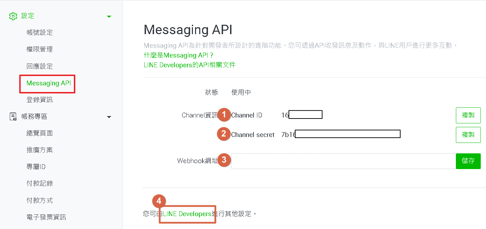
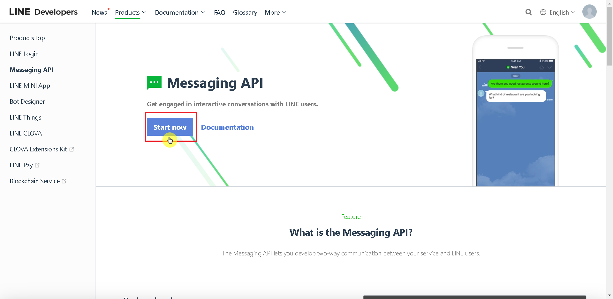

# 申請LINE API

# 架構
DMflow透過API與LINE Server進行串接，提供對話機器人給用戶使用。

## LINE Server

LINE 透過整合有不同的服務，可以透過DMflow溝通LINE的終端，去做資料交換。

## API

API全名為Application Programming Interface，透過別人開出的規範，可以向其他程式做溝通。

## 開始
先申請LINE帳號，[LINE Business ID](https://account.line.biz/login)

### 使用LINE帳號登入
可以使用一般使用者LINE做登入。

### 使用商用帳號登入
以公司為主業務用的電子郵件作申請。填入帳號名稱、電子郵件帳號、公司名稱以及業種(公司業務內容)即可申請完成。

## 設定

若尚未啟用Messaging API，請在設定->Messaging API點選"啟用Messaging API"，並輸入服務提供者(自己命名業務名稱，事後可更改)，並填入隱私權政策及條款(兩者非必填)，確認無誤後，點選"確定"。

- 1.Channel ID
- 2.Channel Secret
- 3.填入Webhook網址。
- 4.進入LINE Developers進行接下來動作。

### LINE Developers

點選後會進入[LINE Developers](https://developers.line.biz/en/)，並依序下圖點選。

可以得到Channel ID、Channel secret以及Channel access token。並填寫Webhook URL即可完成。

## 聯絡資訊

信箱: <service@dmflow.chat>

DMflow.chat 官網: [DMflow.chat](https://www.dmflow.chat)
(於2024-05-18更改網域至[DMflow.chat](https://www.dmflow.chat)，此文檔將不再維護請至[DMflow.chat文檔](https://docs.dmflow.chat)查看新版文檔)
