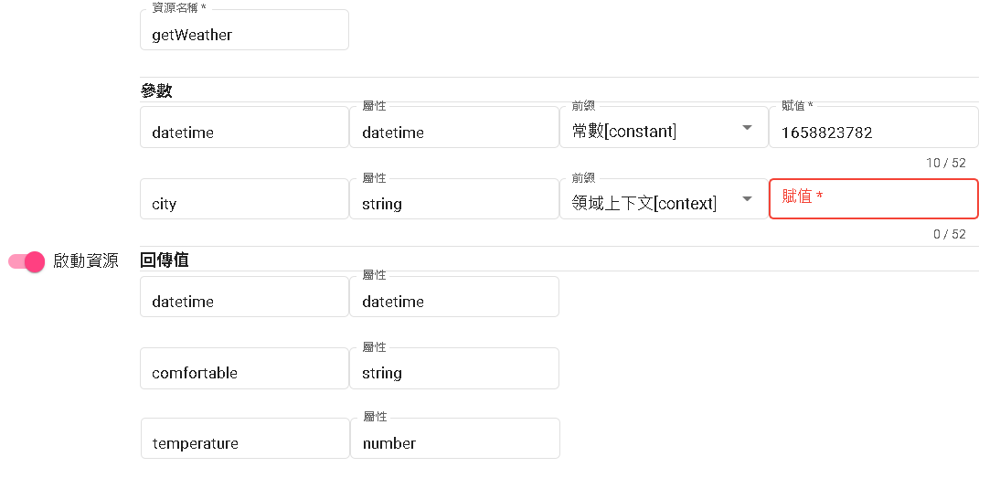

# 知識庫介紹

知識庫包含問答對以及表格問答，以下將會介紹兩者的定義以及用途。

## 表格問答

- 快速回答常見問題：表格問答可以用於回答有結構性的問題。透過事先建立好的問答表格，機器人可以直接從表格中檢索相應的答案，迅速提供給用戶，節省時間和人力成本。

- 自助式問答服務：通過表格問答，用戶可以自主搜索和獲取所需的信息，而不必等待人工客服的回覆。

- 數據收集和分析：通過表格問答，可以收集用戶的輸入和反饋，將其存儲為結構化數據。這些數據可以用於進一步的分析和洞察，了解用戶需求、瞭解產品或服務的優化方向，以及改進對話機器人的效能。

### 表格問答結構

- 關鍵字：在搜尋的時候若命中關鍵字會顯示該搜尋的結果。
- 數字：在搜尋的時候可以比較該數字欄位的到搜尋的結果。
- 日期：在搜尋的時候可以比較該日期欄位的到搜尋的結果，像是出版日期、出產日期等。
- 文本：不影響搜尋。但是根據其他條件所搜尋的結果會同時附帶此文本。
- 是否：根據是否去搜尋結果，像是支援5G或是有WIFI嗎之類的。

### 支援能力

| 問題型態     | 支持問法               | 支援             | 範例
| ------------ | ---------------------- | ---------------- | ------------------------------------------------
| 簡單查詢     | 單屬性                 |  v               | Pixel 6的電池容量是多少?
|              | 多屬性                 |  v               | Pixel 6的電池容量是多少?有沒有支援快充?
|              | 多實體                 |  v               | Pixel 6和iphone12的電池容量是多少?有沒有支援快充?
| 條件查詢     | 屬性條件               |  v               | 價格大於1萬的手機有哪些
|              | 屬性排序               |  v               | 價格最貴的手機是哪支?
| 推理計算     | 聚合計算(求和、求平均) |  x(部分支援求和) | [第一句]我想找國別是日系的車?[第二句]這些價格總共多少? 
|              | 判斷計算               |  v               | Pixel 6有沒有支援快充?[同屬性查詢]
|              | 比較計算               |  x               | iphone12比Pixel 6貴了多少?
|              | 分組、行計算           |  x               |  


## 問答對

問答對是指問題和對應答案的配對組合，它們的主要用途包括：

- 自動回答常見問題：問答對可用於自動回答常見問題，如產品功能、服務詳情、常見疑問等。將常見問題與相應的答案建立成問答對，可以使機器人快速且準確地回答用戶的疑問，節省人工客服的時間。

- 資訊查詢：問答對可以提供資訊查詢的功能，用戶可以輸入問題，機器人通過匹配問答對，提供相應的答案。這樣，用戶可以快速找到所需的資訊，不必浪費時間在網站搜索或諮詢人工客服。

- 技術支持：問答對可用於技術支持的場景，用戶可以提出技術問題，機器人通過匹配相關的問答對，提供解決方案或指導。這樣可以節省人工技術支持的成本，同時提供即時且準確的支持服務。

- 教育和培訓：問答對在教育和培訓領域也有應用價值，可以用於提供學習材料的問答形式，幫助學生進行學習和自測。教師或導師可以建立問答對，涵蓋學習內容的不同方面，學生可以通過與機器人的互動來檢查自己的學習進度和理解程度。

總結來說，問答對在自動回答、資訊查詢、技術支持和教育培訓等方面都有廣泛的應用。它們能夠提供準確、即時的答案，節省人力成本，同時提升用戶體驗和學習效果。

#### 回答型態

- 1.text :純文本
- 2.template:模板[可透過resource回傳值注入]
- 3.redirect:(轉向場景[須搭配Bot Flow])
- 4.JSON API:使用該平台的JSON去做回覆，目前支援LINE、Messenger、Telegram。


#### template模板輸出詳情

- context->根據回傳值的鍵(key)做輸出。
- extractTime->您可以將時間數值轉換為特定格式的字串。
- listOutput->您可以獲取回傳數值（需為陣列），並根據特定格式生成一個列表。在該列表中，每一項都包含數值中的特定屬性。

context
```
${#context.comfortable}
```
在這個範例中，${#context.comfortable}代表取得回傳值中的鍵為comfortable的內容。您可以將這個指令插入到您需要的地方，以獲取相應的回傳值並進行輸出。

這樣，您可以方便地根據回傳值的鍵進行相應的操作和呈現。

extracTime

```
${%extractTime(#context.datetime,'yyyy年MM月dd日HH:mm','')}
```

在這個範例中，您需要將第一個參數設置為回傳的時間數值（以秒為單位）。第二個參數則是一個字串，用於指定所需的日期格式，例如yyyy年MM月dd日HH:mm。第三個參數目前尚未實裝，預計用於指定時區，但在預設情況下，它將使用機器人流程的時區。

透過使用這個優化後的指令，您可以方便地將時間數值轉換為符合指定格式的字串，以滿足您的需求。


listOutput

```
${%listOutput(#context.order,'${#br}第${#index}筆:日期${#item.date}, 金額為:${#item.money};' ,'1')}
```

在這個範例中，您需要將第一個參數設置為回傳的陣列數值。第二個參數則是一個字串，其中${#br}代表換行符號，${#index}代表目前迴圈的索引值，${#item.date}和${#item.money}分別代表每個項目的日期和金額屬性。

藉由使用這個優化後的指令，您可以方便地生成具有特定格式的列表，以便於顯示和使用所需的數值資訊。
  
透過下圖選擇資源，並呼叫該資源得到JSON回應為

```
{
  "temperature": 16,
  "datetime": "1665990946",
  "next_d": [
    {
      "rain_per": "100",
      "date": "2022-10-18"
    },
    {
      "rain_per": "10",
      "date": "2022-10-19"
    }
  ],
  "comfortable": "稍有寒意"
}
```


模板原本輸出

> 舒適度:${#context.comfortable}，溫度${#context.temperature}度c
> 時間${%extractTime(#context.datetime,'yyyy年MM月dd日HH:mm','')}
> ${%listOutput(#context.next_d,'${#br}第${#index}筆:日期${#item.date}, 下雨機率:${#item.rain_per}%;' ,'1')}

模板替代輸出

> 舒適度:稍有寒意，溫度16度c
> 時間2022年10月17日14:48
> 
> 第1筆:日期2022-10-18, 下雨機率:100%;
>
> 第2筆:日期2022-10-19, 下雨機率:10%; 

如果傳遞值未填寫或發生錯誤，僅會做參數值取代為空。

> 舒適度，溫度度c
> 時間


## 接著讀
- [領域介紹](../../tutorials/docs/domain-intro.html)

# 最後更新時間
2023/05/22

- 增加表格問答結構
- 增加表格問答以及問答對的基本解釋
- 將item.br以及item.index更改為br以及index。

