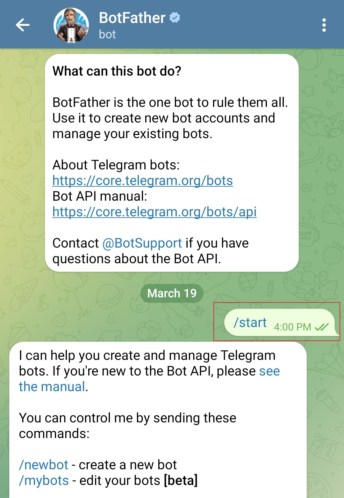
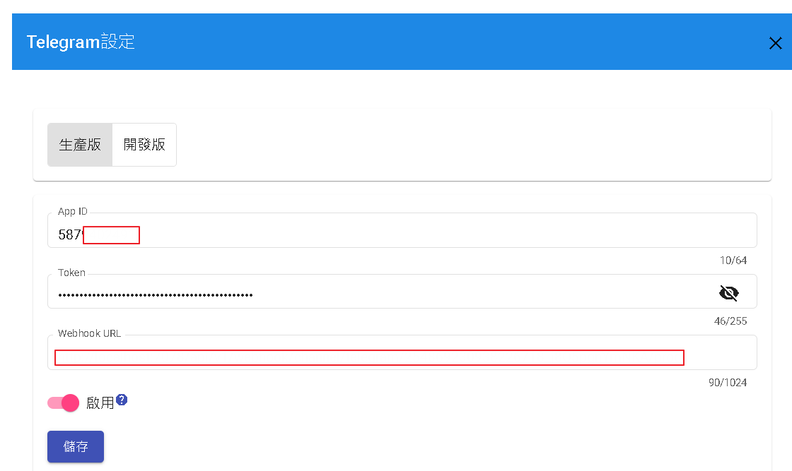

# Telegram開發設定

在 Telegram 上創建新機器人的步驟如下：

- 在您的設備上打開 Telegram 應用程式。
- 在搜尋欄中搜尋 "BotFather" 機器人。
- 點擊 "BotFather" 並開始與它進行對話，點擊 "Start" 按鈕。
- 在與 BotFather 的對話中輸入 "/newbot" 來創建一個新機器人。
- 跟隨 BotFather 提供的指示。它會要求您為機器人提供一個名稱（例如 "MyNewBot"）和一個唯一的用戶名（例如 "@MyNewBot"）。
- 提供所需的資訊後，BotFather 將為您的機器人生成一個 API 金鑰。請確保保持此金鑰安全，因為它用於訪問 Telegram Bot API。
- 您的新機器人現在已經創建完成。您可以通過 BotFather 對話或使用生成的 API 金鑰通過 Telegram Bot API 訪問和管理其設定。



下圖紅色遮住部分為token，將其token複製。


如需要在群組中接收全部訊息，可透過以下去操作，一般預設只接收command "/"開頭的訊息。


進入DmFlow系統，點選你的機器人後，進入設置->第三方整合->Telegram，並將圖二的token冒號前純數字填入APP_ID，token則是填入全部"58XXXXXXXX:AAEXXXXXXXXXXEBXXXXXXX"，選取"啟用"並儲存，後台會驗證填寫是否正確。



# 設置Webhook

```
https://api.telegram.org/bot{{token}}/setWebhook
```

將token取代{{token}}

Body

```
{
    "url":"{{Webhook URL}}"
}
```

將Webhook URL取代{{Webhook URL}}

# 刪除Webhook
```
https://api.telegram.org/bot{{token}}/deleteWebhook
```