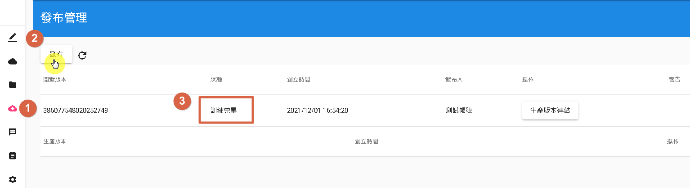
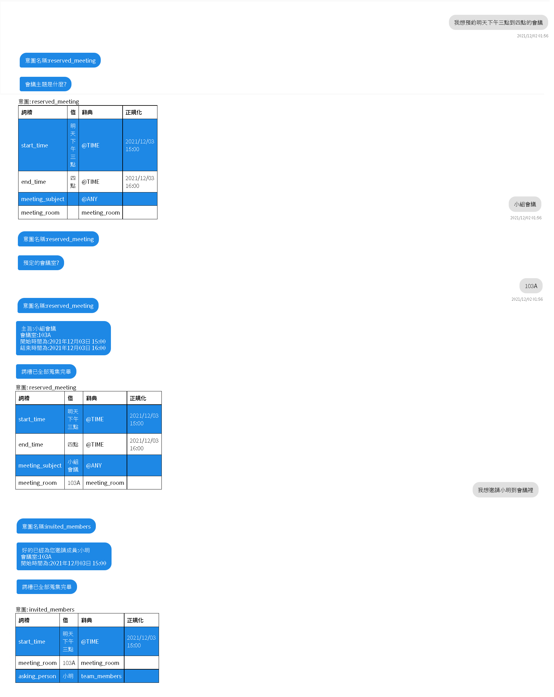

# 發布並測試

- 1.在左側選單中點擊「發布管理」。
- 2.點擊「發布」，如圖中標示[2]，直到出現「訓練完畢」的標記[3]，表示完成發布。

- 3.在左側選單中點擊「測試」，如下圖所示：

- 4.現在您可以進行簡單的對話測試。

以上是發布與測試的流程。

# 了解更多

[Communeify官方](https://communeify.com/)

- 進入官網後，允許Cookie後即會跳出連線真人的聊天視窗，或是可以有問題可以從信箱問<service@communeify.com>