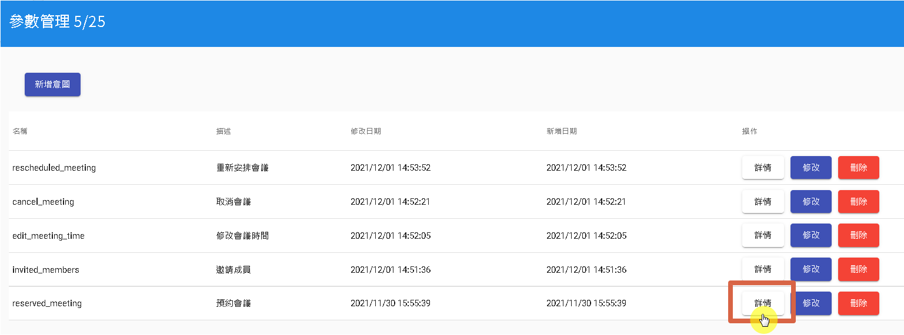
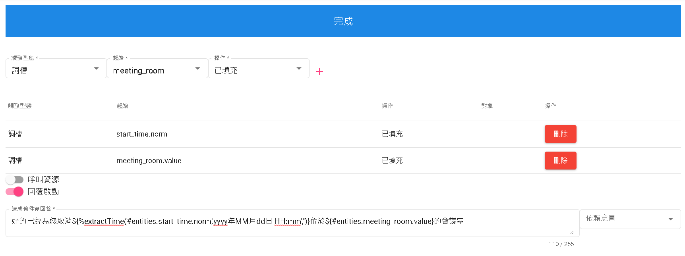
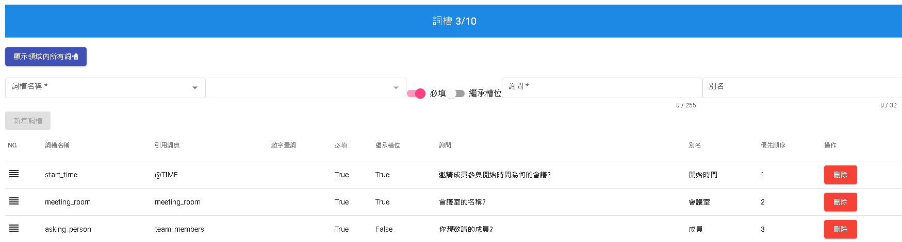
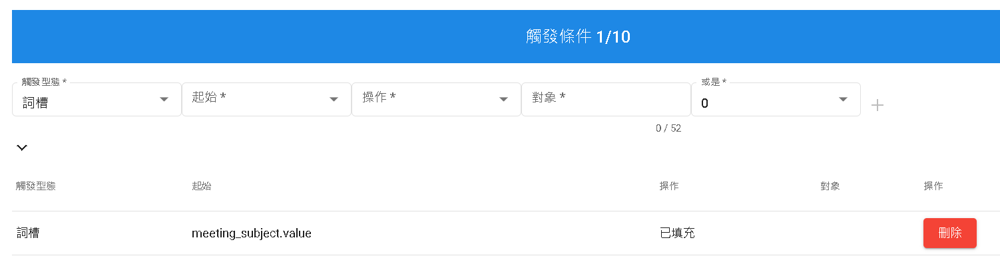
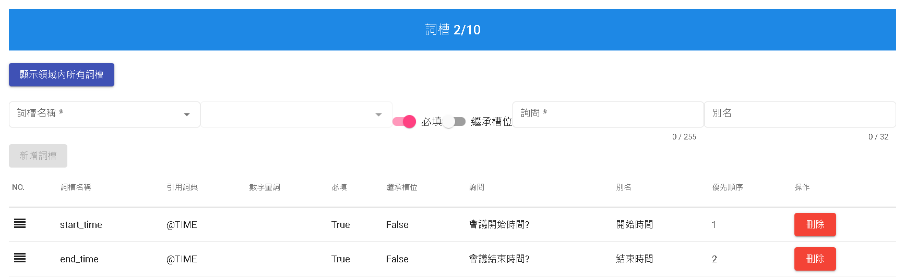

# 個別意圖內容

## 預約會議
首先，我們先進入"預約會議"，點選"詳情"。

我們先依照下圖建立五個領域詞槽分別是"成員"、"會議室"、"會議主旨"、"結束時間"以及"開始時間"。

並在詞槽新建四個詞槽組，分別是start_time、end_time、meeting_subject以及meeting_room

新增以下對話不限於以下"預約{meeting_room}的會議室"、"我要預約會議"、"我想預約{start_time}到{end_time}的會議"

在"完成"欄位仿照下填寫。即可完畢預約會議的意圖。

## 取消會議
進入"取消會議"，點選"詳情"。

並在詞槽新建兩個詞槽組，分別是start_time以及meeting_room

新增以下對話不限於以下"我要取消{start_time}開始在{meeting_room}的會議"、"我要取消{start_time}開始的會議"、"我要取消會議"

在"完成"欄位仿照下填寫。即可完畢"取消會議"的意圖。

## 邀請成員
進入"邀請成員"，點選"詳情"。

並在詞槽新建三個詞槽組，分別是start_time、meeting_room以及team_members

新增以下對話不限於以下"邀請{asking_person}參加{start_time}的會議"、"我想邀請{asking_person}參加會議"

在"完成"欄位仿照下填寫。即可完畢邀請成員的意圖。

## 修改會議時間
進入"修改會議時間"，點選"詳情"。

觸發條件需要滿足"會議主題已填充"如下圖。

並在詞槽新建兩個詞槽組，分別是start_time以及end_time

在"完成"欄位仿照下填寫。即可完畢"修改會議時間"的意圖。

# 下一步
- [發布並測試](../../tutorials/intro/deploy-test.html)

## 聯絡資訊

信箱: <service@dmflow.chat>

DMflow.chat 官網: [DMflow.chat](https://www.dmflow.chat)
(於2024-05-18更改網域至[DMflow.chat](https://www.dmflow.chat)，此文檔將不再維護請至[DMflow.chat文檔](https://docs.dmflow.chat)查看新版文檔)
