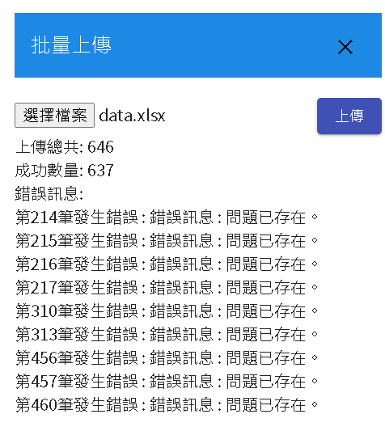

# COVID-19 常見問題解答，介紹問答對應用範例

> 這些範例僅供參考，請注意不要將其視為正確的操作方式。始終依靠權威的衛生機構和專業醫療人員的指導，以確保您和他人的安全和健康。

# 資料數據

<a href="https://github.com/sunlab-osu/covid-faq" target="_blank">covid-faq</a>

```
@inproceedings{zhang2021cough,
    title = "{COUGH}: A Challenge Dataset and Models for {COVID}-19 {FAQ} Retrieval",
    author = "Zhang, Xinliang Frederick  and
      Sun, Heming  and
      Yue, Xiang  and
      Lin, Simon  and
      Sun, Huan",
    booktitle = "Proceedings of the 2021 Conference on Empirical Methods in Natural Language Processing, {EMNLP} 2021",
    year = "2021",
    pages = "3759--3769",
}
```
# 資料處理

- 使用data/FAQ_Bank.csv檔案。
- 過濾找出language為zh並將簡體轉為繁體。
- 下載DmFlow需要的上傳格式範例，並整理成DmFlow所需要的格式需求。
- 即可得到下面的excel檔案。

[DmFlow 問答對上傳檔案](../../../../../../files/xlsx/faq-covid-19.xlsx "DmFlow 問答對上傳COVID-19檔案")

# 檔案上傳



透過"領域連結"、"發布"完畢後即可測試，並導入到機器人裡面。以下圖片是測試畫面。


# 結論

問答對運用簡單的上傳功能，可以滿足對話需求。您只需使用問答對的單輪問答格式，即可建立基本的問答對話。雖然您仍然可以透過分類的方式創造多輪問答，但目前建議以單輪問答為主，以提供更直接和精確的回答。透過這種方式，您可以輕鬆地上傳問答對，並快速應對用戶的提問需求。

# 了解更多

[Communeify官方](https://communeify.com/)

- 進入官網後，允許Cookie後即會跳出連線真人的聊天視窗，或是可以有問題可以從信箱問<service@communeify.com>

