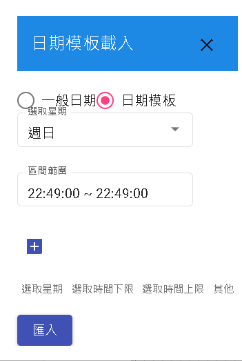
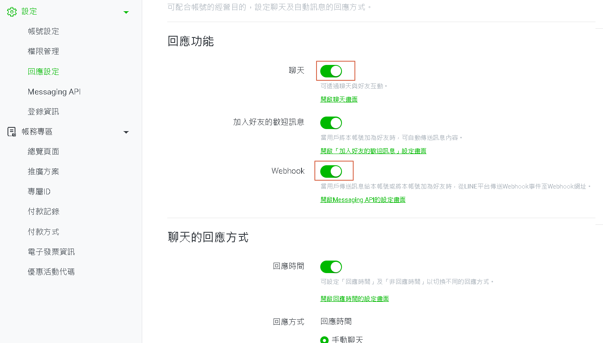
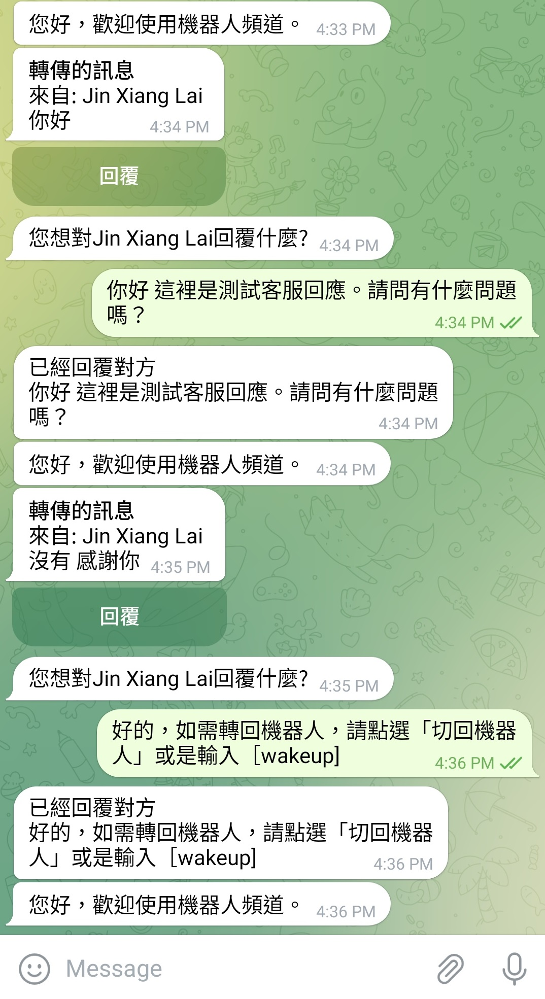

# 真人客服-讓機器人躍升為有情有義的對話夥伴

如何在 DmFlow 中將機器人轉換成真人客服。透過 DmFlow 平台，瞭解如何結合自動化機器人與真人客服功能，提供更加人性化和互動性強的對話體驗。

## 使用Messenger渠道

首先我們先在config中建立messengerToken。再來在變數新增id、success。

*變數管理*

| 變數名稱 | 限制  |       
|----------|------ |
| success  | bool  |
| id       | string|

*資源創建*

name: pass_to_inbox(將控制權轉為Inbox)

```
https://graph.facebook.com/v16.0/me/pass_thread_control?access_token=${#config.messengerToken}
```
Request-Type : POST
Content-Type : application/json(JSON)

Parameter

| 鍵 |  JSON 路徑      |
|----| --------------  |
| id | recipient['id'] |

```
{
    "recipient": {
        "id": ""
    },
    "target_app_id": "263902037430900"
}
```

Return

| JSON 路徑            |  鍵      |
| ------------------   | ---------|
| success              | success  |

```
{
  "success": true,
  "message": "Thread control successfully passed to the target app."
}
```

name: take_thread(將控制權拿回來)
```
https://graph.facebook.com/v16.0/me/take_thread_control?access_token=${#messengerToken}
```
Request-Type : POST
Content-Type : application/json(JSON)

Parameter

| 鍵 |  JSON 路徑      |
|----| --------------  |
| id | recipient['id'] |

```
{
    "recipient": {
        "id": ""
    }
}
```

Return

| JSON 路徑            |  鍵      |
| ------------------   | ---------|
| success              | success  |

name: reply(回覆機器人)

```
https://graph.facebook.com/v16.0/me/messages?access_token=${#config.messengerToken}
```
Request-Type : POST
Content-Type : application/json(JSON)

Parameter

| 鍵 |  JSON 路徑      |
|----| --------------  |
| id | recipient['id'] |

```
{
    "messaging_type": "RESPONSE",
    "recipient": {
        "id": ""
    },
    "message": {
        "attachment": {
            "type": "template",
            "payload": {
                "template_type": "button",
                "text": "是否切回機器人",
                "buttons": [
                    {
                        "type": "postback",
                        "title": "切回機器人",
                        "payload": "{\"type\":\"text\",\"payload\":{\"query\":\"[wakeup]\",\"type\":\"text\"}}"
                    }
                ]
            }
        }
    }
}
```


其中判斷可以再加上rangeTime去判斷工作時間，也可以外接API做客服佇列、是否在線上等等。



## 使用API

```
/_api/v1/bot/chat
```

使用chat API可以使當前使用者進入聆聽模式。此時機器人不會回覆任何話術。

## 其他渠道

### LINE

可直接在LINE OA設定。不過記得用戶需要再"情境節點-聆聽"才能讓用戶不觸發機器人自動回話。



### Telegram

首先我們先在config中建立telegramToken。再來在變數新增id、query、callback。

*變數管理*

| 變數名稱 | 限制  | 
|----------|------ |
| callback | string|
| query    | string|
| id       | string|

*資源創建*

name: telegram_sendMessage(用於回覆客服用戶的問題)

```
https://api.telegram.org/bot${#config.telegramToken}/sendMessage
```

Request-Type : POST
Content-Type : application/json(JSON)

Parameter

| 鍵    |  JSON 路徑      |
|----   | --------------  |
| query | text            |
| id    | chat_id         |

```
{
    "text": "",
    "chat_id": ""
}
```

name: telegram_forward(用於監聽用戶對話)

```
https://api.telegram.org/bot${#config.telegramToken}/sendMessage
```

Request-Type : POST
Content-Type : application/json(JSON)

Parameter

| 鍵      |  JSON 路徑                                             |
|----     |  --------------                                        |
| query   | text                                                   |
| id      | chat_id                                                |
| callback| reply_markup['inline_keyboard'][0][0]['callback_data'] |

```
{
    "text": "",
    "chat_id": "6092427840",
    "parse_mode": "Markdown",
    "reply_markup": {
        "inline_keyboard": [
            [
                {
                    "text": "回覆",
                    "callback_data": ""
                }
            ]
        ]
    }
}
```

*記憶模板*

單一會話儲存

- 新增replyUserId(回覆使用者ID)

在依以下機器人動態圖作範例，即可做出簡單的Telegram真人客服。


以下是實際畫面。




就可以做出簡單的真人問答系統。當然，可進一步搭配API做出查詢訊息、查找FAQ等等。

# 了解更多

[Communeify官方](https://communeify.com/)

- 進入官網後，可以線上直接回覆，或是可以有問題可以從信箱問<service@communeify.com>