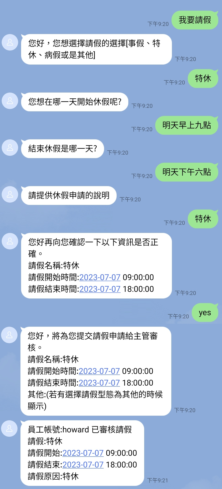

# 設計和實現請假系統的步驟

## 主要流程


## 次要流程

- 查詢紀錄
- 取消請假

(本章節將不會探討次要流程的設計)


# 使用意圖設計申請休假

先創建辭典

leave_type

- 特休;特休假
- 病假
- 事假
- 其他

另外仍有防疫照顧假、喪假、防疫隔離假、謀職假、婚假、產檢假、產假、安胎假、育嬰留職停薪、陪產假、公傷病假、公假、家庭照顧假、生理假等可自行添加。

1.創建詞槽

| 詞槽       | 引用詞典  | 別名
|------      |---------- |----------
|leave       | leave_type| 請假
|reason      | @ANY      | 請假原因
|leave_from  | @TIME     | 請假開始時間
|leave_end   | @TIME     | 請假結束時間

2.將說法填入

```
我想請{leave}從{leave_from}到{leave_end}
我想從{leave_from}開始請假
我想請假從{leave_from}到{leave_end}
我想請假
我想請{leave}
```

3.如果要加上確認

確認要再添加yes以及no的意圖，建立完成後，接續問法如下

```
您好再向您確認一下以下資訊是否正確。
請假名稱:${#entities.leave.value}
請假開始時間:${%extractTime(#entities.leave_from.norm,'yyyy-MM-dd HH:mm:ss','')}
請假結束時間:${%extractTime(#entities.leave_end.norm,'yyyy-MM-dd HH:mm:ss','')}
```

如果命中yes意圖則會導向完成。
如果命中no意圖則會直接結束對話。
如果命中其他意圖會進行其他意圖對話。

4.完成

提交主管審核，得透過resource使用API對外交互。

```
您好，將為您提交請假申請給主管審核。
請假名稱:${#entities.leave.value}
請假開始時間:${%extractTime(#entities.leave_from.norm,'yyyy-MM-dd HH:mm:ss','')}
請假結束時間:${%extractTime(#entities.leave_end.norm,'yyyy-MM-dd HH:mm:ss','')}
```

# 如何向對外交互

此範例將由Google Apps Script作為範例。

我們可以先透過Login的方式，定義是用者的權限。
我們可以透過下一章的[LINE平台-帳號連結](../../tutorials/intro/line-accountlink.html)

我們在帳號連結得到的資料是

| username | password | nonce | user_id
| -------- | -------- | ----- | --------

新增一個欄位叫manager這邊放上主管的user_id

| username | password | nonce | user_id  | manager
| -------- | -------- | ----- | -------- | -------- 

直接自己把自己連接的userId填寫到manager即可，在此略過建立主管、主管註冊、主管登入等步驟。

也就是說你可以參考以下填寫。

| username | password | nonce | user_id  | manager
| -------- | -------- | ----- | -------- | -------- 
| howard   | 123456   | xxxx  | U1234XXX | U1234XXX


我們在上面第四點的完成部分"您好，將為您提交請假申請給主管審核。"，所以必須將獲得的資料建立在另一個Spreadsheets，於是我們新增第二個工作表。欄位如下。

| id | user_id  | leave    | leave_from | leave_end  | reason  | audit
| ---| -------- | -------- | ---------  | --------   | --------| -----

其中audit為true or false，為當前假期是否審核過。

於是在程式碼.gs由此寫下

```
function searchUser(userId) {
  var id = '{{你的Spreadsheet ID}}';
  var spreadsheet = SpreadsheetApp.openById(id);
  var sheet = spreadsheet.getSheets()[0];
  var data = sheet.getDataRange().getValues();

  for (var i = 1; i < data.length; i++) {
    var storeUserId = data[i][3];
    if (storeUserId === userId) {
      return { success: true, user: data[i] };
    }
  }
  return { sucess: false };
}

function sendMessageToManager(userId, user, lineToken, leave, leave_from, leave_end, reason, leave_id) {
  const username = user[0];
  const managerId = user[4];
  const endpoint = 'https://api.line.me/v2/bot/message/push';
  var message = {
    to: managerId, messages: [
      {
        type: 'template',
        altText: '員工請假通知',
        template: {
          type: 'buttons',
          text: `員工帳號:${username}
請假:${leave}
請假開始:${formatTimestamp(leave_from)}
請假結束:${formatTimestamp(leave_end)}
請假原因:${reason}`,
          actions: [
            { type: 'postback', label: '核准請假', data: `/allowed_leave "${leave_id}" ` }
          ]
        }
      }
    ]
  };
  var options = {
    method: 'post',
    headers: {
      'Content-Type': 'application/json',
      'Authorization': lineToken
    },
    payload: JSON.stringify(message)
  };
  var response = UrlFetchApp.fetch(endpoint, options);
  Logger.log('LINE push message sent. Response code: ' + response.getResponseCode());
}

function createLeave(userId, leave, leave_from, leave_end, reason, audit) {
  var id = '{{你的Spreadsheet ID}}';
  var spreadsheet = SpreadsheetApp.openById(id);
  var sheet = spreadsheet.getSheets()[1];
  var uniqueID = Utilities.getUuid();
  var rowData = [uniqueID, userId, leave, leave_from, leave_end, reason, audit];
  sheet.appendRow(rowData);
  return { success: true, id: uniqueID };
}

function updateLeaveAudit(leaveId, notify, lineToken) {
  if (leaveId) {
    var id = '{{你的Spreadsheet ID}}';
    var spreadsheet = SpreadsheetApp.openById(id);
    var sheet = spreadsheet.getSheets()[1];
    var data = sheet.getDataRange().getValues();
    for (var i = 1; i < data.length; i++) {
      var storeId = data[i][0];
      if (storeId === leaveId) {
        let audit = data[i][6];
        if (audit === false) {
          var cell = sheet.getRange("G" + (i + 1));
          cell.setValue(true);
          var userId = data[i][1];
          if (notify && lineToken) {
            const leave = data[i][2];
            const leave_from = data[i][3];
            const leave_end = data[i][4];
            const reason = data[i][5];
            const r = searchUser(userId);
            const endpoint = 'https://api.line.me/v2/bot/message/push';
            var message = {
              to: userId, messages: [
                {
                  type: 'text',
                  text: `員工帳號:${r.user[0]} 已審核請假
請假:${leave}
請假開始:${formatTimestamp(leave_from)}
請假結束:${formatTimestamp(leave_end)}
請假原因:${reason}`
                }
              ]
            };
            var options = {
              method: 'post',
              headers: {
                'Content-Type': 'application/json',
                'Authorization': lineToken
              },
              payload: JSON.stringify(message)
            }; var response = UrlFetchApp.fetch(endpoint, options);
            Logger.log('LINE push message sent. Response code: ' + response.getResponseCode());
          }
        } else {
          return { success: false }
        }
        break;
      }
    }
  }
  return { success: true }
}
function doPost(e) {
  var param = JSON.parse(e.postData.contents);
  let action = param.action;
  var result = {};
  if (action === 'createLeave') {
    let userId = param.userId;
    let leave = param.leave;
    let leave_from = param.leave_from;
    let leave_end = param.leave_end;
    let reason = param.reason;
    let notify = param.notify;
    let lineToken = param.lineToken;
    let audit = false;
    result = createLeave(userId, leave, leave_from, leave_end, reason, audit);
    if (userId && notify && lineToken) {
      const r = searchUser(userId);
      if (r.user[4] && notify && lineToken) {
        sendMessageToManager(userId, r.user, lineToken, leave, leave_from, leave_end, reason, result.id);
      }
    }
  }else if (action === 'updateLeave') {
    let id = param.id;
    let notify = param.notify;
    let lineToken = param.lineToken;
    result = updateLeaveAudit(id, notify, lineToken);
  }
  Logger.log(result);
  return ContentService.createTextOutput(JSON.stringify(result))
    .setMimeType(ContentService.MimeType.JSON);
}
``` 

分別新增二個action分別是createLeave、updateLeave

- createLeave：新增請假原因，其中notify跟lineToken是因為在測試領域的時候，不應該通知主管，需整合機器人流程才可執行。lineToken包含"Bearer "
- updateLeave：將指定id的leave中的audit轉為true

新增好兩個action後，繼續完成領域資源。

# 領域資源設定

建立變數分別是

| 名稱       | 屬性
|---------   |------
| success    | bool
| notify     | bool
| reason     | string 
| leave_end  | datetime
| leave_from | datetime 
| leave      | string
| user_id    | string
| line_token | string

建立資源

```
資源名稱: saveLeave
URL:script.google.com/macros/s/{{生產部屬的ID}}/exec
Method: POST
Content-Type: JSON
```
參數

| 鍵        | path 
| -----     | ------
| user_id   | userId
| leave     |
| leave_from|
| leave_end |
| reason    |
| notify    |
| line_token| lineToken

```
{
    "action": "createLeave",
    "userId": "",
    "leave": "",
    "leave_from": "",
    "leave_end": "",
    "reason": "",
    "notify": "notify",
    "lineToken": ""
}
```
notify是指要不要通知主管。

回傳值

| JSON Path |  鍵  
| --------- | -----
| success   | success


# 回到DmFlow做流程

1.可以先在config.lineToken 新增line token，以Bearer xxxx(此範例未將Bearer拆開)

2.新增變數

| 名稱       | 屬性
|---------   |------
| success    | bool
| notify     | bool
| user_id    | string
| leave_id   | string

3.建立資源

```
資源名稱: updateLeave
URL:script.google.com/macros/s/{{生產部屬的ID}}/exec
Method: POST
Content-Type: JSON
```
參數

| 鍵         | path
| ---------- | ------
| leave_id   | id
| notify     |
| line_token | lineToken

```
{
    "action": "updateLeave",
    "notify": false,
    "lineToken": "",
    "id": ""
}
notify是指要不要通知使用者審核已經過了。
```
回傳值

| JSON Path |  鍵  
| --------- | -----
| success   | success


4.領域設定

開啟請假領域並添加傳遞變數分別為

|  鍵      | 前綴       |值
| ------   | ---------  | -------
| notify   | constant	| true	
| lineToken| config	    | lineToken	
| userId   | sys_user   | userId

5.新增allowed_leave 場景


ID 3 資源節點

```
選取updateLeave
參數：
  notify->constant true
  leave_id->conversation._params.0
  line_token->config.lineToken
回傳值：
  success->success
```

Start->ID 3 條件節點

```
條件為
  conversation._params.0 已填充
  sys_user.platform = constant @line
```

ID 6 回覆節點
```
文本：已審核成功
取消等待用戶回覆
```

ID 8 回覆節點
```
文本：該員工已經審核過了
取消等待用戶回覆
```

ID 3->ID 6 條件節點
```
條件為
  conversation.success = constant true
```

ID 3->ID 8 條件節點

```
條件為
  conversation.success = constant false
```

並在主節點，隨便放下調用節點，並選取請假領域即可。

6.更新並發布

實際畫面：

使用者要求請假



審核者畫面


> 最後若是此範例完畢，記得管理部屬作業將該程序封存，讓程序下線，避免已經綁定信用卡的使用者造成不必要的費用問題。
