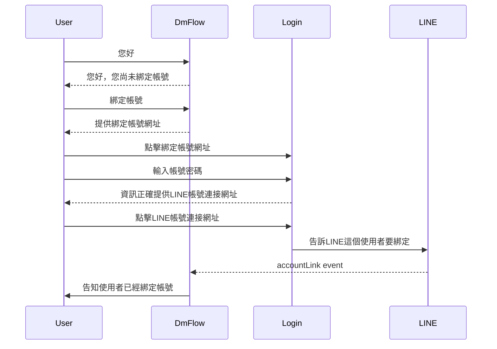
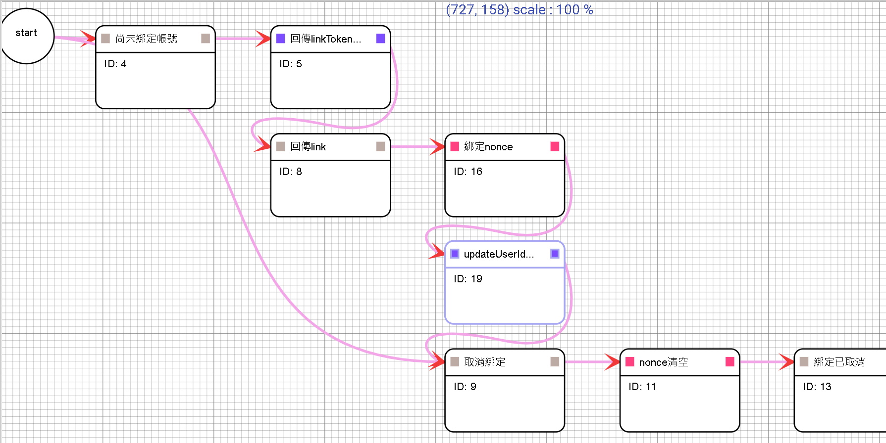
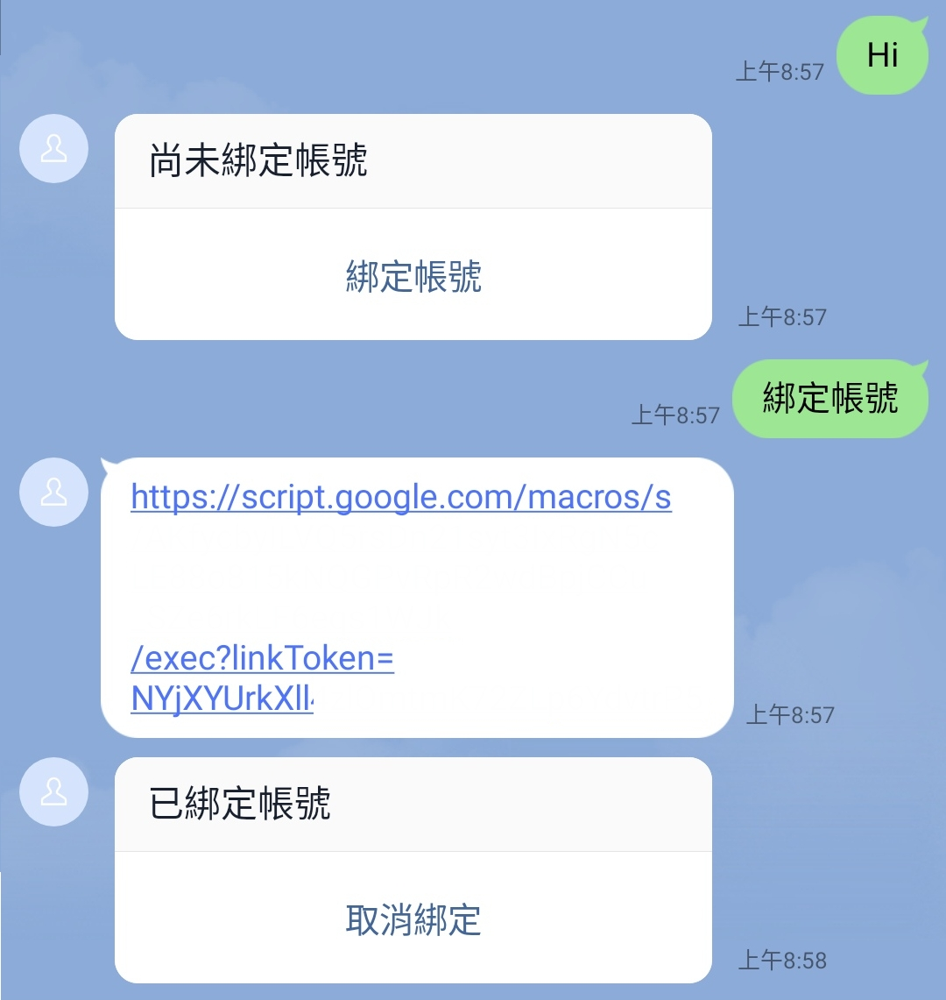
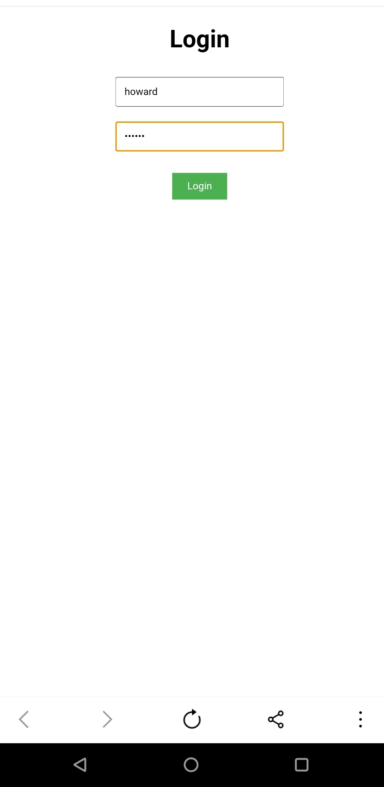
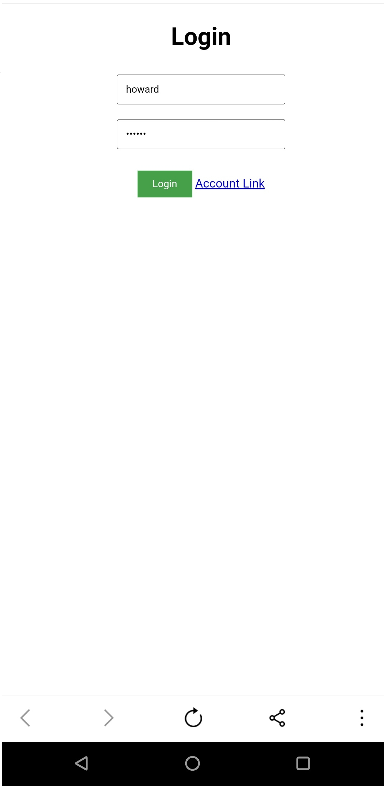
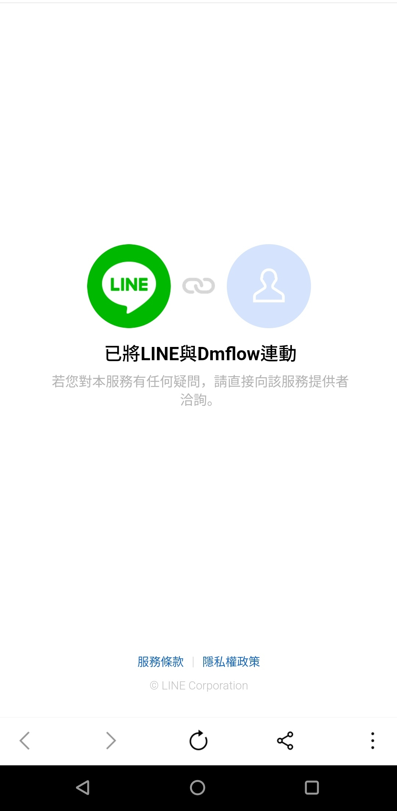

# 如何快速建立連結

> 此範例因為測試需求，使用的是Google Apps Script，如果要正式使用可使用其他方式如firebase或自定義伺服器完成以下教學。

大致流程如下：


## 步驟一：建立需求的檔案

首先我們先建立index.html
```
<!DOCTYPE html>
<html>

<head>
  <base target="_top">
  <style>
    body {
      font-family: Arial, sans-serif;
      text-align: center;
      padding: 20px;
    }

    h1 {
      margin-top: 0;
    }

    input[type="text"],
    input[type="password"] {
      width: 200px;
      padding: 10px;
      margin: 10px;
    }

    button {
      padding: 10px 20px;
      background-color: #4CAF50;
      color: white;
      border: none;
      cursor: pointer;
    }

    button:hover {
      background-color: #45a049;
    }
  </style>
</head>

<body>
  <h1>Login</h1>
  <input type="text" id="username" placeholder="Username" autocomplete="off" required><br>
  <input type="password" id="password" placeholder="Password" autocomplete="off" required><br>
  <input type="hidden" id="linkToken" value=""><br>
  <button onclick="login()">Login</button>
  <a href="#" id="account-link" style="display: none;">Account Link</a>
  <script>
    function login() {
        var username = document.getElementById("username").value;
        var password = document.getElementById("password").value;
        var linkToken = document.getElementById("linkToken").value;
      }
  </script>
</body>

</html>
```

程式碼.gs

```
function doGet(request) {
  return HtmlService.createHtmlOutputFromFile("index");
}
```

## 步驟二：開始撰寫gs

我們需要login的邏輯並開始撰寫

先開啟Google spreadsheets並建立欄位為username, password, nonce, user_id

可以填寫你要的使用者，我在裡面建立了帳號為howard、密碼為123456

| username | password | nonce | user_id
| -------- | -------- | ----- | --------
| howard   | 123456   |

根據網址，即可拿到你的Spreadsheet的ID，記得如果只要使用Login頁面，可以將存取只能給自己使用，但因為此範例最後面需要用到DmFlow的資源節點，所以需要開放給所有知道連結的人。
```
https://docs.google.com/spreadsheets/d/{{你的Spreadsheet ID}}/edit#gid=0
```
```
function login(username, password, linkToken) {
  var id = '{{你的Spreadsheet ID}}';
  var spreadsheet = SpreadsheetApp.openById(id);
  var sheet = spreadsheet.getSheets()[0];
  var data = sheet.getDataRange().getValues();

  for (var i = 1; i < data.length; i++) {
    var storedUsername = data[i][0];
    var storedPassword = data[i][1];
    if (storedUsername === username && storedPassword == password) {
      var nonce = createNonce(16);
      var cell = sheet.getRange("C" + (i + 1));
      cell.setValue(nonce);
      var redirectUrl = `https://access.line.me/dialog/bot/accountLink?linkToken=${linkToken}&nonce=${nonce}`;
      return { success: true, redirectUrl };
    }
  }
  return { sucess: false };
}


function createNonce(length) {
  var text = "";
  var possible = "ABCDEFGHIJKLMNOPQRSTUVWXYZabcdefghijklmnopqrstuvwxyz0123456789";
  for (var i = 0; i < length; i++) {
    text += possible.charAt(Math.floor(Math.random() * possible.length));
  }
  return text;
}
```

並更改index.html
```
  <script>
    function login() {
        var username = document.getElementById("username").value;
        var password = document.getElementById("password").value;
        var linkToken = document.getElementById("linkToken").value;
        google.script.run.withSuccessHandler(handleLoginResult).login(username, password, linkToken);
      }
      function handleLoginResult(result) {
        if(result){
          if(result.success){
            alert("Login successful!");
            if(result.redirectUrl) {
              var linkElement = document.getElementById('account-link');
                  linkElement.style.display = "inline";
                  linkElement.href = result.redirectUrl;
            }
          }else {
            alert("Login failed! Please check your credentials.");
          }
        }
      }
      google.script.url.getLocation(function(location) {
        var hiddenValue = location.parameter["linkToken"];
        document.getElementById("linkToken").value = hiddenValue;
      });
  </script>
```

即可完成簡單的登入頁面。

此為index.html完整版

```
<!DOCTYPE html>
<html>

<head>
  <base target="_top">
  <style>
    body {
      font-family: Arial, sans-serif;
      text-align: center;
      padding: 20px;
    }

    h1 {
      margin-top: 0;
    }

    input[type="text"],
    input[type="password"] {
      width: 200px;
      padding: 10px;
      margin: 10px;
    }

    button {
      padding: 10px 20px;
      background-color: #4CAF50;
      color: white;
      border: none;
      cursor: pointer;
    }

    button:hover {
      background-color: #45a049;
    }
  </style>
</head>

<body>
  <h1>Login</h1>
  <input type="text" id="username" placeholder="Username" autocomplete="off" required><br>
  <input type="password" id="password" placeholder="Password" autocomplete="off" required><br>
  <input type="hidden" id="linkToken" value=""><br>
  <button onclick="login()">Login</button>
  <a href="#" id="account-link" style="display: none;">Account Link</a>
  <script>
    function login() {
        var username = document.getElementById("username").value;
        var password = document.getElementById("password").value;
        var linkToken = document.getElementById("linkToken").value;
        google.script.run.withSuccessHandler(handleLoginResult).login(username, password, linkToken);
      }
      function handleLoginResult(result) {
        if(result){
          if(result.success){
            alert("Login successful!");
            if(result.redirectUrl) {
              var linkElement = document.getElementById('account-link');
                  linkElement.style.display = "inline";
                  linkElement.href = result.redirectUrl;
            }
          }else {
            alert("Login failed! Please check your credentials.");
          }
        }
      }
      google.script.url.getLocation(function(location) {
        var hiddenValue = location.parameter["linkToken"];
        document.getElementById("linkToken").value = hiddenValue;
      });
  </script>
</body>

</html>
```

## 步驟三：寫入userId

有兩種方式寫入userId

- 1.直接在轉login的頁面的時候，可以直接攜帶userId
- 2.透過DmFlow資源節點去觸發寫入userId

在此舉立第二種範例。

我們在 程式碼.gs新增以下程式碼

將新增一個資源。
```
{
  "action": "updateUserId",
  "userId": "xxxx",
  "nonce": "xxxx"
}
```

```
function writeUserId(userId, nonce) {
  var id = '{{你的Spreadsheet ID}}';
  var spreadsheet = SpreadsheetApp.openById(id);
  var sheet = spreadsheet.getSheets()[0];
  var data = sheet.getDataRange().getValues();

  for (var i = 1; i < data.length; i++) {
    var storedNonce = data[i][2];
    if (storedNonce === nonce) {
      var cell = sheet.getRange("D" + (i + 1));
      cell.setValue(userId);
      return { success: true };
    }
  }
  return { sucess: false };
}

function doPost(e) {
  var param = JSON.parse(e.postData.contents);
  let action = param.action;
  var result = {};
  if (action === 'updateUserId') {
    let userId = param.userId;
    let nonce = param.nonce;
    result = writeUserId(userId, nonce);
  }
  return ContentService.createTextOutput(JSON.stringify(result))
    .setMimeType(ContentService.MimeType.JSON);
}
```

於是可以先新增部屬作業。

## 步驟四：回到DmFlow做設定

我們先來看最終成果圖。



- 首先現在"使用者參數"新增一個nonce作為是否已經連接帳號的根據。並在"機器人參數"新增lineToken，數值為Bearer {{line access token}}

- 先建立變數節點
  - link_token: 屬性: string，用途是呼叫LINE linkToken後需要回傳linkToken
  - nonce: 屬性: string，用於查詢user Spreadsheet的nonce去比對帳號。
  - user_id: 屬性: string，用於修改user Spreadsheet的userId。

- 在資源節點新增兩個分別是

1. line_linkToken 用於綁定帳號

```
因預設為HTTPS所以不用打https://
Request URL: api.line.me/v2/bot/user/${#sys_user.userId}/linkToken
Method: POST
Content-Type: JSON
Headers: Authorization: config.lineToken
RESPONSE
{
 "linkToken": "xxxx"
}
```

2.  updateUserId 用於更新userId
```
Request URL: script.google.com/macros/s/{{生產部屬的ID}}/exec
Method: POST
Content-Type: JSON
REQUEST PAYLOAD:
{
    "action": "updateUserId",
    "nonce": "",
    "userId": ""
}
請求參數新增nonce和user_id(請求參數鍵要改成userId，否則無法取代REQUEST PAYLOAD的userId)
RESPONSE
{
 "success": true or false
}
填寫完後點擊新增或修改，重進一次修改資源，可以點擊測試直接測試該資源。
```

- 回到DmFlow圖形

每個節點的用途可以從這裡了解。[DmFlow 機器人對話流程](../../tutorials/docs/bot-flow.html)

ID 4 回覆節點
用途：為了回覆使用者未綁定帳號的問句。
```
文本：尚未綁定帳號
選項：綁定帳號(回傳文本:綁定帳號)
```

Start -> ID 4 條件節點
用途：平台必須是LINE且nonce屬於尚未填充的狀態。
```
條件為
  sys_user.platform = constant @line
  user.nonce 未填充
```
ID 5 資源節點
用途：向LINE Server去拿取linkToken。
```
選取line_linkToken
回傳值：
  link_token->conversation.linkToken
```

ID 4 -> ID 5 條件節點
用途：假設回覆等於綁定帳號則移動到綁定帳號節點。
```
條件為
  query = constant 綁定帳號
```
ID 8 回覆節點
用途：拿到linkToken後顯示前端login頁面，並帶linkToken數值。生產部屬的ID為自己的ID請勿複製貼上。
```
文本：https://script.google.com/macros/s/{{生產部屬的ID}}/exec?linkToken=${#conversation.linkToken}
```

ID 5 -> ID 8 條件節點
用途：假設拿到linkToken直接前往回覆輸出連結。
```
條件為無條件
```

ID 16 變數節點
用途：我們接收到Account Link事件後可以拿到nonce。
```
user nonce 字串取代 前綴:conversation,目標:_message.payload.nonce 
```

ID 8 -> ID 16 條件節點
用途：當前端登入完成且完成帳號連結後，LINE Server會提供給DmFlow 事件為Account Link的事件。
```
條件為
  conversation._message.type = constant accountLink
```

ID 19 資源節點
用途：調用updateUserId將nonce相符的帳號更新他的userId
```
選取updateUserId
參數：
  nonce->user.nonce
  user_id->sys_user.userId
回傳值：
  success->conversation.success
```

ID 16 -> ID 19 條件節點
用途：Account Link事件後可以拿到nonce和result，可以先判斷result是否為ok或failed，但此範例不判斷。
條件為無條件

ID 9 回覆節點
用途：最後需要顯示解除綁定的訊息。
```
文本：已綁定帳號
選項：取消綁定(回傳文本:取消綁定)
```

Start -> ID 9 條件節點
用途：使用者回答取消綁定且渠道為LINE的時候觸發
```
條件為
  query = constant 取消綁定
  sys_user.platform = constant @line
```
ID 11 變數節點
用途：將user.nonce清除
```
user nonce 字串清空
```

ID 9 -> ID 11 條件節點
用途：當使用者選擇選項為取消綁定或直接說出取消綁定的時候觸發。
```
條件為
query = constant 取消綁定
```
ID 13 回覆節點
用途：用於回覆使用者綁定已取消了，下一次使用者需要重新綁定才能繼續問話。
```
文本：綁定已取消
關閉等待用戶回覆
```

## 步驟五：測試

在LINE整合填寫Channel ID和secret和access token，可參考[DmFlow LINE整合](../../tutorials/docs/line.html)

並根據開發版、生產版做發布即可測試。可參考[DmFlow 發布](../../tutorials/docs/bot-published.html)

成果：



點擊連結後跳去登入頁面。
 


登入成功後顯示Account Link的連結



點完連結後，會出現連接畫面，此時LINE Server會丟account Link event給DmFlow，DmFlow會顯示以綁定帳號。



> 最後若是此範例完畢，記得管理部屬作業將該程序封存，讓程序下線，避免已經綁定信用卡的使用者造成不必要的費用問題。


