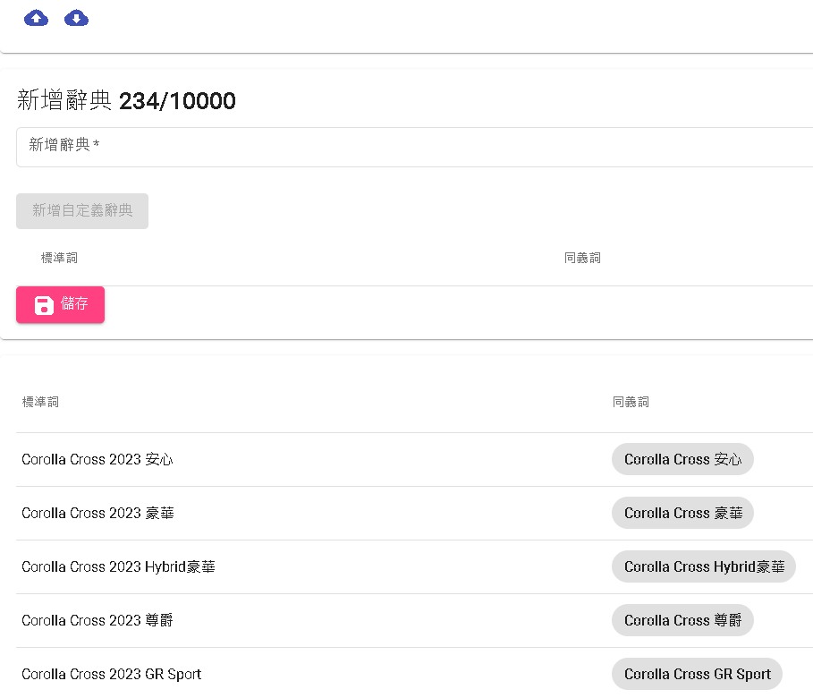
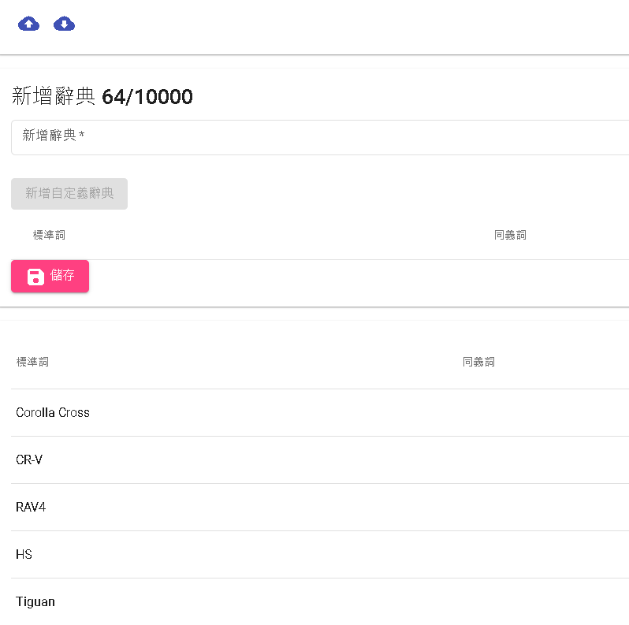
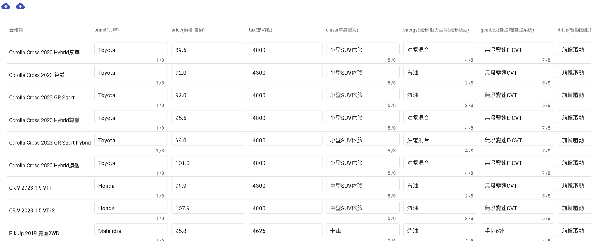

# 介紹如何使用表格問答解決問題

可以先準備資料

目前測試資料包含

```
資料來源
https://c.8891.com.tw/
```

將資料轉成DmFlow需求的excel格式，縮圖直接用上述資料來源網址，如使用無法顯示或資料來源有問題請寄信到<service@communeify.com>告知。

- [car.xlsx](../../../../../../files/xlsx/car.xlsx "car.xlsx") 上傳到汽車資料庫的資料
- [car-dict.xlsx](../../../../../../files/xlsx/car-dict.xlsx "car-dict.xlsx") 汽車實體資料
- [car-kind-name.xlsx](../../../../../../files/xlsx/car-kind-name.xlsx "car-kind-name.xlsx") 汽車車型資料

# 1.準備Schema


# 2.上傳汽車實體

使用 [car-dict.xlsx](../../../../../../files/xlsx/car-dict.xlsx "car-dict.xlsx") 上傳汽車實體



# 3.上傳其他關鍵字實體

如果有關鍵字，使用到空格，或其他特殊符號的文字，可以透過關鍵字實體解決搜尋不到的問題。

使用 [car-kind-name.xlsx](../../../../../../files/xlsx/car-kind-name.xlsx "car-kind-name.xlsx") 上傳汽車車型



# 4.上傳汽車資料庫

然後上傳 [car.xlsx](../../../../../../files/xlsx/car.xlsx "car.xlsx")



# 5.連接領域，即可直接測試。


還有其他強大功能，可以直接前往查看[表格問答](../../tutorials/docs/qa-intro.html)

# 6.如何串連第三方渠道

直接使用對話模板，分別綁定實體對話(命中實體)以及搜尋對話(搜尋實體)，並發布生產版本。

## 如何使用

- 1.直接運用API可以直接呼叫此模板
- 2.運用機器人調用節點，直接部屬到LINE或其他第三方渠道即可。


# 了解更多

[Communeify官方](https://communeify.com/)

- 進入官網後，可以線上直接回覆，或是可以有問題可以從信箱問<service@communeify.com>
