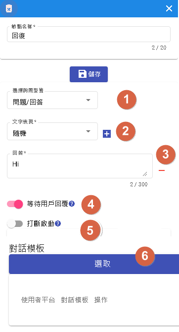
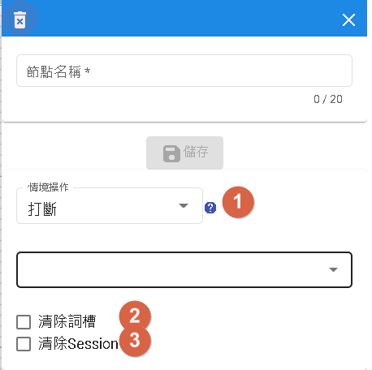
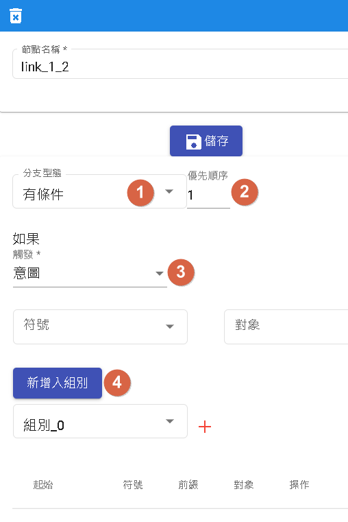

# 對話流程

用於流程式基本對話，用來補足領域式對話限制流程缺點。

## 優點
- 圖示化展示，更直覺的了解節點跟節點的關係位置。
- 拖曳式節點，相對於傳統cli寫程式的機器人套件，更能滿足一般使用者撰寫流程。


- 1.新流程:用於刷新此流程，會將當前所有設定變為原來的設定包含情境以及節點。
- 2.保存:新增、載入版本流程。
- 3.更新:用於更新當前版本。
- 4.挑選情境:跳出視窗可以新增、更新、刪除、選擇情境
- 5.放大:畫布放大。
- 6.歸位:畫布歸位跟start節點對齊。
- 7.縮小:畫布縮小。
- 8.全局設定:重載選項。
- 9.全螢幕
- 10.模板:分為記憶模板以及對話模板。
- 11.測試:用於測試當前機器人流程。
- 12.暫存流程:當一定時間內會更新當前流程緩存，使用者可以去其他頁面處理任務。
- 13.節點設定:資源、回覆、情境、變數、收集以及調用節點設定。

## 保存


- 1.新增新的版本。
- 2.版本名稱、狀態(完成代表成功)、更新原因、預先載入以及是否發布
- 3.編輯 可以重寫更新原因，以及預先載入以及是否發布
- 4.載入選中版本腳本。
- 5.瀏覽歷史紀錄。

### 預先載入

當版本有勾選預先載入，則第一次進去流程畫布，會優先載入此腳本，而非最新日期的腳本。

### 是否發布

當版本勾選是否發布，則表示將發布成"開發版本"，可使用於測試。

## 測試


- 1.輸入詢問句。
- 2.可以直接測試該情境流程。
- 3.可根據視角選擇不同平台的回話方式。
- 4.用於測試生產版版本。
- 5.是否啟用業務資源服務，假設點取"啟用"，則會外呼資源節點。
- 6.若不啟用業務資源服務，可將模擬的參數填寫至此。
- 7.將該頁面重新填寫刷新。

# 節點介紹

## 開始節點

作為該情境全局節點，影響所有節點。<br>

- 1.詢問:用於開場問話。
- 2.模式:分為一般模式以及喚醒模式。喚醒模式，需要用戶輸入"喚醒句"相等才會進入。
- 3.預載領域:必須是意圖型，為了後面收集節點使用。
- 4.此為顯示使用"預載領域"的節點。
- 5.對話模板，用於不同渠道的模板，一般是回答"詢問"，假如不同渠道又不同問話，則會自動用該渠道回答用戶。

## 資源節點

可以呼叫外界資源，進行業務邏輯。<br>

- 1.參數的前綴分為config(機器人參數)、constant(常數)、conversation(單輪會話)、session(多輪會話)、slots(詞槽)、sys_user(系統使用者參數)、user(使用者參數)
- 2.回傳值的前綴分為conversation(單輪會話)、session(多輪會話)以及、user(使用者參數)
- 3.參數的屬性如果是datetime以及number，此時前綴選取constant時，只能填入數字，為string時可以填入任何文字，其餘僅支援大小寫a到z。

### 前綴介紹

前綴分為機器人參數、常數、單輪會話、多輪會話、詞槽、系統使用者參數以及使用者參數。
- 機器人參數:模板->記憶模板->機器人參數
- 常數:輸入的文字為字串。
- 單輪對話:要查看是否有文字注入。
- 多輪對話:模板->記憶模板->單一會話儲存
- 詞槽:根據"預載領域"注入該領域詞槽。
- 系統使用者參數:模板->記憶模板->使用者參數(預設)[目前僅提供userId]
- 使用者參數:模板->記憶模板->使用者參數。

### 消息接收非文字類

如果用於line和messenger接收非文字訊息時，有保留字

- conversation._queryType 用於判斷text, image, audio, video, event, file
- conversaion.@line 和 conversaion.@fbmessenger 接收到非text和event時啟用。

```
{
  "@line": {
    "attachments": [
      {
        "id": "att_id",
        "url": "att_url",
        "type": "att_type"
      }
    ]
  }
}
```
若為file且平台有提供fileName和fileSize時，一樣會提供

```
{
  "@line": {
    "attachments": [
      {
        "id": "att_id",
        "url": "att_url",
        "type": "att_type",
        "fileName": "fileName",
        "fileSize": 10240
      }
    ]
  }
}
```

相同於@fbmessenger

```
{
  "@fbmessenger": {
    "attachments": [
      {
        "id": "att_id",
        "url": "att_url",
        "type": "att_type"
      }
    ]
  }
}
```
|PATH       | 說明
|---------- | ---------
| id        | 對應平台是否提供特定id，messenger可以事前上傳檔案
| url       | 對應平台是否提供特定url
| type      | text, image, audio, video, event, file
| fileName  | 當type=file時，若平台有提供即會顯示
| fileSize  | 當type=file時，若平台有提供即會顯示

如何使用

- 當節點為"條件節點"時，可以先判斷conversation._queryType 型態為何。
- 再透過"資源節點"，把attachments傳出去後端做處理。


#### 參數介紹

將數值注入到資源裡面。

假設conversation.test裡面的值為"測試"，請求參數將會把 city=測試 傳遞出去。

#### 回傳值

將資源回應的JSON[目前只支援JSON回傳]回傳給對話系統。

假設得到的數值是"測試"，則注入到conversation.test的數值將會是"測試"。

## 回覆節點

一般節點使用，可以用作提問問題或是回答問題。<br>

- 1.選擇詢問型態:目前支援單純問題。
- 2.文字表現:目前僅支援隨機。
- 3.回答:可複數，若有N個回答，機率就是1/N
- 4.等待用戶回復:當選取此時，在此階段會停止，直到用戶回應後，才繼續跑流程。
- 5.打斷啟動:打斷用於"開始節點"的分支條件。
- 6.對話模板，用於不同渠道的模板，一般是回答"詢問"，假如不同渠道又不同問話，則選取該渠道回答用戶。

## 情境節點

情境節點的移動。<br>

- 1.情境操作分為打斷、重新開始、重回主情境、完成、結束流程、聆聽以及跳轉。
- 2.清除所有當前殂存的詞槽。
- 3.清除"模板"->"記憶模板"->"單一會話儲存"的所有資料。

### 情境操作

- 打斷:可選其他情境作跳轉，當完成後會繼續該節點。
- 重新開始:重新該情境。
- 重回主情境，一般重回"主情境"，但不同渠道或API有攜帶情境參數時，將以該參數為主。
- 完成:將跳回上一個情境，若無上一個情境則重新開始當前情境。
- 結束流程:將對話結束，若為喚醒模式，必須重新輸入喚醒詞才會進去對話。
- 聆聽:該用戶輸入任何問句都不會觸發，直到問句等同於開始節點的喚醒句才可以醒來。特別注意:要使用此情境，需再開始結點設定喚醒句。
- 跳轉:可以任意跳轉該情境內任一"回覆節點"。

## 變數節點

變數節點作為參數變動，賦予變數模板數值的地方。<br>


### 操作型態

- 詞槽:包含開始節點選擇的意圖詞槽。
- 變數:包含單一會話(session)以及使用者(user)變數
- 系統參數:目前僅支援"使用者標籤"。

### 操作

- 當來源為列表時，會有列表新增、列表刪除。
- 當來源為時間時，會有字串取代。
- 當來源為字串時，會有字串取代以及字串清空。
- 當來源為數字時，會有歸零、加一以及減一可以選擇。

## 收集節點

收集節點為意圖型的簡單化收集詞槽。<br>

- 1.詢問
- 2.當超過"最大失敗次數"，將會丟出conversation.{qaId}.fallback
- 3.選擇開始節點，指定領域中的意圖型。
- 4.選擇開始節點，指定領域中的所有詞槽。
- 5.設定該詞槽預設內容，若用戶對話沒命中則使用。
- 6.設定該詞槽預設正規化(數字、日期等)，若用戶對話沒命中則使用。

## 調用節點
調用不同的領域

當"開啟"覆蓋，將會覆蓋掉本來在領域內的參數。

## 條件節點



- 1.分支條件：分為有條件、無條件以及百分比
- 2.優先順序：可透過優先順序去排序分支條件先後順序，若相同順序，根據節點位置坐排序。
- 3.有條件的觸發條件
- 4.組別，同組為AND，不同組為OR，根據組別順序檢查，當結果為TRUE則執行下一個節點。

### 分支條件

- 有條件，根據不同條件前往不同節點。
- 無條件，直接連線到其他節點。
- 百分比，根據機率前往不同節點。

### 觸發條件

- 意圖
- 詞槽
- 變數
- 詢問

# 接著讀

- [機器人範例](/products/dmflow/tutorials/docs/bot-example.html)