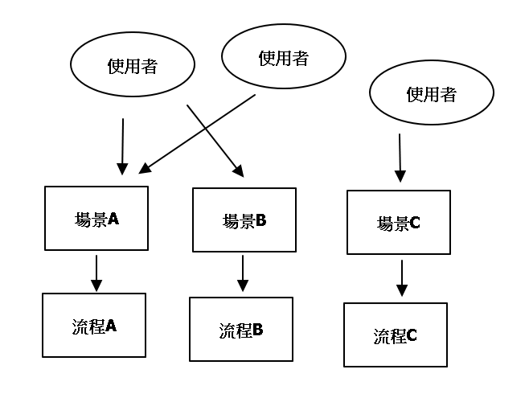

# 全局設定
用於對話流程的設定，包含啟用的領域、場景以及通用回答。

## 領域

### 新增可使用領域

- 1.點選[+]
- 2.在"領域添加"中點選[+]，即可新增領域。

### 不同類別領域
分為意圖型、知識庫以及問答對，三種不同類型分別要做不同設定。

### 意圖型

- 1.可選用特定意圖做填實體，或者可以選擇空，等待對話在做辨識其意圖。[可覆蓋]
- 2.是否啟用該領域。
- 3.是否啟用命中失誤次數。
- 4.傳遞變數給領域，強制注入領域中的context(上下文)

### 知識庫

- 1.回傳答案數量之限制。[可覆蓋]
- 2.是否啟用搜尋內容。(啟用後將會開啟搜尋實體時，同時搜尋內容)[可覆蓋]
- 3.是否啟用該領域。
- 4.是否啟用命中失誤次數。
- 5.預設模板，目前知識庫回答有兩種回復方式，分別為介紹實體(綁定實體對話模板)以及實體列表(綁定搜尋對話模板)。

### 問答對

- 1.選擇指定問答對的分類。[可覆蓋]
- 2.當解答高於此數值，將會將此問題作為用戶問題。[可覆蓋]
- 3.當解答高於此數值時，會出現其他建議問題。[可覆蓋]
- 4.是否啟用該領域。
- 5.是否啟用命中失誤次數。
- 6.綁定特定平台對話模板(目的是有些問題會特別做相似問題作為使用者參考)
- 7.傳遞變數給領域，強制注入領域中的context(上下文)

*1 可覆蓋：當前參數為該機器人全部場景調用相同參數，但在機器人流程裡面的"調用節點"可以將該參數從新覆蓋。

## 場景

對話流程會根據不同場景做不同回答流程。
- 1.場景名稱僅支援a-z以及下滑線(_)。

每個使用者可以根據不同場景進入不同的流程。

## 通用回答

每個場景共通繼承的回答。

- 1.流程錯誤回答：當對話系統核心發生異常時所告知用戶的會話，一般不會出現，出現此須告知管理員。
- 2.當event為start的時候，機器人的回話。
- 3.每當流程做更新時，會顯示此文字，並將當前對話重新開始。
- 4.忙碌中，一般不會出現，除非該機器人有大量請求時才會出現。
- 5.未命中，當分支條件未設置"空"時，預設的回話。

# 接著讀
- [變數以及資源管理](/products/dmflow/tutorials/docs/bot-resource.html)