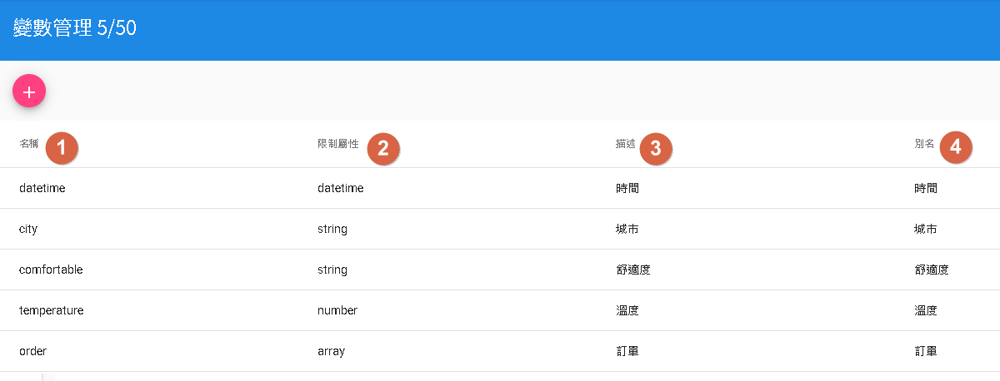

# 變數以及資源管理
- 變數管理：資源所需參數使用。
- 資源管理：對話流程用於資源節點使用，可以連接對外API做業務邏輯交互。

## 變數管理

- 1.名稱：為變數名稱，以英文為取名方式。
- 2.限制屬性分為string(字串)、number(數字)、datetime(日期時間)以及array(陣列)
- 3.描述
- 4.別名：目前無用途，主要目的是將該名稱轉為可辨識文字，例如：price=>價格 價錢。

## 資源管理

- 1.資源名稱：為該資源名稱，以英文為取名方式。
- 2.描述
- 3.請求地址：資源業務邏輯地址，注意前面已填入https協定，無須再填寫至請求地址。
- 4.請求型態：目前僅支援GET以及POST
- 5.Content-Type：支援URL和JSON[application/json]
- 6.請求頭欄位：Header填寫，前綴分為constant(常數)、conversation(單輪會話）、session(多輪對話)、user(使用者參數)以及config(機器人參數)[延伸1]
- 7.參數：會將注入參數根據Content-Type請求。[延伸2]
- 8.回傳值：將該請求的回傳值，將當前JSON路徑[尚未支援中文]的數值注入該鍵。[延伸3]

### 延伸1
- constant:後面可放任何文字，不用理會前綴。
- conversation、session、user以及config等。可從[模板](/products/dmflow/tutorials/docs/bot-template.html#記憶模板)中的記憶模板前往觀看。
### 延伸2
假設有一參數city=>城市
- URL:直接作為參數&city=urlEncode(城市) 方式傳遞。
- JSON:則是 {"city":"城市"} 方式傳遞。

### 延伸3
假設地址回應為{"city":"城市"}，有一參數city=>城市

那JSON路徑為city，鍵選擇變數city即可。而數值將會在"對話流程"中的"資源節點"做注入。

### JSON路徑教學
JSON路徑：範例地址回應為{"city":"城市", "obj":{"apple":"蘋果"}, "order":["訂單"]}
- 假如我們要拿城市則路徑為city
- 假如我們要拿蘋果則路徑為obj['apple']
- 假如我們要拿訂單則路徑為order[0]

# 接著讀
- [對話流程](/products/dmflow/tutorials/docs/bot-flow.html)