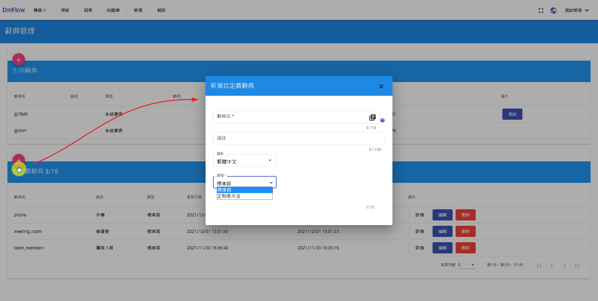
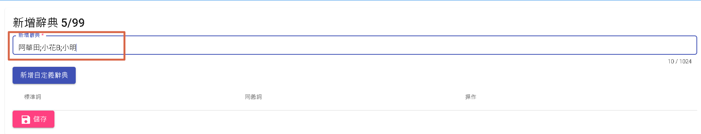
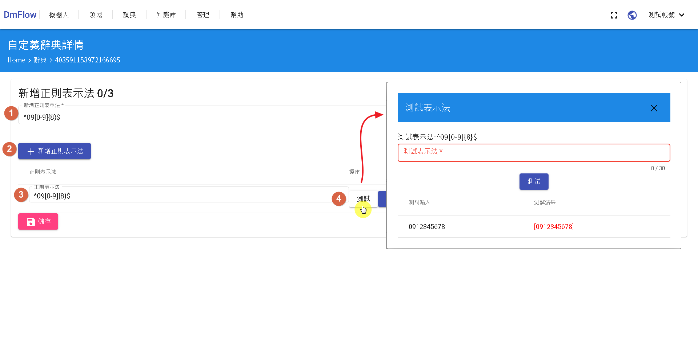

# 自定義辭典
自定義辭典目前分為"標準詞"以及"正則表示法"。可以點+，新增自定義辭典做選擇，如下圖。

注意: 辭典名只能用14位"小寫英文字母"和"_"(下划線)，且無法更改。

## 標準詞
紅框內可用分號(;)分隔文字，如下:

## 正則表示法
由點標[1]寫正則表示法，並由點標[2]新增，會出現點標[3]的列表，並點選點標[4]的測試，即可測試該表示法可以得到的文字。

# 接著讀
- [知識庫介紹](/products/dmflow/tutorials/docs/qa-intro.html)
